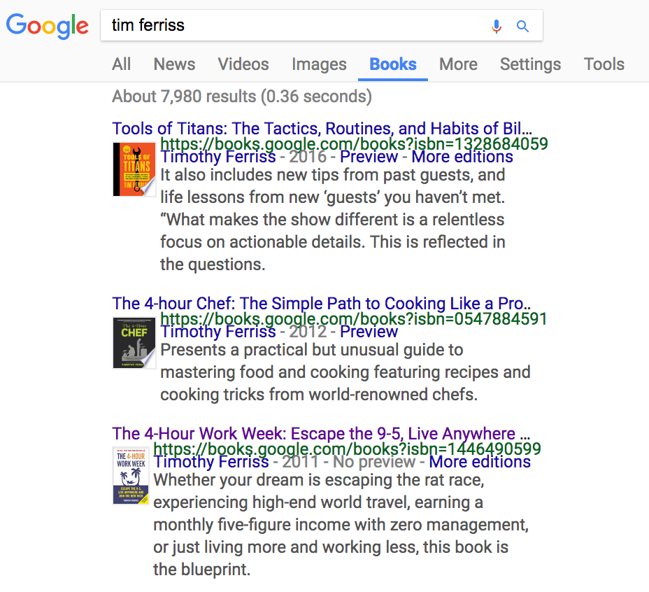
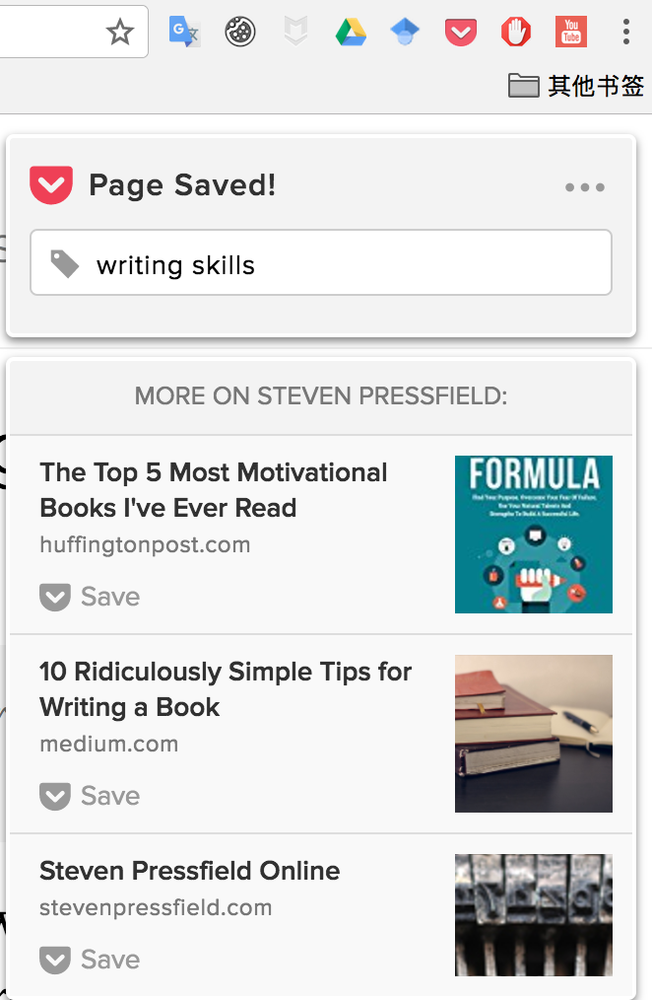
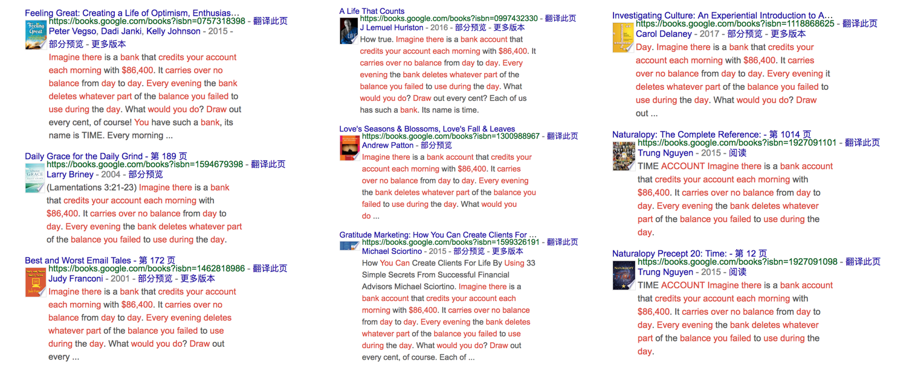

# 02.素材

## 02.素材

素材就像是蔬菜。一种蔬菜肯定有不同的烹饪方式。而衡量一个厨师是不是厨艺精湛，其实就是看他是否能够充分利用每一种食材罢了。

### 素材的作用

#### 钱钟书

> 许多人说，钱钟书记忆力特强，过目不忘。他本人却并不以为自己有那么“神”。他只是好读书，肯下功夫，不仅读，还做笔记；不仅读一遍两遍，还会读三遍四遍，笔记上不断地添补。所以他读的书虽然很多，也不易遗忘。
>
> 做笔记很费时间。钟书做一遍笔记的时间，约莫是读这本书的一倍。他说，一本书，第二遍再读，总会发现读第一遍时会有很多疏忽。最精彩的句子，要读几遍之后才发现。
>
> 钟书去世后，我找出大量笔记，经反复整理，分出三类。
>
> 第一类是外文笔记\(外文包括英、法、德、意、西班牙、拉丁文\)。除了极小部分是钟书用两个指头在打字机上打的，其余全是手抄。笔记上还记有书目和重要的版本以及原文的页数。他读书也不忽略学术刊物。凡是著名作家有关文学、哲学、政治的重要论文，他读后都做笔记，并记下刊物出版的年、月、日。钟书自从摆脱了读学位的羁束，就肆意读书。英国文学，在他已有些基础。他又循序攻读法国文学，从十五世纪到十九世纪而二十世纪；也同样攻读德国文学、意大利文学的历代重要作品，一部一部细读，并勤勤谨谨地做笔记。这样，他又为自己打下了法、德、意大利的文学基础。以后，他就随遇而读。
>
> ——杨绛《钱钟书手稿集》

#### 李敖

在凤凰卫视2006年1月19日的《李敖有话说》里，李敖是这样介绍他的读书方法的：

> 我李敖看的书很少会忘掉，什么原因呢？方法好。什么方法？心狠手辣。
>
> 剪刀美工刀全部用到，把书给分尸掉了，就是切开了。这一页我需要，这一段我需要，我把它按类别分开来。那背面有用怎么办呢？把它影印出来，或者一开始就买两本书，把两本书都切开以后整理出来，把要看的部分分类存留。
>
> 结果一本书看完了，这本书也被分尸掉了。这就是我的看书方法。
>
> 那分类怎么分呢？我有很多自己做的夹子，夹子我写上字，把资料全部分类。一本书看完以后，全部进入我的夹子里面。
>
> 我可以分出几千个类来，分得很细。好比说按照图书馆的分类，哲学类，宗教类；宗教类再分佛教类、道教类、天主教类。
>
> **任何书里有关的内容都进入我的资料里来。进入干什么呢？当我要写小说的时候，需要这个资料，打开资料，只是写一下就好了。**
>
> 换句话说，我这本书看完之后，被我大卸八块，五马分尸。可是被我勾住了，这些资料我不凭记忆来记它，我凭细部的很耐心的功夫把它勾紧，放在资料夹子里。我的记忆力只要记这些标题就好了。
>
> 我告诉大家，记忆力是可以训练的。记忆力一开始就是你不要偷懒，不要说躺在那里看书，看完了这本书还是干干净净的，整整齐齐的，这不对。看完了这本书，这本书就大卸八块，书进了资料夹，才算看完这本书。
>
> 不要以为这本书看完了，干干净净的新的算看过。那个不算看过，因为当时是看过，可是浪费了。你不能够有系统地扣住这些资料，跟资料挂钩。
>
> 可是照我这个方法，可以把你看过的书，都把它的精华抓出来，扣在一起。这就是我的这种土法炼钢的治学方法。”

通过钱钟书和李敖这两个故事，可以发现收集素材起码有两点好处：

第一，搜集素材的过程其实就是二次学习。 第二，写作需要的时候能够快速调用已有素材。

一本书质量的好坏，很大程度上受到书里提及的案例（素材）的影响。案例越丰富，越贴切，就说明作者的知识量越宽广。

换言之，一个知识量宽广的作者的作品才值得阅读。

### 工具箱

#### 一、Google的使用方法

1.加号

在Google的对话框里，所有的空格都被理解为加号。但是，像一些过分常用的，没有意义的词常常会被忽略。

比如，你输入 the advantage of learning English，你会搜索到 advantage、learning、English,但是你不会搜到 the 或者 of，因为它们太经常被使用了。

2.减号

比如，输入 the advantage of learning English - communication。你搜索到的内容将会是除去communication之外所有关于 the advantage of learning English 的内容。

也就是说，在关键字中插入减号的时候，Google会默认你搜索的是除去减号后面的前面的关键词。

3.引号

如果你想要找到 the advantage of learning English 完整的词组，你需要用到引号将它们引用起来，“the advantage of learning English”。

4.星号

星号，你可以把它理解为万能符号。它的功能是代替任何单词。

比如，你搜索 the most \* couple in the world，它会返回诸如，the most \(beautiful/famous/athletic/powerful/perfect...\) couples in the world。

5.波浪号

波浪号是个神奇的符号。在某个单词前使用波浪号，意味着你会搜索到与该单词含义相似的词组。

比如，你搜索 the ~ advantage of learning English，收到的结果有 the benefits of learning English。

另外，Google 出了一个[帮助文档](https://support.google.com/websearch/?hl=en#topic=3378866)，如果有任何问题，你可以从里面找答案。

最后，值得一提的是，谷歌图书（books.google.com），这绝对是个好东西。

你在里面输入关键词时，它会返回相关联的书籍。比如，输入“tim ferriss”：

当你在书籍中输入关键词时，它会返回这本书里带有这个关键词的所在位置。比如，书内搜索的位置输入”writing“：

你看，谷歌图书里面每本书可以试读的章节有很多呢，比任何电子书试读网站（比如，亚马逊、当当）的功能都强大。

#### 二、Pocket

我在收集素材的时候，会浏览大量的网页。有些网页需要保存下来，就需要使用pocket了。

当然，能够保存网页的方法（软件）很多，不过Pocket有两个明显的优势：

1.可以给网页贴上标签 

2.算法推荐与保存的网页相似（有关）的内容

你看，我用Google搜到一篇关于写作技巧的文章，保存时给它做了一个标签：writing skills。你会看到除了那篇文章之外，下面又出来三篇相关的文章。使用Savepocket搜集素材也是一个不错的方法。

#### 三、Wikipedia的启示

在搜集素材的时候，你会遇到很多之前没听过的概念，这个时候，最好的方法就是，使用Wikipedia查询。这样，你能最快速地正确地全面地了解一个陌生的概念。

#### 四、全文检索

全文检索功能可以节约你的时间，是真正的“聪明地工作”。

它意味着，当你开始调用素材的时候，你可以通过输入关键词（可能就是两个字），立刻找到相应的素材。

我的素材都是放在Mac电脑里的。它里面有个很强大的功能，Spotlight，不仅能查到任何类型的文件，而且能查到没有出现在文件名里但出现在文件里的关键字。

当然，如果不用Mac的话，你也可以在Windows系统中设定一个全文检索功能。具体操作，网上都有啊。

#### 五、写作软件

1.锤子便签

我的两个手机里面都要装锤子便签。锤子便签虽然是锤子科技设计的，但是每一款品牌的手机都可以使用。如果你还没有使用过，那么，你一定要尝试一下。

它支持markdown排版，可以将文字自动生成图片的形式。不过，最大的优点还是，它支持关键词检索。也就是说，不过你输入多少条内容，你都可以通过关键词迅速找到它。

2.印象笔记

印象笔记有三大好处——

第一，易于收藏保存。你在网页或者公众号上看的文章，都可以保存到印象笔记上。

第二，印象笔记支持全文检索。

第三，印象笔记可以主动推荐与你收藏过的文章相关的其他文章。也就是说，印象笔记，不仅仅可以当成你的笔记，它也是你收集资料的信息源。这一点，与savepocket的功能相似。而且，由于印象笔记是国外团队在运作，它会推荐很多优秀的英文文章，这很值得看。

3.Mweb

曾经我误以为，写作嘛，随便找一个软件开始就好喽。比如，印象笔记。

但，后来用了Mweb之后才意识到，原来一个超级赞的写作软件，也会使我写着写着根本停不下来。

只要那个屏幕看上去好看漂亮，用起来又超级简单方便。有什么理由不会想要一直在上面写下去呢。

Mweb，满足我对写作软件的一切要求——

a.支持全文检索

b.文件夹可以分类至子文件夹（印象笔记就做不到）

c.全屏的写作界面（超级爽）

d.导出简单（图片、富文本、PDF、HTML...）

e.发布方便，可直接分享至博客、微博。

#### 好的工具是为了让自己舒服

多说一点，因为要写这本书，我换了电脑，干脆买了最漂亮的Macbook。每次打字的时候，别提多开心了。

在阅读时，我看大的字体比较舒服，于是在Mweb里，就使用了24号字。这句话的意思是，你或许不必使用和我一样的软件、设备，但是，你得想办法，让自己舒服。

只有你觉得舒服了，你才愿意开始。

还记得吗，写作最困难的部分是什么？

是开始。

你要坐在那里，去写。

然而，如果那个开始令你感到不舒服，你就会抗拒。比如，你的电脑现在超卡。你不会乐意打开它的，你在使用的时候会被这个不重要的东西烦死。你的写作热情，被它消耗殆尽。久而久之，写作计划，就拖下来了。

所以，不管是使用什么设备，还是应用哪种软件，你一定要清楚，工具只是用来服务的。它应该做到的是，让你快速沉浸其中，有所收获。然后，慢慢形成自己舒适的写作方式、思考方式、生活方式。

聪明的工作，聪明的生活。

### 第三部分 精进的方法：琢磨

你还记不记得，在这场直播的最开始部分，我问了一个问题：对于素材这个主题，你觉得什么最重要？

我们在第一部分讲了素材的作用，第二部分讲了素材的收集方法。很多人可能对素材的收集方法这一节很有兴趣啊。翻翻看知乎，大部分的提问都是这样的：求介绍几款好用的写作软件，收集照片的网站有哪些，等等，都是这种问题。嗯，甚至，当我进入了区块链世界之后，我也发现，大部分人问的都是，哎呀，这个钱包怎么操作？国外的交易所怎么操作？

由于绝大多数人问的是这种问题，以至于，绝大多数写作者自媒体，特别爱放送这些问题。虽然，网上已经有一大推相似的文章放在那里了。

所以，我是什么意思呢？收集素材的方式方法很多。但这绝对不是重点。真正的重点是：精进。

精进你的素材。

有个不知名的作者，写了一篇广为流传的文章“Bank Used by All”：

> Imagine there is a bank account that credits your account each morning with $86,400. It carries over no balance from day to day. Every evening the bank deletes whatever part of the balance you failed to use during the day. What would you do? Draw out every cent, of course? Each of us has such a bank. It's name is TIME. Every morning, it credits you with 86,400 seconds. Every night it writes off as lost, whatever of this you have failed to invest to a good purpose. It carries over no balance. It allows no over draft. Each day it opens a new account for you. Each night it burns the remains of the day.
>
> 想象你有一个银行户头，每天有人往里面给你存 86，400 块。但是呢，如果你当天用不完那些钱，那么剩下的钱也不会算到第二天的账户上。也就是说，那个户头每晚都会自动清零。这时候，你会怎么做呢？当然是把钱全都取出来花掉，对吧？
>
> 事实上，每个人都有这么一间银行。它的名字叫做时间。每个人每天都有 86，400 秒——无一例外——它和那个户头一样，没有结余，当晚清零。

你看到这篇文章的时候，第一反应是什么？

既然这篇文章的主题是【素材】，我就再换个问法：你觉得这个素材可以用在哪儿？

很容易想到的答案是：它可以被收录在“珍惜时间、珍惜当下”的素材里面。

除此之外呢？

在[《这也许是史上最中肯的投资建议》](https://mp.weixin.qq.com/s?__biz=MzAxNzI4MTMwMw==&mid=2651631497&idx=1&sn=6819b25f5f1a55f0ad1ae52c94c65291&chksm=801ff7f1b7687ee7650a608c357203dcde7d4be7796109cf84fd2c42ce602a60ea64988d2872&mpshare=1&scene=1&srcid=0707STCjBBdpVdBXVe34rrts&key=aeabb9cb46103f1981176e661874a2f688afda0eedf4ec6ad75784bd01a388877a9a6ce442f8b192c0b775830604d4ff0babc2784d7da5a6c2f908091f3ace5a26a53f5b546a4c9b940ac23782526b51&ascene=0&uin=MjE5NzI4NzIzMg%3D%3D&devicetype=iMac+MacBookPro12%2C1+OSX+OSX+10.12.3+build%2816D30%29&version=12020810&nettype=WIFI&fontScale=100&pass_ticket=QEBlYXgBfldV%2FSA4iPkbk2B9Rd8RqD2o2JMLeKKWPCLxMD9ArtHEO8NZMAr5XKGd)中，李笑来写了这么一段话：

> 那一刻，最令我震惊的其实并不是这个类比本身，而是我自己对自己状态的反思：
>
> 为什么一用金钱类比，我就马上进入另外一个状态了呢？

不只是他，我在看到这个和金钱相关的类比时，也立刻来了精神。

这种状态，隐藏了一个事实：

> 类比影响思维

换句话说，这个素材可以用在“类比影响思维”上。

这种状态，还隐藏着另一个事实：

> 换个角度看问题，得到的结论就不一样。

换句话说，这个素材可以用在“换个角度看问题”上。

除此之外，这个素材还有没有更多的可用价值呢？

我干脆在谷歌图书里面输入了关键字 "imagine there is a bank account that credits your account each morning with $86,400"。在谷歌图书里竟然有9本书都用到了这个素材。

一个一个跳进去看，于是又发现了这个素材的几种用法：

> 1.be punctual \(A Life That Counts\) 2.treasure every moment you have \(Pratiyogita Darpan\) 3.live in the present on today's deposits \(Gratitude Marketing: How You Can Create Clients For Life By Using 33 Simple Secrets From Successful Financial Advisors \) 4.manage time \(Drop Corndogs First: A Guide for the Growing Restaurant Manager\) 5.time: use it or lose it \(Reboot!: What to Do when Your Career is Over But Your Life Isn't\)

就这么一直琢磨，一直调研——怎么可能得不到好的素材嘛，怎么可能不会准确地使用素材嘛？

好。我刚刚列举了，我在面对“时间银行”这个素材时，自己做的思考以及行动。

所以，你看，我面对这一个素材，居然可以把它应用到8个主题上。

所以，写作，这事儿就变得超级容易啊。

而，你知道吗？既然，我都把素材琢磨到这份儿上了，这个素材，我几乎是不可能遗忘的。更真实的是，它直接存在大脑里了，就像阿拉伯数字1+2等于3那样，不需要热思考，直接调用就行了。

思考思考再思考。

清晰的写作产生清晰的思考。

