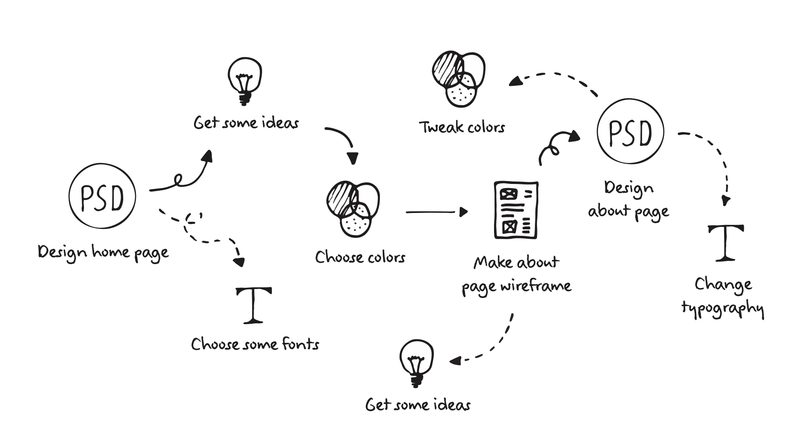
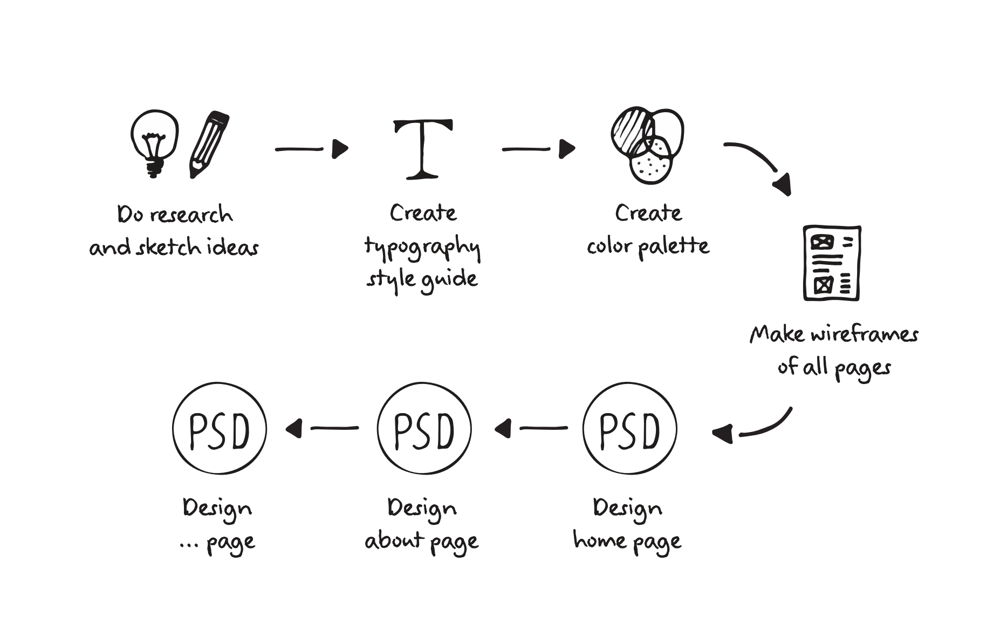
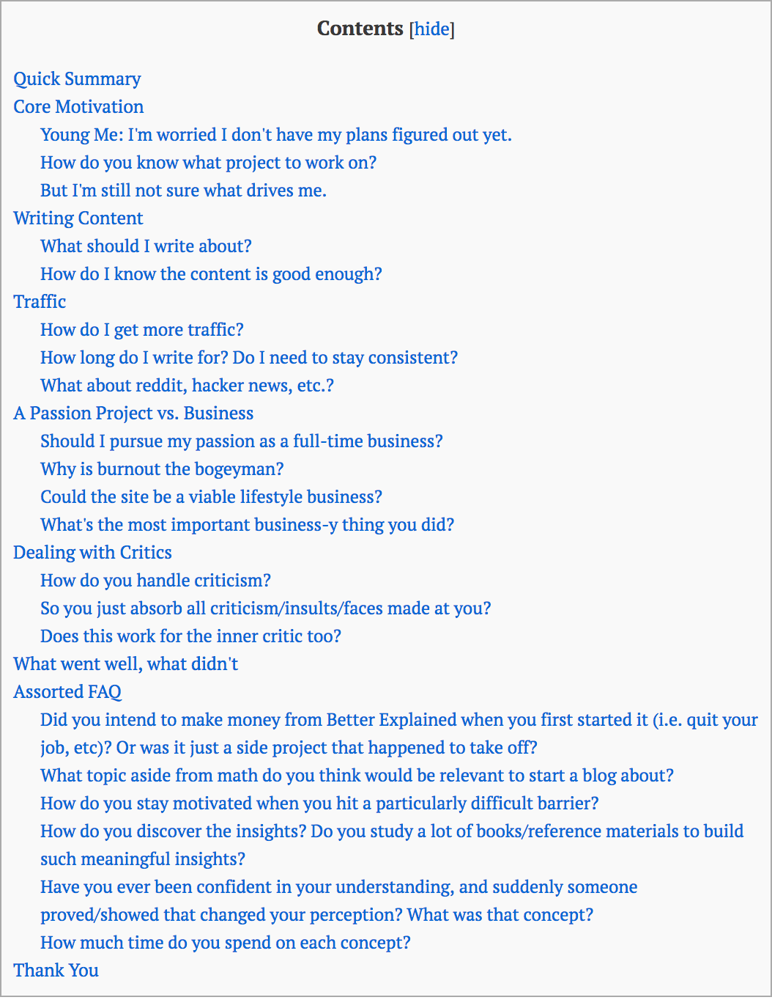
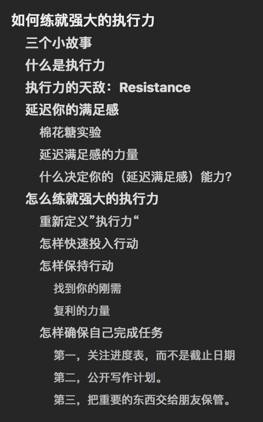

# 04.怎么写提纲

## 04.怎么写提纲

### 开始写作前

在开始写作前，我将想要弄清楚的问题，通通写了下来——【开始写作之前应该问自己的N个问题】。

你会发现：有些问题可以被归为一类。有些问题重复了。有些问题，根本不重要。有些问题，真的特重要。

当我把这些问题摊到纸上，并且反复过滤了三遍，最终留下了一系列待解决的问题。

其实，在这个过程中，我就确定写作内容了——那些待解决的问题，就是我要写的内容，即，它们也就是这本书的目录（提纲）。

### 跟设计师学列提纲

你知道网页设计师是怎么设计出那些很酷的网页吗？

Rafal Tomal是世界有名的网页设计师，他写了一本非常畅销的关于网页设计的书，The Essential Web Design Handbook。书里有这样一段话——

> 这些年，我的设计过程一直在进化。刚开始的时候，简直一团糟。因为我很容易被突如其来的灵感弄得分心，接着那些灵感和想法，就会控制整个设计过程。
>
> 最初的设计过程是这样的——

> 但这个方法是错误的。它不但消耗我大量的精力，而且，使得最后的设计稿经常显得不协调，整个页面缺少一致的风格。那时候，我意识到，如果不能调整自己的设计过程，那么再好的技巧，也展示不出来。
>
> 这是我现在的设计过程——从最开始有个想法——直到最后设计完成——

在书里，还有这么一段话——

> A good design process will help you stay on track, make you more creative, help you find better ideas, get more approvals from your clients, and even let you do your work faster and more efciently.

写书之前列出提纲和设计网页之前设定好思路，目的是一样的，让工作更有效率。

但，列出提纲不是一件容易的事情。比如，你不知道该从哪里入手，不知道如何制定一个系统的写作方案。

甚至，最大的困难在于，面对已经罗列好的提纲，你不知道该如何取舍。但无论如何，一本书的内容，是有限的，你总不会决心写一本永远完不成的书吧？

### 具体的方法论

#### 研究目录

我是通过研究非虚构性书籍的目录来确定提纲的。

在这方面，对我有启发的几本书有且不止《写作法宝：非虚构写作指南》（On Writing Well:The Classic Guide To Writing Nonfiction）、《风格的要素》（The Elements of Style）、《疯狂的简洁》（Insanely Simple）、《写给大家看的设计书》（The Non-designer's Design Book）、《把时间当做朋友》、《新生：七年就是一辈子》。

你会发现非虚构类书籍的目录基本有两种呈现方式：一类是由几大部分组成，每部分下面有几个章节，每章节下面又分成了几个小结；而另一类书籍的目录是每篇文章不分上下级，相互平行的。

你可以任意选择其中一种方式去列提纲。

另外，也许你已经发现了，在我刚刚列举的几本书中，除了前两本书之外，其他几本书和写作技巧都没多大关系。

这是因为，写作，比起来文笔，思考更加重要。就连写作类的书籍都这么说：

> Writing, a tool of thought, a means of undertaking sustained acts of inquiry and reflection.
>
> —— Writing Analytically

只有清晰的思考，才能产生清晰的写作。

很可惜的是，国内绝大多数人都容易忽略说明性书籍或者指导性书籍的重要性。以至于，他们特别容易忽略这些书籍对于写作的意义。

但如果你能认真的一字不差的反复阅读过一本优秀的（原版）说明类书籍的话，你绝对从这本书里感受到文字的力量：绝对不止那些写作技巧，还有一条甚至多条硬邦邦的“思想”在脑海里穿梭。

#### 学习Table Content

看到table content 时，很多人本能的反应：你是让我看论文吗！我当然知道绝大多数人难以忍受它的无聊，所以，我绝不会把这东西放出来的。

更何况，我发现了比论文提纲更有趣易读却同样有帮助的文章。这种文章有一个共同特征：作者会在文章里写出table contents.

比如——

> [在betterexplained.com十年的经验](https://betterexplained.com/articles/life-lessons-10-years/)（在【写什么：长青内容】那篇提到）

或者，我的稿子：

有了table content， 文章就是这么清清楚楚。

另外，如果不知道去哪里找长文看table content的话，最好的方法就是玩维基百科（Wikipedia）。每篇文章都有table content ，页面下面还附送参考链接。

#### 最重要的是完成

正如之前说的，在这本书里，你必须有所取舍。别忘了，最重要的是，你一定要完成这本书。而不是陷入无尽的纠结中。

所以，你必须给自己制定一些规则。比如，因为这是我的第一本书，所以，我的目标就是四万字。当写到5万字左右的时候，就立刻停下来，开始精剪。

有这么三种方式，保证写作进度：

第一，确定这本书的总字数。

在准备写书的时候，我就在想，一定要给自己设定一个字数目标。那么，怎样设定字数是科学的呢？

经过统计调查，最终得出以下结论：

10，000 字，相当于一本宣传册或者商业白皮书。阅读时间，30-60分钟左右。

20，000 字，相当于一个短篇电子书或者宣言（声明\)。比如，共产党宣言，大约有18，000字。阅读时间，1-2小时左右。

40，000-60，0000 字，相当于一本标准的非虚构书，或者一本中篇小说。

60，000-80，0000 字，相当于一本长篇的非虚构书，或者是一本标准小说的长度。比如，马尔科姆.格拉德维尔（Malcolm Gladwell），大部分的书都是这个长度。阅读时间，4-6小时左右。

80，000-100，000 字，相当于长篇非虚构书，或者是长篇小说。阅读时间，6-8小时左右。

100,000+ 字，相当于史诗小说、学术书籍，或者自传。比如，《乔布斯传》。

第二，确定篇数。

在写这本书的时候，我就是结合了方法一和三。即，先确定了自己要写多少字，然后通过列出提纲，得出究竟要写多少篇文章。

第三，确定每天写多少字。

之所以在这里提出这一点，是为了要提醒你：你需要关注自己每天的写作进度。

比如，我的目标是两个月内完成一本四万字的书。那么，我就可以得出每天必须完成的字数。

表面上看，我只需要完成40000/60，也就是每天完成666字即可。但实际情况远远比这复杂的多。

所以，在本书的第二部分，我会介绍许多聪明人的方法论，看他们如何克服重重障碍，最终达成目标。

