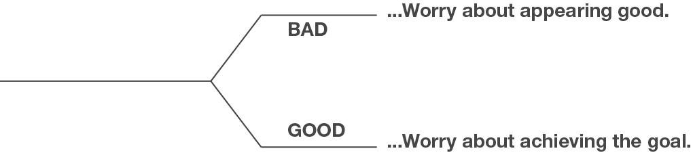

# 07.清晰写作产生清晰的思考

## 07.清晰写作产生清晰的思考

### 没有人一上来就能写好

绝大多数人在没开始的时候，会有这种心理状态：我现在写得也不好，就算了吧，就不要写书了吧；要不等到能够写好的时候，我再开始吧。

这些人没有认清事情的真相。他们完全被错误的想法蒙蔽了。因为——

> 没有人能一开始就写得好。

事实上，当你学习任何一项新技能的时候，你都不可能一上来就学得很好的。

但是，很奇怪，我们这些成年人，有一种心理在作祟，竟然觉得自己一上来就能学好。我们可以回想一件事情，刚开始学自行车的时候。谁一上来就会骑车了呢。谁不是在家长的陪伴下、搀扶下，摔了几个跟头之后学会的呢。我们早就知道那个过程的：

如果要学会一项技能，肯定是需要花费时间的，肯定是要足够努力才有可能做好的。

而现在，难道因为我们已经二十几岁了，就拥有了立刻掌握学习一门技能的魔法？假如我们开始学一门从未接触过的语言，比如德语，难道因为我们二十几岁就理所应当的能立刻说得很流利？可，作为一个初学者，我们和那些开始咿咿呀呀的小朋友有什么差别呢？

因此，想要一上来就能做好是不可能的，哪怕是做到都是极其困难的。而，由于自己一上来就做得不够好，从而放弃去做——这种想法完全是学习任何新技能的拦路虎——越早从头脑中剔除，越能得到解放。

斯坦福大学心理学教授 Carol Dweck 在Mindset 一书中指出人有两种观念模式：固定心智（fixed mindset）和成长心智（growth mindset）。

固定模式的人相信，一切是注定的，一切是天生的。比如，他们迷信“智商”是固定的，有的人天生高智商，有的人是低智商就只能一直是低智商。

而成长模式的人相信，一个人可以通过后天的努力，取得进步。他们认为付出是对的，他们坚信自己能够通过努力获得成长。

现就职于哥伦比亚商学院的 Heidi Grant Halvorson 博士在她的《成功：我们如何达成目标》一书中，基于 Carl Dweck 的理论，将人们分为两种：

> Be-good Type（表现型人格）：更关注当前的表现，常常因为害怕表现不好而直接放弃……
>
> Be-better Type（进取型人格）：更关注将来的结果，所以当前表现不佳并不影响他们继续努力……

在《原则》一书中，Ray Dalio 现身说法，表述了同样的事实：

> People who worry about looking good typically hide what they don’t know and hide their weaknesses, so they never learn how to properly deal with them and these weaknesses remain impediments in the future. These people typically try to prove that they have the answers, even when they really don’t. Why do they behave in this unproductive way? They typically believe the senseless but common view that great people are those who have the answers in their heads and don’t have weaknesses. Not only does this view not square with reality, but it also stands in the way of progress.
>
> 那些担心自己表现不够好的人，往往选择隐藏自己的弱点。但是，他们不知道的是，一旦他们选择逃避，那么就很难学会处理自己的弱点，并且这些弱点，在未来还是会反复出现。这些人，会让自己看起来无所不知（have anwsers），即便，事实上，他们根本没有答案。为什么他们要让自己变得这么低效呢？他们和绝大多数人一样都存在的这样的误解：那些厉害的人是一定无所不知的，是一定没有弱点的。然而这样的误解，既与现实相悖，有阻碍进步。
>
> One of my biggest weaknesses is my poor rote memory: I have trouble remembering things that don’t have reasons for being what they are, such as names, phone numbers, spellings, and addresses. Also, I am terrible at doing tasks that require little or no logic, especially if I have to do them repeatedly. On the other hand, I have a great contextual memory and good logic, and I can devote myself to things that interest me for untold hours. I don’t know how much of what I am bad at is just the other side of what I am good at...But I do know that I have created compensating approaches so that what I am bad at doesn’t hurt me much; e.g., I surround myself with people who have good rote memories who do the things that I am bad at, and I carry around tools like my BlackBerry.
>
> 我最大的一个缺陷是固定记忆：我对任何没有来由的事物都有记忆障碍。比如，名字、电话号码、拼写、地址。我在没有逻辑的任务中表现也很糟糕。不过，我又有很好的情景记忆能力和逻辑思维。在我真正有兴趣的事情上，我乐此不疲。我不清楚，是不是由于我在某些方面表现太差劲，所以在另外一面上表现得就杰出。这是一种自然的补偿。我知道，我也得想办法去补足自己的弱点，比如，我周围有很多擅长固定记忆的人，他们擅长的恰恰是我不擅长的。我需要和这些人交往。

优秀的人心甘情愿地忍受自己的笨拙，忍受自己的低下，忍受各种各样浪费注意力的诱惑——或者说根本不需要忍受。因为，他们清楚，最终，是会成长的。

回到写书这件事上：

1.坚信成长

我很清楚自己现在做得还不够好。但我能清楚地感受到每天的细微的变化，那个就是成长。一旦感受到自己的进步，就越兴奋，越有信心，同样，就再也无法忍受停滞不前和畏畏缩缩了。

2.坚信时间的力量

我很清楚自己现在做得还不够好。但我知道，成长是需要时间的。

比尔盖茨18岁开始创业，不过，他13岁就开始学计算机编程了；安迪沃霍尔26岁时获得了美国平面设计学会杰出成就奖，不过，他6岁就开始学画画了；鲍勃迪伦，23岁因一首 Blowing in the Wind 出名，不过，他高中时就开始组建乐队了；科比布莱恩17岁就进入NBA打球了，不过，据他自己说，两岁的时候就开始打篮球。

成为天才是需要时间的。

3.行动

我很清楚自己现在做得还不够好。但我必须行动。计划的再多，也不如行动。于是，每天都要写。

超级网红安迪沃霍尔说：

> Don't think about making art, get it done. Let everybody else decide if it's good or bad, whether they love it or hate it. While they deciding, make even more art.
>
> 不要想着去创造艺术，先做再说。让其他人去决定它的好坏，以及喜欢还是讨厌。当他们在做决定的时候，你就创造更多的作品。

清晰的写作产生清晰的思考。于是，我们必须掌握两件事：明确概念和学会提问。

### 明确概念

2007年8月，金融界发生震荡，高盛集团CEO称之为“二十五标准差事件，且连续数天发生”。《金钱周刊》有篇文章报道，“原本应该十万年才发生的事，接二连三的发生了。”2010年，The Gartman Letter 创始人 Dennis Gartman 写到，“昨天我们目睹的一系列震荡是前所未有的，货币价格偏离正态分布六、七、八个标准差...甚至十二个标准差也不为过。”

上面说的的标准差，就是另一种形容极度不可能发生事件的说法。下面的表格会让你对标准差有更直观的认识。

那么，以上几乎不可能发生的事情，怎么就接二连三发生了呢？Bonner 说完这件事十万年才会发生一次后，又补充道“如果不是这样，那就是高盛的模型出了差错。”

没错，他们的模型确实错了。事实上，这些模型都建立在价格波动呈正态分布的假设基础上。如果这个模型前提是错误的，如果价格波动并不是呈正态分布，那么此类金融危机就是可预期的。

正态分布和柯西分布的形状，并没有相差太多，很容易混淆。你以为所面对的是正态分布，实际上却是柯西分布。而，它们之间的差别竟有这么巨大——

由于不清楚“正态分布”和“柯西分布”这两个概念，华尔街的记者闹出许多笑话。不过，这件事也带给我们一个启发：

> 概念的重要性

事实上，很多时候，之所以我们的思考不正确，是因为，我们对那件事情根本就没有概念。

即，如果没有准确、清晰、完整的概念，我们就很难去做出正确的思考。

比如，曾有一度，我因为概念不清，错过了结识“贵人”的机会。

我特别讨厌那些“抱大腿”的人。比如，明星相互蹭热搜啊。学生给老师送礼。我甚至还觉得，请牛人为自己的新书作序，这种行为，都是在抱大腿。

但是，尽管有些新生代作家和创业者，他们做出了“抱大腿”的行为，但我还特别认可并且喜欢他们。

你看，我讨厌“抱大腿”这种行为。我却从心底里认可那些做出“抱大腿”行为的人。

对“同一件事情产生了两种想法”，这太矛盾了，所以肯定哪里不对。

究竟哪里不对呢？

后来我想到了——我根本没有弄清楚“抱大腿”这个概念啊。

我是不是可以理解（正确的理解应该是），新生作者请牛人为自己作序，这其实是，一种“有价值的社交”。用当下的话来讲，这就是在发放“社交货币”而已。

“有价值的社交”与“抱大腿”，完全不是一个概念。而，我竟然愚蠢的把“有价值的社交”当做“抱大腿”，以至于拒绝向比我厉害的人寻求帮助或者说不好意思主动去帮助比我厉害的人。最终，错过了发放“社交货币”的机会。

而，其实很多年前，就有一个人把“有价值的社交”这件事儿研究透彻了。这个人，你肯定认识。

> 他出生在农村，因为他的伯父把他带到城里去读书，后来参加了地质队，在全国如火如荼进行活动的时候，他没有参与过，他在深山老林里。六十年代中期的时候，他写了篇文章发表，然后遭到批评，说他满脑子资产阶级思想。
>
> 然后他就想自己干点什么事才能出人头地，还能不涉及意识形态，想了很久他想到写字，写字总可以了吧。然后他就开始练字，后来写得很好，写了一本字帖，然后就投稿，六年没人给他发表，六年没人出版。但是他做一件非常非常心机的事情。
>
> 大概在1974年、1975年、1976年的时候，他每半年就要自费买火车票来北京一趟，看看北京发生什么变化，每来一看，没变化就回去了。六七趟之后他得到一个信息，文怀沙出狱了。他觉得大势来了，就冲了过去拜访文怀沙同学，表达了对文怀沙的景仰。
>
> 一个在监狱里待那么久没人理的人，现在千里迢迢来了个人跟你说，师傅你终于出来了，你会是什么感受？文怀沙看了他的字帖，又看他人仪表堂堂，字也写得非常非常漂亮，但字帖却六年都没有得到出版。
>
> 接下来有了文怀沙的支持，有了当时文化部部长的推荐，这本字帖顺利出版了。庞中华的字帖一下子遍布大江南北，然后就有了大家对于他的记忆。
>
> 最猛的时候，中国城市人口人均三本庞中华的字帖。今天我们还在想知识如何变现，人家是直接套现。这个历史上早就发生了。在接下来的30年里他出版了457本字帖，他的版税率有多高？35%。今天没有听说谁能拿到这么高的版税。

庞中华可是知识分子啊。那时候的知识分子，脸皮总是薄的，最怕被人说三道四。可庞中华不一样，他清楚地知道“社交”和“抱大腿”的区别，他不认为自己的做法是在“抱大腿”，于是，就这么勇猛地去发放社交货币了。结果，他成功了。

为什么要强调概念对于思考、写作的重要性呢？

因为价值观是由一个接一个的概念构成的。如果你没有准确、清晰、完整的概念，如果其中某个概念出错，那你的价值观必然受到影响。价值观决定行动。于是，行动就必然出错。

在错误的道路上越行越远，又有什么意义呢？

#### 学会提问

Tim Ferriss 在普林斯顿大学讲课的时候给学生设置了一个任务：想方设法得到看起来不可能得到的名人（比如，比尔盖茨、埃隆马斯克、比尔克林顿）的邮箱，并且还要他们回答自己提出的三个问题，最起码其中一个要得到回复。当然，他还做出了许诺，谁能够做到，就获得他送的去往世界任何地方的往返机票。

第一年，全班有20个学生，结果都失败了。

第二年，他布置了同样的任务以及给予了同样奖励。不过，这一次，他提前告诉了这届学生一个策略。

结果令人惊讶，17个人中有6个在48小时内就完成了任务。有的人得到了市长的个人邮箱，有的则拿到了畅销书作者的邮箱。不过，值得一提的是，有一个学生（Marrinan）竟然要到了Google 创始人埃里克·施密特的邮箱。

Ferriss 在 The 4-Hour Workweek 书中公开了他要求学生这么做的原因，并且分享了要到名人联系方式的技巧：

> 我相信成功是可以被测量的，尤其是当你在不得不去面对不舒服的对话的时候。我觉得如果能够帮助他们克服被冷冰冰的电话或者邮件等这种被拒绝的恐惧，这会让他们永远地得到解放。事实上，每个人都容易低估自己，但是当你看到身边的同学都能做到看起来不可能做到的事情，比如要到乔治布什、迪士尼CEO、谷歌CEO等人的邮箱时，你会重新考虑自己的潜能。
>
> 事实上，我每天都这么训练自己：找到一个人的邮箱（通常是从博客里获得的信息），写2-3段话表明我熟悉他们的工作，然后提出一个容易得到回答并且相当聪明的问题。我的目标是，通过这个问题创造出一个可持续对话的语境，而不是单纯的像他们寻求帮助。

事实上，Tim Ferriss 的提问技巧和 Eric Raymond 所写的《聪明的提问》[（How To Ask Questions The Smart Way）](http://www.catb.org/esr/faqs/smart-questions.html)里提到的技巧异曲同工。

Eric Raymond，是《大教堂与市集》的作者、《新黑客词典》的维护人，被广泛公认为是开放源代码运动的主要领导者之一，并且是最为大众所知道的黑客。

而 Tim Ferriss，美国普林斯顿大学企业管理客座讲师，Google、PayPal 等创意公司的受邀演讲人。在全球范围内分身为企业家、作家、演员、武者和舞者。能说六门外语：中文、韩文、日文、德语、西班牙语、意大利语。曾获中国散打全美冠军，保持一项探戈舞吉尼斯世界纪录。

总之，两位都是极其聪明的人。

这两位提倡的聪明的提问的共通之处主要有三点：

> 1.做足自己本该做好的功课。 2.提出有启发性的问题 3.创造对话语境。

如果真心想要得到对方的回答，就必须做足功课。

在你提问之前，不妨先Google，这个问题是否已经有了解决的方法。不要着急，不要指望Google在几秒钟就能解决问题。要想一想，你提问的方式和方法是否正确。也就是要学会“聪明的使用Google”。

然后，再将问题仔细过滤一遍。因为草率的问题只可能得到草率的答案。你越是能够证明自己功课准备的充足，越能够得到回答者的重视。

最起码应该做到：

> 使用清晰、准确、完整的标题 将所有的问题，精简压缩到少于三个 用清晰、正确、精准并合乎文法的语句 使用易于读取且标准的文件格式发送问题 精确地描述问题，要言之有物 话不在多而在精 描述问题症状而不是你的猜测 清楚表达你的问题以及需求 去掉无意义的提问句、感叹词 即便很紧急，而不要在标题上写着“加急” 要有礼貌

除此之外，Eric Raymond 还提到一个技巧：

> 表明你愿意在寻找答案的时候做点什么会是一个好的开始。像是“谁能给点提示？”“我这个例子还缺什么？”“我应该去哪个网站查？”，这比“请告诉我具体进程”更容易得到回复。
>
> 这是因为你表明了只要有人指明方向，自己就有解决这个问题的决心。

要明确一件事：不要以为自己一定有资格得到答案；你并没有。毕竟，你没有为这个问题付费，不是吗？

因此，你需要提出一个有内容的、有趣的、能够激发回答者灵感的问题，靠着这样一个好问题去赚答案。

最后，创造对话的语境。这是提问的终极技巧，也是对提问者最好的结果。而前两条，“做足自己本该做好的功课”和“提出有启发性的问题”都是创造对话语境的基础。

Tim Ferriss 在谈到自己为什么能迅速学会一项技能的时候，提到两个对他最重要的技巧，一是冥想练习，另一个就是提出更好的问题。下面一段话，他说出了提问的实质——

> Thinking is a process of asking questions. You're asking yourself questions and then you're answering them in your own head. So if you get better at asking other people questions, you get better at asking yourself questions which means you're improving your thought performance and level of thinking.
>
> 思考，是不断提问的过程。当你对自己提问的时候，你一定会在脑海里搜索答案。因此，如果你能够更好地提问，那么，你将会越来越擅长对自己提问题，从而提高你的思考能力。

### 最后

什么是写作？

William Zinsser 在写作圣经 On Writing 写道：

> Writing is thinking on paper. Anyone who thinks clearly can write clearly, about anything at all.
>
> 写作是纸上的思考。任何想法清晰的人都可以做到清晰地写作。

哲学家、语言学家 Ludwig Wittgenstein 对思考和表达的表述也是鞭辟入里：

> Everything that can be thought at all can be thought clearly. Everything that can be said can be said clearly.
>
> 一切能被思考的都能清晰地思考；一切能用语言表达的都能清楚地表达。

清晰的写作产生清晰的思考。清晰的思考产生清晰的写作。明确概念、学会提问，是基本功。

