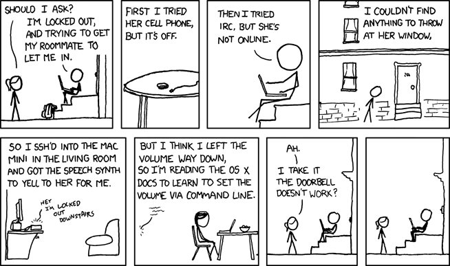
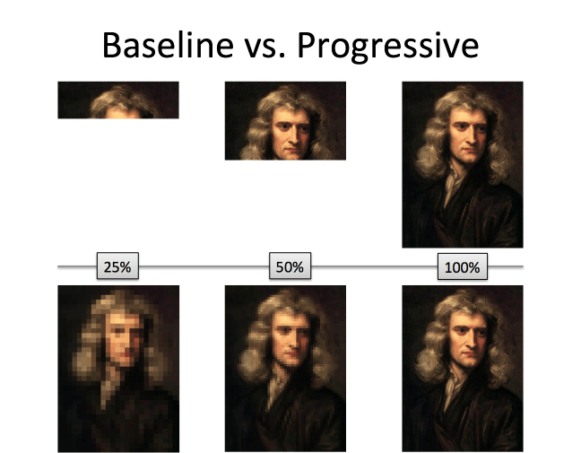
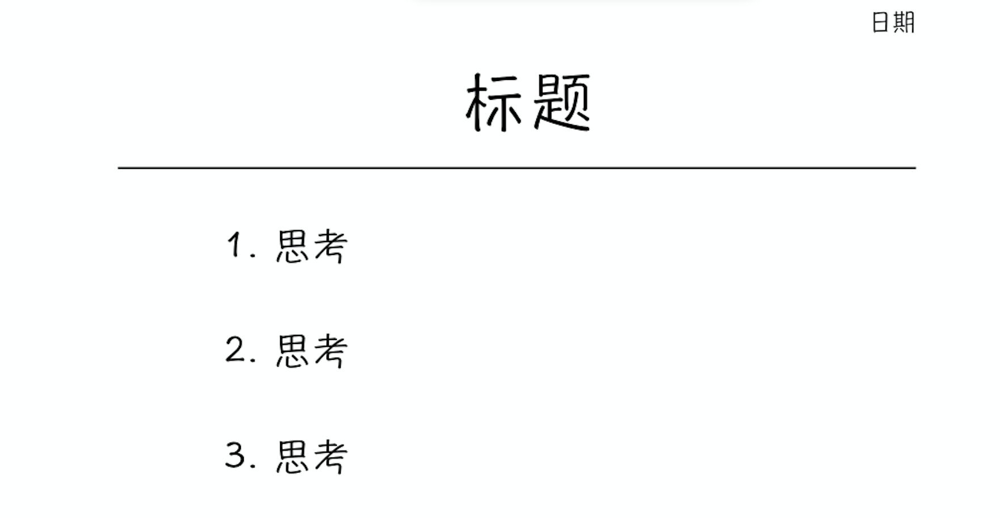
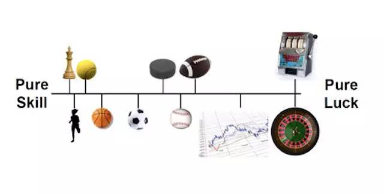
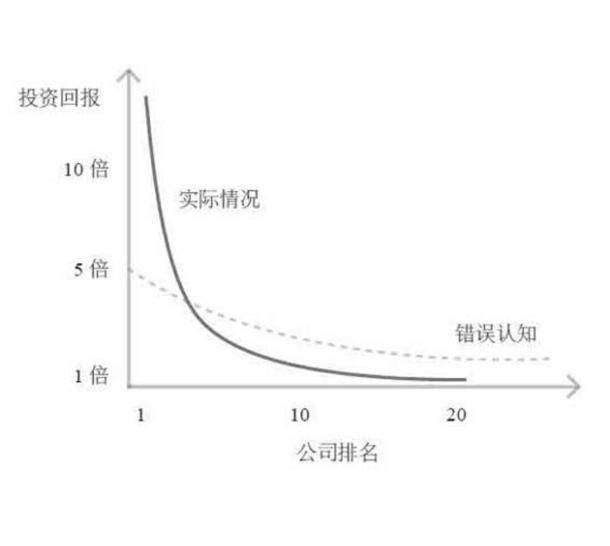
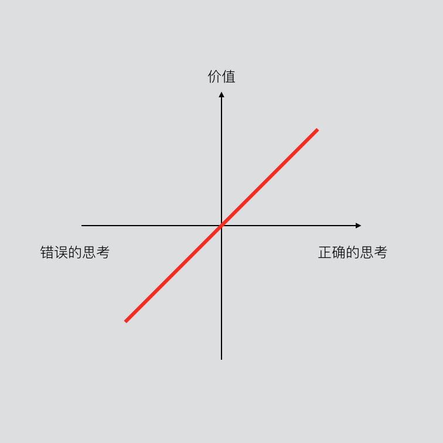

# 08.思考工具

## 08.思考工具

### 锤子和钉子

有这么一句古老的箴言：

> 如果你手中有一把锤子，所有的东西看上去都像是钉子。

手中有锤，就容易形成思维定式：无论遇到什么问题，先抡上黄金大锤再说，至于有没有用，那就另当别论了。并且，事情过去后，还颇为得意，因为，咱毕竟是有锤子的人。（不过，没有锤子又万万不可，谁会蠢到徒手钉钉呢。）

然而大脑仅仅是大脑本身，它并不能够代表我们。所以，运用心智之后的正确做法应该是——

> 手中有锤，心中无锤。

无论如何，你手中要有工具。但是，不要因为自己手中有它，不论什么情况下，都习惯性拿出来挥舞一番。不同的工具，适用于不同的情景。

在《穷查理宝典》中，查理芒格说，在他追求知识的过程中，有两种思维习惯起到了很大的作用：

> 第一，我总是试图通过韦德的代数学加雅各比提倡的逆向思维来考虑问题。雅各比说，“反过来想，总是反过来想”。我得到正确判断的办法，通常是先收集各种错误判断的例子，然后仔细考虑该怎样避免得到这些下场。
>
> 第二，我非常热衷于收集错误判断的例子，所以我完全无视不同行业、不同学科之间的界限。毕竟，既然其他行业有许多重大的、容易发现的愚蠢事例，我为什么还要在自己的领地上搜寻某些无足轻重的、难以发现的新蠢事呢？
>
> 除此之外，我已经明白现实世界的问题不会恰好落在某个学科的界限之内。它们跨越了界限。如果两种事物存在密不可分的相互关系，我认为那种试图考虑其中一种事物而无视另一种事物的方法是很值得怀疑的。

我们需要一个藏宝箱，收集各种思考工具，需要的时候，都得拿，更加有的选。

### 一、用类比思考

我们先看一张图片——

它讲的是一幅画是怎么形成的——很明显，有两种方式：Baseline和Prograssive。 其实，一幅画的形成过程与我们学习新知的过程很相似。那么，以上两个方式，哪种更好呢？

多数人有这样的误区：学习一定要循序渐进（Baseline）——只有掌握了细节，才算是学会，才可以去学以致用。

事实上，大脑在学习新知的初期，是很痛苦的。而一点一点挖掘细节的方式，相当于在给大脑一遍又一遍上刑。大脑乐意这么学习才有鬼！因此，想办法缩短大脑的疼痛期——让大脑从新知迅速进入已知状态（舒适区），接下来的学习便会轻松很多。

类比，就是能够让大脑迅速进入已知状态的最佳工具之一。

#### 定义

> Analogy is a cognitive process of transferring information or meaning from a particular subject \(the analogue or source\) to another \(the target\), or a linguistic expression corresponding to such a process.
>
> 类比是一种认知过程，它是将信息或者涵义，从一个特定的物体传递到另一个物体；类比是一种语言的表达，这个表达同样是传递的过程。

我们其实可以把“类比”这个概念，理解为一种交通工具，比如，大巴——它将你从一个熟悉的地方，载到一个陌生的地方。

需要注意的是——

类比，最直接的目的，是让我们快速了解新知。所以，在这个过程中，我们需要借助已知（经验）中与新知有共同点的部分，了解新知。

因此，这个已知（经验）越简单越好，这样便于快速理解新知；已知与新知之间的共同点越多越好，这样才能深入理解新知。

#### 应用场景

大部分人最初接触“类比”这个概念应该是在作文课上。那时候老师讲，类比，它是一种修辞手法，接着会罗列几个文学作品里的例子。《围城》里面就有很多，比如——

> 他身大而心不大，像个空心大萝卜；
>
> 这一张文凭仿佛有亚当夏娃下身那片树叶的功用，可以遮羞包丑，小小一张方纸能把一个人的空疏愚笨寡陋都掩盖起来。

不过，类比并不仅仅是写作中的一种修辞技巧。语文老师没有告诉你的是——类比是一种重要的学习方法，在记忆、沟通与问题交流中扮演重要角色；在生物、化学、物理、科技、心里学等各个领域都有其不同定义。举几个例子——

在物理学中，原子中的原子核以及电子组成的轨域，可以类比成太阳系中行星环绕太阳；电流和电压，可以理解为水流和水压。

在法律（美国法律）中，每一个判例都会成为法律准则和今后的行为规范，因此今天在美国做事情的很多原则都能追溯到过去某一个重要的判例上。

在生物学中，有个概念叫做“趋同演化”（Convergent Evolution）。它指两种没有亲缘关系的动物长期生活在相同或者相似的环境（生态系统），它们因需要而发展出相同功能器官的现象。比如，人类和狐猴类，同属于灵长类动物，都有棕色和蓝色的眼睛；鱼类和鲸豚类都有流线型的外观和鳍肢...

这么看，貌似每个学科都与类比”有关系呢。

事实上，类比是很实用的思考工具，跟字典似得。不过，字典上的解释是固定的；类比会随着你主动琢磨，能更新能升级。

#### 类比影响思维

类比是影响思维的。而思维影响选择。选择决定行动。行动构成命运。

一个“类比”用的不小心、不恰当，真的很有可能就“改运”了呢...

> 寻找更为恰当，更为准确的类比，其实不是像很多人想的那样，“不就是个说法嘛？！” 因为说法根本不重要，重要的是说法、想法可能引发的是最重要的东西：行动。

李笑来在《我的跨界秘籍——苍蝇与蜜蜂的启示》中分享了这样一个故事——

> 美国密执安大学教授卡尔·韦克讲述过一个奇妙的实验：
>
> > 把一群蜜蜂和苍蝇装进同一个玻璃瓶里，将瓶子横着放平，让瓶底朝着窗口，看它们会有什么结果？那些向来善飞而又勤劳的小蜜蜂不停地在瓶底附近飞舞，一次一次撞到瓶底，企图找到出口，直到筋疲力尽，累饿而死。苍蝇可不管什么瓶底和瓶口，哪里光明还是黑暗，在瓶子里乱撞，不到两分钟的功夫，纷纷从瓶子口逃之夭夭。
>
> 卡尔·韦克的总结如下：
>
> > 这件事说明，实验、坚持不懈、试错、冒险、即兴发挥、最佳途径、迂回前进、混乱、刻板和随机应变，所有这些都有助于应付变化。

后来，他补充道——

> 可是，除此之外，我更多看到的是另外一回事儿。
>
> > 蜜蜂在这个情况下显得过于“只有一根筋”，所以才吃亏。苍蝇相对于蜜蜂，并没有更聪明或者更愚蠢，或许苍蝇也一样是“只有一根筋”，只不过当前的局面对苍蝇的行为模式更有利罢了。
>
> 试想一下，
>
> > 咱不用那只瓶底透明的瓶子了；而是做个暗箱，只开个小孔，透进一点弱光。把苍蝇和蜜蜂放进去，结果会怎样？肯定是蜜蜂会顺着光率先飞出来，而乱飞乱撞的苍蝇呢？估计也有累死在里面的，因为靠乱飞乱撞碰到那个小孔的概率其实并不高、甚至很低……箱子越大苍蝇能飞出去的概率就越低。
>
> 于是，我的总结是这样的：
>
> 无论是谁，若是只有一根筋，总有一天会倒霉。

他说，在刚刚冲进一个新领域的时候，他会把自己调整成“苍蝇模式”。他知道自己还没建立”正确的敏感“，所以，乱打乱撞实际上就是最佳的选择。

而，找到门道之后，他会马上将自己调成”蜜蜂模式“。既然自己已经有了正确的敏感，就应该不断打磨那个敏感，让那个敏感为自己所用，让自己飞得更远、更高。

当我宣称自己正在写一本书的时候，很多新人（还没开始写作的他们）问我，怎么样建立自己的写作系统呢？

我的回答通常是：写着写着就知道了。

开始写作的前5个月，我根本没有任何方向，反正自己不缺素材，又有时间，所以，无论是关于设计、演讲、商业、经济、哲学，这些话题，我都写过来了。后面越写越发现，自己最想要写的话题是”个人成长“，所以，干脆在这方面”最认真“。直到决定写这本书，所谓的”体系“才有了雏形。

事实上，我的做法，就是在”苍蝇模式“与”蜜蜂模式“间转换。

#### 让别人更好的理解你

当你能琢磨出一个好的“类比”时，也许你不明白的未知，就自动变成已知了。因为，在琢磨类比的过程中，你需要不断地提取以往的知识（经验）与新知匹配。这个匹配过程可能需要十几次，甚至几十次。每一次匹配，都相当于重新接触一次新的知识。最终结果可能是，你不再需要这个类比，就已经学会了新的知识。

使用类比的另一个好处是：你不仅能够理解新知；你还能够通过类比，帮助别人建立新知，即，通过类比，让别人迅速理解你要表达的东西。

比如——

> 我们都有这样的感受——每当遇到一个想不通的问题时，总是习惯盯着问题看，却往往找不到答案。
>
> 如果问题是一把锁，那么你也知道盯住锁头本身，是不可能打开门的吧。所以，此时，我们的做法应该是寻找钥匙吧。
>
> 换言之，我们不要盯着问题本身（反正盯着问题也无法解决），而是应该转身去寻找答案。
>
> 李笑来《通往财富自由之路》

再比如——

> 书写是对思维的备忘：人在思考一个问题的时候，就像是在黑暗中打着电筒往前走（事实上，我们的工作记忆资源是有限的，有研究证明我们只能在工作记忆里面持有7加减2个项目；此外认知负荷也是有极限的），每一步推导都将我们往前挪一小步，然而电筒的光亮能照到的范围是有限的，我们走了几步发现后面又黑了，想到后面就忘了前面的，想到某个分支上去就忘了另一个分支，我们常常想着想着就想岔了，想岔了也就罢了，问题是一旦想岔了太远，就很难回到当初岔开的地方了。有时候，我们是如此努力地试图一下就走出很远，同时又老是怕忘记目前已经取得的进展和重要结论，结果意识的微光就在一个很小的范围内打转，始终无法往前走出很远。而将思维过程记录下来，则给了我们完全的回溯自己的思维轨迹的可能。
>
> 刘未鹏《书写是为了更好的思考》

#### 方法

虽然想出的类比速度或快或慢，质量或好或坏，我们总还是有办法的——

1.把概念刻在脑子里

> 心理学家和人类学家们早就注意到这么一个事实：
>
> 如果一个概念在某个文化里并不存在，那么，那个“客观存在”在那个文化里“主观上并不存在”，即，那个文化里的人对那个客观存在无任何感知。反之，若是一个概念存在，即便它并不是一种客观存在，人们还是可以从主观上感知。

简言之，要时刻意识到——类比这种学习方法，可以帮我快速了解新知。

2.确定目标

这一步，就是要我们确定要学习的新知是什么。

3.用上经验

其实，大部分的新知都是我们已知（经验）的变形、扩展和组合。

比如，电流和电压可以看成是水流和水压。那么，怎么理解电阻呢？我们可以思考哪个物体可以类比成电阻，并且还要与水流水压有关联。可能的类比是：把电阻看成是水管。水管的材质、大小影响水流值、两端水压值；同样，电阻的材质、大小也会改变电流和电压。

虽然一个类比不可能100%准确，但它却非常有用，不是吗？

4.优化测试

每当完成了一个类比时，我们要问问自己——

* 这个类比，是否合理？
* 它还有哪些不完整的地方？
* 我能不能换个角度，琢磨出新的类比，最终确定到底哪个类比更合适？
* 这个类比真的对我有帮助吗，我是不是真的理解了新知？
* 我能够清楚解释给他人吗？

5.“10岁原则”

我们把这个类比讲给10岁的小孩子听，她/他能不能听得懂？

我们说过，类比很酷的一点就是能让人听懂你说的话，从而不会误解你的意思——这个前提是使用的类比足够简单。假如我们使用非常冷门、复杂的类比，那么类比就失去它的意义了。

一位老奶奶问爱因斯坦相对论是什么？如果爱因斯坦告诉她说，亲爱的太太，相对论就是E=mC^2 。 E是光子能量，M是质量，C是光速……估计老太太会晕过去。

但是如果爱因斯坦这么说，“亲爱的太太，相对论就是这样的情况，如果你做好饭在家等你儿子回家吃饭，如果时间过去了五分钟，您觉得时间长不长呢？”，老太太:“长，是觉得长，好像过了半小时一样！”爱因斯坦:“这就是相对论”。

真正的牛人，不是把道理（理论、事情）解释的越来越复杂，而是将复杂的道理说的简单再简单了。

好的类比，就是简单再简单。

### 二、零秒思考

日本咨询大师赤羽雄二在麦肯锡工作的时候，每天要做10张笔记，然后，晚上的时候，会把这些笔记再做一次整理。久而久之，他发现这么做法极大地锻炼了思考能力。

他创建了一个锻炼思考能力的模型，并将其称之为“零秒思考”。

这个方法很简单，分为两步——

准备一张A4纸，横着放。在最上面一行写上你正在思考的问题，也就是标题。需要注意的是，这个标题最好用问题的形式呈现，这样的好处是加深印象。

然后，在标题下面画一条横线。横线下面就是你对这个问题的思考。注意，一张纸，只写三个要点。如果多余三个要点，就再换另一张纸。

 

当你持续地这么做了之后，你会发现不但思考能力更加深入，逻辑能力也加强了。

不过，在“零秒思考”这个操作过程中，你还需要注意三点——

1.每张纸只写一个问题。 2.整个过程不要超过一分钟。 3.每个要点，不要超过20个字。换言之，整张纸，不要超过100个字。

之所以这么做，是因为它背后的三大机理——

1.工作记忆。

大脑的工作记忆只有四格。即便你脑袋有再多好的想法，你也是只能同时记住四件事而已。然而，好的想法转瞬即逝。所以你有必要将它整理出来。

2.手眼脑并用。

你会发现，“零秒思考”需要手眼脑的合作，将脑袋里的不可捉摸的思考，变成可视觉化的问题+要点。

3.触发微习惯

很多研究行为习惯的大师，都会告诉别人，如果你想要养成一个习惯，你需要从最小的行为开始。比如，你想要养成跑步的习惯，那么，你可以从一天只跑一分钟开始。由于每天跑一分钟，非常容易，所以，你会可以去做。这就是微习惯形成的秘诀。

“零秒思考”要求在一分钟内完成，并且不能超过100个字。这两个要求超级简单，是不用费力就可以做到的事情。所以，你会乐意天天去做，天天都在训练思维能力，久而久之，养成一种运用思维工具的思考习惯。

### 三、曼陀罗九宫格

曼陀罗思考法开源于日本思考大师泉浩晃，它的目标是将“知识”转化为实践的“智慧”。它将笔记分为九个区域，形成能诱发潜能的“魔术方块”。

> 逐条记录的笔记很难使人产生独特的想法和创意，因为思想唯有在向四面八方发展之时才可能产生创意，这种根据直线循规蹈矩的思考方式，称为“直线式思考”。
>
> 相反，曼陀罗九宫格能在任何一个区域（方格）内写下任何事项，从四面八方针对主题做审视，这是一种“视觉式思考”。
>
> 人类思考必在感觉器官感觉事物之后，方能利用曼陀罗图形予以系统化，给予有方向感的利用，潜能便可在连续反应下持续被激发。

最基础的模式，通常指的是“5W1H”模式。不管是什么问题，都可以用这个模式去获取更多信息。另外，How本身就是一种询问过程，它是融合在5W当中的，不管你在思考哪一个W，都可以把How的精神跟态度加进来。

 

你可以看到，这是一种发散性的思考方式。不过，本书重点要介绍的是另外一种思考方式：曼陀罗”顺时针“九宫格。

#### 如何快速掌握一个主题

举个例子，假设你要研究一个主题。你可以这么做——

1.输入。 买关于这个主题的书籍，5到10本。

2.设定目标。 将你要研究的主题写到九宫格最中心位置。

3.提取。 从这些书中提取出3个核心点。看5本书是三个要点，10本书也是三个要点。不多不少，只能三个。这样做的好处在于，你必须学会取舍，从而提炼出真正重要的东西。

4.创造。 当你在做取舍的过程中，有极大的可能，会产生你自己对于这个主题的想法，也就是你的”洞见“。在国外，也就是”A-ha Moment“（顿悟时刻）。

5.迭代。 当你产生了自己的洞见时，你要继续思考，你的洞见能否被解构（这是，你完全利用”零秒思考“的模型继续做推演），或者，你的洞见能否与得到的三个核心点重组，从而得到一个新的洞见。

6.论证。 你需要搜寻一些案例（人、事、物）去论证你的洞见是否成立。

7.修改。 你要继续试试看，能不能改变一下你的洞见，来一个”加减乘除“的创意手法。加一加什么东西进去看看？减一减某些元素会怎样？连一连（相乘的观念）其他不相关因子看看有什么变化？断舍离（除法的概念），或许能用更加简洁的方式学会这个主题？

8.实践。 多说不练假把戏。不过在行动之前，你需要想两件事:第一，如果去做的话，我会失去什么，又，我能得到什么；第二，如果不去做的话呢？

最后，做一个反馈，通过以上八个步骤，你是否有掌握这个主题？

完成这个过程，你就能够创造出属于自己的结构化思维方式。

当然，这只是一个框架。面对不同的问题，你可以主动做出调整。无论怎样，工具，是用来为人民服务的。

### 四、简易的工具

1.线条

  

在 The Success Equation 中，作者 Michael J. Mauboussin 用一根带刻度的直线说明了运气和技能的关系。有些活动，运气的成分居多；有些活动，技能的成分居多。

我们可以把自己的职业放在相应的位置上，然后判断，到底自己处在哪个位置上。亦或，纯靠运气的活动，就干脆不要做了吧......

2.平面坐标

事实上，平面坐标（Coordinate），这东西是偶尔才发现的。有段时间，笛卡尔生病了，整天躺床上。有一天，他看到天花板上有个苍蝇。他实在太闲了，就开始琢磨，到底怎么才能确定那个苍蝇的位置呢？于是，平面坐标产生了......

有了坐标，我们就有了函数。

**幂函数**

我们可以看到在彼得·蒂尔（硅谷创投教父，Paypal创始人）《从0到1》的书里的一段内容:  

公司排名与投资回报的关系

> 我们创始人基金的绩效表现解释了这个扭曲的模式:Facebook,是我们2005年的投资组合里表现最好的，回报比其他所投资公司加起来的还要多。帕兰提尔是表现第二好的公司，带来的回报比刨除Facebook外所有公司加起来的还要多。这个高度不平均的模式并非偶然，我们的其他基金也都出现过这种情况。
>
> 风险投资中最大的秘密是:成功基金的最佳投资所获得的回报要等于或者超过其他所有投资对象的总和！

3.矩阵图

要选择什么样的事情做？（《高效能人士的七个习惯》）

|  | 重要的 | 不重要的 |
| :--- | :--- | :--- |
| 紧急的 |  |  |
| 不紧急的 |  |  |

为什么要做一些不喜欢做的事情？（《把时间当做朋友》）

|  | 有趣的 | 无趣的 |
| :--- | :--- | :--- |
| 有用的 |  |  |
| 无用的 |  |  |

自我认知与他人对自己的认知之间的差异？乔哈里窗格（[Johari Window](https://en.wikipedia.org/wiki/Johari_window)）

|  | 自己已知的 | 自己未知的 |
| :--- | :--- | :--- |
| 他人已知的 |  |  |
| 他人未知的 |  |  |

### 总结

人人都自认为会（能）思考。

甚至连鱼也懂得最简单的思考（归纳）。比如，一只大鱼看到小鱼，就知道，我可以吃掉它。遇到和它一样大的物种，就不再做任何行动。而遇到比它还大的鱼时，就干脆掉头就走。

> 但是，会思考绝不等同于“会正确的思考”。

一个硬邦邦的事实：

思考的越正确，价值就越大。反之，亦然。

比如，巴菲特和查理芒格。买入的股票，基本上就不怎么动了。因为在买之前，已经花了大量的时间去思考，确定某只股票是否有价值。在买完之后，只需要静静地等待那个果实。

而对有些人来说，他们连最基本的“婚姻”和“爱情”的概念都区分不清，以至于，婚后一点也不“幸福”。这，无非就是没有正确的思考能力的结果之一罢了。

当然了，正确的思考能力，又不是一天就能学会并且做到的。总要有个过程的。

Portia Nelson 有一首名为 [Autobiography in Five Chapter](https://en.wikipedia.org/wiki/Portia_Nelson#Writing)（自传·五短章）的诗，就讲述了思考能力提升的过程：

第一章

> 我走在街上 人行道上有个深坑 我掉进去了 我很迷惘...我很无助 但这并不是我的错 仿佛永远都找不到出路

第二章

> 我走在同样的街道 人行道上有个深坑 我假装没看到 我又掉进去了 真不敢相信，竟然是同一个地方 但这不是我的错 我花了很久才爬上来

第三章

> 我走在同样的街道 人行道上有个深坑 我看到了 我又掉进去了...这是个习惯... 但，我的眼睛是睁着的 我知道我在哪里 这是我的错 我很快从洞里出来了

第四章

> 我走在同样的街道 人行道上有个深坑 我绕过去了

第五章

> 我走在另一条街道上

写作吧。

> 只要真写，就能真思考。

直到有一天，自己挣扎着穿越了那些默默忍受笨拙和孤独的黑暗日子，你知道自己正走在一条光明的街道上。

