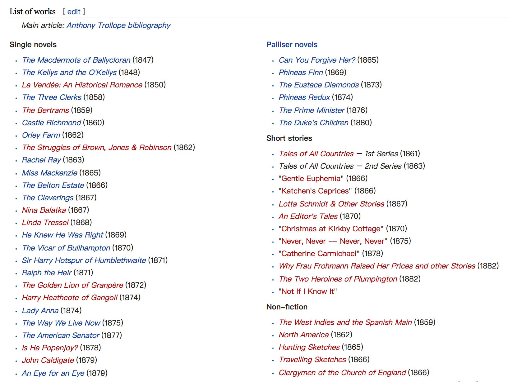

# 09.目标

## 09.目标

为了工作、健康、家庭、生活，我们经常被鼓励或者主动去设定目标。但我们很少去思考一件事：应该用什么科学方法和策略去制定目标，并且能够保证完成它。

### 设定目标

#### 目标 VS. 欲望

《原则》（Principle by Ray Dalio）中有这么一句话——

> You can have virtually anything you want , but you can't have everything thing you want.
>
> 本质上呢，你能得到你想要的，但你不可能得到一切。

这句话什么意思？这句话其实是在区别“目标”和“欲望”。你要想一想，你之前设定的所谓的“目标”，它们是真正的目标，还是只是你的欲望。

#### 什么是设定目标

设定目标是最容易的部分。哪个运动员不想要在奥运会上拿金牌呢？哪个作者不想写出一本畅销书或者“长销书”呢？哪个身体超重的人不想要健康的身材呢？哪个创业者不想要赚更多的钱呢？

可是，你要知道一件事：真正的挑战并不取决于你想要达成什么目标，而是，为了那个目标，你是否愿意为之努力。

我们都想要一块金牌。但，谁愿意像国家运动员那样投入训练呢？

坐下来去想，你能做什么你想做什么，这事儿很容易。而美好的结果到来之前，忍受重复和孤独，没那么容易。

所以，所谓“设定目标”，它不仅仅是选择你想得到何种回报，同时也是选择你愿意为它付出何种代价。

#### 船舵和船桨

想象有一艘row boat。你的目标就像是船舵，它决定你的方向。如果你把精力投入在目标上，船舵会很稳，那么船保持前进。如果你在目标上来回跳动，船舵也会来回摆动，那么你会发现自己就在一直兜圈子。

不过，船上另外一个部分甚至比船舵还重要：船桨。如果船舵是你的目标，那么船桨就是你达成目标的动力。船舵决定方向，船桨决定进程。

以上类比，其实是在区分两个概念：目标和方法论。生活中，这两个概念的差别——

如果你是个教练，目标是赢得比赛，那么，方法论是每天给你的队员安排的训练计划。

如果你是创业者，目标是赚钱，那么，方法论是你的产品质量和营销手段。

如果你是个作家，目标是写一本书，那么，方法论是制定每天的写作计划并且严格执行。

目标确定方向，方法论决定进程。如果只有船舵，你哪都去不了的。你得有桨，你得划船。

换言之，你必须找到达成目标的方法论。

### 达成目标

#### 无情修剪

心理学上有一个概念：”目标竞争“（goal competition）。它指的是一个人在达成目标的过程中，遇到最大的障碍之一，是还有其他的目标。换句话说，在你的时间和精力都有限的情况下，你的这个目标和其他目标是在相互竞争的。当你设定一个新的目标时，你肯定要把花在其他目标上的时间和精力转移到这个新目标上。

即，你必须减少目标清单。

在遭遇失败的时候，我们通常会想，目标本身是不是有问题，或者，方法论是不是不正确。这时候，专家会告诉我们：“你需要有更大的目标！你要有一个超大的梦想，它会激励你，你每天都会进步的。”或者，我们对自己说：“唉，真希望我有更多的时间啊！”

事实上，这些技巧掩饰了一个真相：那些看起来像设定目标时出现的问题，其实是选择目标的问题。

我们不需要更大的目标，我们也不可能有更多的时间，我们能做的是专注。这里的专注指的是，你必须把你所有的目标做一个排序，不重要的就干脆剔除。

就像 Seth Godin 说的——

> You don't need more time, you just need to decide.

生活就像玫瑰。玫瑰在不断生长的过程中，会生出多到它难以负荷的花骨朵。有经验的养花人会告诉你，为了它能长出漂亮的花朵，他们会把一些花骨朵剪掉。换言之，如果你想要这颗玫瑰茁壮成长，那么你得把一些花骨朵掐掉，甚至是长相很好的花骨朵，只有这样，你才能得到更漂亮的。

目标也是如此。在生活中，我们随时可能会遇到新的好的机遇，随之产生新的目标。你得学着像养花人那样，随时修剪它们。缩减，再缩减。这样，你才能看到玫瑰的盛放。

#### 制定具体计划

> Deciding in advance when and where you will take specific actions to reach your goal can double or triple your chances for success. —Heidi Grant Halvorson, Columbia University professor
>
> 研究表明，如果能制定出一套详细的计划，那么你会多两倍、三倍的可能达成目标。

实验首次发布在《英国健康心理学日报》（British Journal of Health Psychology）上，过程如下——

研究者随机征集了248个成年人，并将他们分成了三组。

第一组是对照组（control group）：参与者被要求记录接下来两周的运动频率。同时，他们在离开之前，读了一些与运动无关的小说。

第二组是动力组（motivation group）：参与者也被要求记录接下来两周的运动频率。然后，每个人读了一篇运动能够减少心脏病的文章。同时，他们还被告诉"大多数坚持锻炼的年轻人会降低患上冠心病的风险"。

第三组是计划组（intention group）：第三组除了做了和第二组一样的事情之外，他们还被要求制定一个具体的计划，包括这一周在什么时间什么地点做运动。同时他们还被要求按照这种方式去表述自己的计划——下一周，我会在X地点X日期X时间，做20分钟的运动。

在接受了上面的指导之后，参与者离开了。

两周之后，研究人员得到了惊人的结果——

控制组中，38%的参与者每周至少做一次运动。

动力组中，35%的参与者每周至少做一次运动。

计划组中，竟然有91%的参与者每周至少做一次运动。

这个结果说明了两件事：

1.动力组和控制组的结果差不多，这说明，仅仅有动力是不够的。

2.计划组的数据是动力组的2-3倍，这说明，制定一个具体的计划有助于完成任务。

研究者对结果感到惊讶：制定一个具体的计划竟然如此有效，同时，我们在实验中发现，动力竟然一点用都没有。

或许，正如他们说的那样，动力并不会让你真正去行动，计划的执行才是重点。

心理学家将这些具体的计划称之为”执行计划“（implementation intentions）。在这个试验之后，又出现了很多相似的实验，结果——

制定X时间X方式健康饮食的计划的人，比没有制定具体计划的人，更可能吃健康的食物。（[Good intentions, bad habits, and effects of forming implementation intentions on healthy eating](http://onlinelibrary.wiley.com/doi/10.1002/%28SICI%291099-0992%28199908/09%2929:5/6%3C591::AID-EJSP948%3E3.0.CO;2-H/abstract)）

那些把在X时间X地址要每天吃维他命这件事写下来的人比那些没有写下来的人，更不会错过时间。（[Implementation intentions and repeated behavior: augmenting the predictive validity of the theory of planned behavior](http://onlinelibrary.wiley.com/doi/10.1002/%28SICI%291099-0992%28199903/05%2929:2/3%3C349::AID-EJSP931%3E3.0.CO;2-Y/abstract)）

事实上，超过100个实验都证明：那些有具体计划，具体到时间地点的人，更容易达成目标。

在[Achieve Your Goals: Research Reveals a Simple Trick That Doubles Your Chances for Success](http://jamesclear.com/implementation-intentions)中，James Clear 提到了制定计划的策略——“If...Then...”（如果那么）——句式。

简单来说，就是：

> 在【行动A】之前/后，我会去做【行动B】。

比如—— 坐享：在起床之后，我会去坐享10分钟。 晨读：在早饭之后，我会去看20页原版书。 写作：在午饭之后，我会去写作。

他说这么做的好处在于：

> If you don't plan out your behaviors, then you rely on your willpower and motivation to inspire you to act. But if you do plan out when and where you are going to perform a new behavior, your goal has a time and a space to live in the real world. This shift in perspective allows your environment to act as a cue for your new behavior.
>
> 如果不制定具体计划，你可能需要意志力和动力鼓励自己去行动。一旦开始制定具体的计划——什么时间在哪里——它将触发你的行动。

#### 设定上限

当我们在设定目标时，我们通常会给自己定一个下限。

比如：一个身体超重的人的可能会说，这个月我要减掉至少5斤；一个销售员可能会说，今天我要把这个产品卖出去至少十件；一个作家可能会说，今天我要写至少500字；一个篮球运动员可能会说，今天我要练习投篮至少50次。

但是，如果我们不只是设定下限，我们还设定上限，会怎么样？

这个月我要减掉至少5斤，但最多不超过10斤；今天我要卖出去至少十件产品，但最多不超过20件；今天我要写至少500字，但最多不超过1500字；今天我要练习投篮至少50次，但最多不超过100次。

为什么要设定上限呢？

在这里我要讲一个美国西南航空公司的故事。西南航空是美国唯一一家连续30年都持续增长的航空公司。西南航空最初只是一家小公司，现在成为了国际企业，并且在很难盈利的航空领域，它竟然能够连续30年都保持增长。这究竟是怎么做到的？

在 Great by Choice 中，作者 Jim Collins 揭晓了这个秘密：西南成功的原因之一是，他们的领导人积极地给公司的成长设定上限。比如，在1996年，西南航空关掉了95%的航线，只做4个地点。

西南的领导人当然想要公司每年都保持增长，但是他们会刻意避免增长速度太快。他们更愿意让公司处在他们能够维持的增长速度上，这样整个公司才能持续地发挥潜力。

回到设定上限这个策略上，我知道，我们是一群想要进步不知满足的人。我们并不满足“至少”那个目标，总是会“一不小心”就超出了目标很远。但是，你也有过这种体会，你并不能每天都“一不小心”超出目标很远。换言之，你很难持续地做出做大努力。

这时候，设定一个上限会让每天“一不小心”多做一点变得更容易，从而持续地进步。还记得“复利”公式？那个持续的力量，有多么惊人。

#### 目标要具体

Transform Your Habits 的作者 James Clear 讲了这么一个故事——

有一次他去旧金山会见朋友，顺带想在那里拍些好的照片。于是，他对自己说，“在做其他事情时，拍照好了”。结果，他一张好照片都没拍到。

他在反思之后发现，自己的想法很模糊。比如，他觉得自己可以在和朋友逛街时，拍些街头照片吧，但是呢，却没有明确到底要拍哪一种街头照片。直到在旧金山的最后一天，他确定了拍摄的具体目标，最终，得到了一张精彩的摄影作品。

他说，当你投入到一个具体的任务中，你就会知道下一步应该怎么做。假如你想要在日出时拍一张金门大桥的图片。下一步，就是找一个好的拍摄位置。假如你已经找到好的位置了，下一步，就是早起，然后在那儿等着。

#### 目标要明确

当李笑来准备开专栏的时候，得到上订阅最多的专栏已经“迅速突破”5万订阅。由于“不做到第一就难受”，所以他必须想出个办法，确保最终做到成为“远超第二的第一”。他的“灵感”是这样的——

> 既然大家都在研究“企业商业模式”，那么我应该写“个人商业模式”——后者的市场肯定比前者大，大出至少两个量级......

当他明确目标——写“个人商业模式”，之后，一切就变得简单了。正如他在《通往财富自由之路》里提到的——

> 这个思路是胡来所谓“做到”的最重要的原因，因为这个思路出现的那一瞬间，今天的结果已经基本确定了，剩下的，就是该干什么就干什么，然后等待那个结果出现......

8个月后，他成了“远超第二的第一”。

#### 15分钟间隔期

从第一本小说（1847年）开始，Anthony Trollope 就展现了惊人的写作速度。在随后的38年里，他一共出版了47部小说，18本非虚构著作，12本短篇故事，2部戏剧，还有各种各样的文章和书信。

 

（图片来源：[https://en.wikipedia.org/wiki/Anthony\_Trollope](https://en.wikipedia.org/wiki/Anthony_Trollope) ）

Anthony Trollope ，是怎么做到的呢？

> It had at this time become my custom,—and is still my custom, though of late I have become a little lenient of myself—to write with my watch before me, and to require of myself 250 words every quarter of an hour…
>
> This division of time allowed me to produce over ten pages of an ordinary novel volume a day, and if kept up through ten months, would have given as its results three novels of three volumes each in the year… —Anthony Trollope
>
> 这已经成为了我的习惯——在写作时，我面前有一块手表，我要求自己15分钟内要写出来250字......
>
> 这种对时间划分的写作方法使得我可以在一天里写10页纸，如果我这么持续地写上10个月，那么，一年，我就能写出来三部小说。

这个策略看起来很简单，15分钟写250个字，然后，一直持续下去。但是，你仔细想一想，就会发现，这个策略没那么简单。

当我们学会给自己的任务列表做优化，把要事放在第一位的时候，我们通常会遇到这种情况：这个被优先的任务，往往很困难，以至于你很难在一天之内完成它。甚至，你很难在几天之内完成它。

就拿我写书来说，我给自己设定期限是两个月。也就是说，写书，是我每天最先要做的事情，并且，要连续地做一个月。实不相瞒，连续地写第一本书，连续地把写书放在任务的第一位，在这个过程中，我有疲倦的时候。

不过，Anthony Trollope 已经解决了这个普遍存在的问题。

我们之前提到过，Trollope 高效的写作方法，15分钟为一个期限。我们不需要效仿他15分钟完成多少字，一天能够完成10几页纸。

Trollope 的15分钟，其实还有另一层意思。你可以把15分钟当做一个小小的里程碑。也就是说，只要你完成了15分钟的写作时，你就完成了一项任务，你就可以去庆祝。所以，每次 Trollope 完成一个15分钟时，他都能立刻得到满足。这种满足感，是他持续下去的动力。

而这个策略之所以有效，有如下两个原因：

1.小的、短期的肯定给量大的、长期的的任务提供动力。也就是说，你更有可能完成任务。

2.越是快速地完成任务，越会形成高效的工作状态。这个状态，不断循环。

你发现了吗？ Trollope 并不是等了三个月把书写完后才有的成就感，也不是把某一章节完成之后才有的成就感。每一个15分钟，他都会检查自己的进度。如果他写了250个字，他就会自动把脑袋里的时间关掉，然后，他会立刻得到成就感。

这个方法的关键就是，你得想办法让自己快速得到一个回馈。不管是15分钟的成就感，还是其他的方法。我们在追求目标的路上越快地得到反馈，我们就越能持续地做下去，并且更有可能早一点完成它。

### 最后

你会发现，设定目标，是必要的，它给我们提供了一个明确的方向。但是，在设定目标或者追逐目标的时候，千万不要有这种想法：

> 一旦达成目标，我就会开心；一旦达成目标，我就会成功，一旦达成目标，我就会......

这种心智模式是可怕的：

* 它（潜意识）在暗示你，达成目标之后，你才能获得快乐（成功...）。
* 它（潜意识）在暗示你，必须要100%达成目标。

你必须相对应地明白两件事：

第一，你不要觉得达成目标之后，才能获得快乐。换句话说，在追逐目标的过程中，你也是可以快乐的。甚至，即便没有达成目标，你也是可以快乐的。

第二，100%的完成目标并不是一件容易的事情。所以，即便能够完成60%，都是值得庆祝的。

