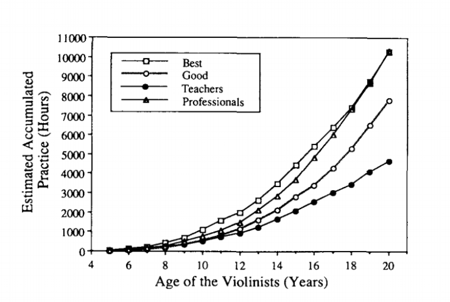

# 10.刻意练习

## 10.刻意练习

### 快速入门

想要快速理解一个概念，或者快速进入一个领域的方法是什么？

找到那个领域里最厉害的人，然后看看他对那个领域的看法。

当我决定写“刻意练习”这个概念时，我开始去寻找这个领域里最厉害的专家：Anders Ericsson 。他研究“刻意练习”超过30年，他是第一个提出“10000小时”的人。他是给国外顶级教练作指导的教练，他是专家中的专家。

我列举了三条 Ericsson 新书 Peak: How to Master Anything 里与刻意练习相关的关键知识点。

第一，10000 小时理论

Ericsson 是第一个提出“[1000小时](http://projects.ict.usc.edu/itw/gel/EricssonDeliberatePracticePR93.PDF)”的人，但是，他并没有把它作为一个理论。让“10000 小时”变得著名的，是畅销书作家格拉德维尔（Malcolm Gladwell）。在《异类》（Outliers）一书中，格拉德维尔引用了 Ericsson 的研究成果，然后把它发展成为了“10000 小时理论”。于是，这个理论开始流行。

Ericsson指出，格拉德维尔的10000小时理论是错误的。以下是研究报告里的一张图。

 

纵向：年龄18岁。你会发现在18岁之前，没有任何一组的练习时间达到10000小时。

横向：10000小时。你会发现，最好的学生和专家在20岁的时候才积累到10000小时。

因此，我们可以做出这种假设：随着年龄的增加，老师和好学生，这两组，或早或晚会积累到10000小时练习量。那么，他们积累到了10000小时，就能成为专家了吗？显然，这个推论，不正确。

Ericsson 说，长时间的练习（比如，10000小时）并不是一个人成为专家的原因。“脑中画像”比长时间的练习更加重要。

第二，脑中画像

你在做某项练习的时候，你得强迫自己将注意力放在这个练习上，当你清晰的意识到自己每一步都在做什么时，脑袋里就像形成了一张图像，这就是“脑中图像”。

举个例子。

国际象棋：高手和一般选手的差别在于，高手的脑袋里有更多的应对策略。面对每一次棋路上的变化，高手脑袋里存储了更多的“画像”，所以他们能够在权衡各种方案后，做出正确的判断。

攀岩：专业的攀岩者并不是一上来就攀岩，而是在行动之前，会在脑中形成最佳线路图。在攀爬的过程中不断与脑中形成的线路图进行比对。这是他们攀岩成功的原因。

高尔夫：专业的球手，在每次挥杆之前，脑中会先形成整个挥杆的动作。而顶级的球手，不但能够在脑中形成挥杆动作，还能在脑中模拟出挥杆的结果，从而再次调整挥杆动作，直到完美。

正如 Ericsson 说得——

> Mental representation explains the difference between novices and experts.
>
> 脑中画像解释了新手和专家的区别。

第三，练习。

Ericsson 把练习分为三种——

* Naive Practice \(幼稚的练习\)
* Purposeful Practice（功能性练习）
* Deliberate Practice（刻意练习）

“幼稚的练习”指的是，有些人觉得学习这件事，只要花大量的时间去练习，就能学得好。这和10000小时理论一样，是绝大多数学习者的误区。最明显的例子就是，大多数人英语学了10年，似乎还没有一个3岁美国小朋友说得好。

“功能性练习”是“刻意练习”的升级版。分为这四个区块——

* 设定目标
* 集中注意力
* 获得反馈
* 走出舒适区

我会在接下来的内容给出具体方法论。

### 什么是刻意练习

#### 学习和练习的区别

生活中，我们有各种各样的目标。比如，学外语，学编程，健身，减肥，理财投资，等等。你很清楚一件事：现在的你和理想中的你之间的差别就是知识。你想掌握它，所以，你开始去找教程、找老师。

但是，如果的目标不只是要学到知识，而是取得成就成为专家的话，仅仅去学是没有用的。你会发现，你很难得到想要的那个结果。

根本原因在于，你把学习和练习弄混了。

在 The Practice Mind 一书中，作者 Thomas Sterner 指出了练习和学习的区别——

> When we practice something, we are involved in the deliberate repetition of a process with the intention of reaching a specific goal. The words deliberate and intention are key here because they define the difference between actively practicing something and passively learning it.
>
> 在做练习的时候，我们得带着特定的目的去不断重复某个过程。而区别主动练习和被动学习的关键就在于刻意和目的。

学习新知识和练习新技能，听上去可能很相似。事实上，它们的真实差别是巨大的。

举个例子。你想要健身，想练出肱二头肌。你可以在通过网上收集的资料或者问健身教练，得到方法论。但如果想要练出肌肉，你得真正地去健身房，然后举一组一组的哑铃，或者杠铃。

再举个例子。你想要一本书。你可以问畅销书作者他们写书的秘诀；但无论怎样，你得一个字一个字地敲上去，然后出来一句话，一段话，一篇文章。最终完成一本书。

被动学习创造知识；主动练习提升技能。在区分了“学习”和“练习”之后，我们终于进入到正题——刻意练习。

#### “刻意练习”的定义

我从三年级开始学书法。从楷书的横竖撇捺点开始练习，到后来学习行书、隶书。

待我长大一点，我遇到另外一个书法老师。这个老师不太一样，他一上来就教我画长长的横线。但那个横线并不普通，仔细看的话，会发现，这一条横线中间，竟然有一道如刀切般的印。他告诉我，书法中，所谓的“劲道”，其实就是每个线条上“如刀刻般”的质感。

看到这道印时，我非常惊讶，因为学了多年的书法，竟然从来不知道笔画除了形状优美之外还要做到有质感。

他说练习方法很简单，分为三步：

第一，逆锋起笔； 第二，运笔时，把一道笔画，切割成一个一个的点，你要向缝纫机那样，哒哒哒哒，运笔提笔运笔提笔，不间断地保持匀速，直到笔画完成； 第三，回锋。

我非常痴迷“如刀刻般”的线条。为了能够写出优美的汉字，我严格遵守这三步，一道线又一道线，一张纸又一张纸，一天又一天。

当时并不清楚，现在回想之后，这应该是我第一次接触到“刻意练习”的概念。

事实上，很多人对刻意练习的定义都不同。我最喜欢的是版本是 Kathy Sierra 在 Building the Minimum Badass User 上对“刻意练习”的定义——

> Deliberate practice is when you work on a skill that requires 1 to 3 practice sessions to master. If it takes longer than that, then you are working on something that is too complex.
>
> Once you master this tiny behavior, you can move on to practicing the next small task that will take 1 to 3 sessions to master. Repeat this process for 10,000 hours. That is deliberate practice.

简单翻译过来：

当你在打磨一个技巧的时候，可以将它分成三个部分。

第一部分，可以再分成三小步。当你掌握了这三小步，也就是第一部分之后，就进入第二部分。第二部分也要分成三个小的部分掌握......不断重复练习，直到掌握完整的技能。

举个例子。

斫琴（制作古琴）的步骤之一：刮灰胎。先解释一下灰胎：一般来说，灰胎是由鹿角霜和大漆组成的。但有些斫琴师使用的灰胎还会添加其他成分，比如，金粉。

按照 Sierra 对刻意练习的定义，把刮灰胎分为三段：

1. 练习制作灰胎：调整鹿角霜和大漆的比例。
2. 掌握刮灰胎的工具：你得学会怎么拿刮灰胎的刀片。在琴身的不同位置上，要学习使用不同的刀片。
3. 使用刀片，将灰胎涂抹到琴身上。原则是：不留刀痕，完整均匀地涂抹到琴身上，并且厚度要控制在要求的范围内，比如1.2毫米。

在斫琴的过程中，需要多次给琴上灰胎，所以，只要再重复上面三步，整个刮灰胎的过程，就完成了。

虽然整个过程看起来简单，但每一个步骤都是需要单独去刻意练习的。比如，拿刀片这个看似简单的动作。如果不会使用刀片，你会很容易在上灰胎的时候，留下刀痕，而这个刀痕即便是刷过漆之后，还是去不掉的。也就是说，因为这一道刀痕，在你制作的古琴上，会留下一条疤。最终，由于不会使用工具，你只能得到一张伤痕累累的琴。

这个“三段式”奏效的原因是，它要求学习者必须有逻辑。你得知道先练习什么，然后做什么，最后做什么。你还得知道：当你决定学下一个技能之前，你要想想自己上一个技能是否有学到位。如果调整的灰胎比例失调，那么，即便你有神一样的刀法，也救不回这张琴的。

### “刻意练习”的方法论

#### 明确目标

科比·布莱恩（Kobe Bryant）应该是全世界最成功的篮球运动员之一了。2012年，科比被选为美国国家队的一员。在这期间，国家队的训练员，罗伯特和科比有过一段接触。他在 [Reddit](https://www.reddit.com/r/nba/comments/19o38z/hi_rnba_my_name_is_robert_and_im_an_athletic/) 上，揭示了科比成功的经验——

> 来自罗伯特，美国国家队训练员
>
> 我受邀请到帮助美国队调整他们的身体状态。我之前和 Carmelo Anthony 和 Dwyane Wade 一起工作过，这是我第一次和科比工作。
>
> 我在倒时差，看完《卡萨布兰卡》的时候，早晨3点半了。过了没多久，我进入了浅睡。
>
> 突然，我的手机响了，是科比打过来的。我很紧张地接起来。
>
> “嗨，Rob，我希望没有打扰到你吧？”
>
> “不会啊，怎么了？”
>
> “我在想你能不能帮我调整一下身体状态。”
>
> 我看了看手表，4：15。
>
> “当然可以啦。我们待会儿在器材室见吧。”
>
> 我花了20分钟洗刷整理，然后走出酒店。我到那里的时候，科比已经全身汗水了，就好像他刚从泳池出来一样。那时候，还不到5点。
>
> 接下来的1小时又15分钟，我们做了身体训练。然后，我们去了另一件训练室，他在那里又做了45分钟的力量训练。之后，他要去练习投篮，我要回酒店休息。我们就分开了。
>
> 我再次到训练室的时候是早晨11点。
>
> 下一幕，我记得非常清楚。所有的篮球队员都在那儿，LeBron was talking to Carmelo and Coach Krzyzewski was trying to explain something to Kevin Durant. 而另外一边，科比正在练习投篮。
>
> 我走向他，拍了他一下，说，“今天很棒啊”
>
> “啊？”
>
> “比如，身体训练。你做得很棒。”
>
> “哦，Rob，多谢你了。”
>
> “那你什么时候结束的？”
>
> “结束什么？”
>
> “结束投篮啊。你什么时候离开练习室的？”
>
> “哈，就现在啊。我想投篮800次，你看，刚刚完成它。”

你想想，科比·布莱恩早晨4点半开始进行身体特训，然后6点到7点开始长跑、短跑、举重，最后在7点到11点的时候完成800个投篮。对了，之后还有国家队的训练。

很明显，科比比其他运动员的练习时间更久，但这并不是他成功最重要的原因。

你发现了吗？科比在训练的时候有明确的目标：800次跳投。他的目标是完成800次跳投，即，工作量，而不是从7点练习到11点，即，工作时间。

为什么重视训练的时间没有用呢？Aubrey Daniels 是这么解释的——

> 假设有两个球员都要练习投篮一小时。球员A投了200个，而球员B只投了50个。球员B在投篮时，中间有休息，常和朋友闲聊。而球员A有个同事给他做记录。每10分钟，同事会评论一次他的投篮成绩。假设，这种典型的训练每天都有，并且一开始他们两个人的水平相当，你觉得在100小时之后，谁会更厉害呢？

每个人都可以吹嘘自己在某件事情上花了多长时间，以此证明自己有多努力。问题是，花费的时间并不是重点。刻意地对某个技能反复练习，以至于练习的时间很久，这才是提升的关键。

#### 组块

本·霍根（Ben Hogan）被认为是20世纪最伟大的高尔夫球员之一，是第一个赢得五大满贯的人（其他四个是Sarazen，盖瑞·普莱尔，杰克·尼克劳斯和老虎伍兹）。在某些领域，霍根被尊称为”发明练习“的人。在一次采访中（Interview with George Peper. Golf Magazine.\)，他是这么说的——

> I couldn't wait to get up in the morning so I could hit balls. I'd be at the practice tee at the crack of dawn, hit balls for a few hours, then take a break and get right back to it.
>
> 我几乎等不到天亮就想去练球了。先练习开球，然后练习击球几个小时，休息一会，再继续练习。

对霍根来说，每一次练习都有特定的目的。他将一个完整的过程拆分成许多个零碎的组块，并且针对每个组块练习。比如，他是最先在不同距离使用不同球杆的球手，也是最先利用沙坑或树木来判断挥捍的距离的球手。

他还自创了挥杆理论。**具体的内容**

我在收集写作技巧的过程中，听说过这么一个故事——

在本杰明·富兰克林的少年时代，他经常受到父亲批评，他父亲认为他的写作能力太差。和其他少年的叛逆不太一样，他觉得父亲的批评很有道理，于是他决心改进写作水平。

他去找了当代最好的作家的书籍。然后，开始一字不差地阅读，他将书上的每一句话都做了释义。接着，他用自己的语言重写他做了释义的文章。并且，拿着他的版本和原版进行比对。”每一次，我发现自己的错误，就立刻纠正。“最后，富兰克林发现，阻碍他提升写作水平的是他的词汇量，于是，他接着投入到词汇上。

其实，刻意练习就是这样：将整个过程拆分成小的组块，发现自己的弱点，找到合适的方法论，不断改善，直到完成整个过程。

### 基因限制

最近几年，专家越来越重视刻意练习，认为它是成功的关键原因。不过，虽然它能够帮助我们从“业余选手”成为“专业选手”，但这是有条件限制的。

因此，如果我们想要发挥自己最大的潜能，我们得区分在什么情况下，刻意练习可以让我们成功，什么情况下，刻意练习几乎没有作用。我们需要了解限制条件。

在20世纪90年代，有个叫 Louis Rosenbaum 的人开始研究职业棒球运动员的实力。他很快发现，专业的棒球运动员和常人的视力不太一样。

根据 Rosenbaum 的研究，职业棒球运动员的平均视力是20/11。换句话说，棒球运动员可以在6米之外就看清视力表，而普通人只能在3.3米之外看清。

在《运动的基因》（The Sports Gene）一书中，作者 David Epstein 说，在每个运动领域，运动员的可视化能力都比普通人高。平均来看，甲级联赛球员的视力比乙级联赛球员好；而乙级联赛球员的视力要比校队球员好，校队球员的视力超过普通人。

因此，如果你想要变得专业，你得像科比或者霍根那样，除了刻意练习，你还得有双“鹰眼”。在一些高度竞争的领域，刻意练习只是成功的必要条件。

我们当然可以通过刻意练习掌握专业的技能。但是，我们得知道，人类拥有的能力是受到限制的。这个限制就是基因。

行为遗传学家发现基因几乎影响了人类的所有特征。它不仅会影响外表上的特征，比如身高、眼球的颜色，它还会影响大脑的能力，比如，长时记忆、短时记忆，对视觉的处理速度，对语言的接受能力，它甚至还会影响一个人对于学习的热情程度。

《运动的基因》里有一个我非常喜欢的例子：施特菲·格拉芙（Steffi Graf），单打排名世界第一，网球史上至今空前绝后的年度金满贯得主，国际网球名人堂成员。在少年时代，格拉芙在接受测试的时，与同龄人相比，不但她的身体素质，比如肺活量、运动技巧，是最高的，而且她的竞争欲望也是最高的。她是千载难逢的拥有惊人的运动天分和天生就渴求胜利的人。

格拉芙的成功似乎正如遗传学家 Robert Plomin 说的那样，”我想不到有任何一处特征不受基因的影响“。

那么，基因的影响到底有多大呢？这很难说。有些研究着说基因影响一个人25-35%的表现。当然，这个数值取决于不同的领域。

那么，为什么我要在“刻意练习”这篇文章里加入“基因”这个话题呢？

因为这样一个事实：基因对一个人各方面的影响是真实存在的。然而，虽然基因是影响一个人的能力的，但是它并不决定你的能力。反而，当你认清基因的时候，你会更加了解自己。换句话书，基因不决定命运，反而，基因制造了机会。一个形象的类比是，你很会打牌，这当然好，但如果你手里有好牌，赢的机会就更大。

#### 多维竞争力

那我们怎么打得一手好牌呢？我们怎么发挥自己最大的潜力呢？有一个技巧，叫做发展你的“多维竞争力”。

呆伯特漫画的创始人 Scott Adams 在[博客](http://dilbertblog.typepad.com/the_dilbert_blog/2007/07/career-advice.html)上有篇《职业建议》（Career Advice）的文章就提到了这个技巧——

> Everyone has at least a few areas in which they could be in the top 25% with some effort. In my case, I can draw better than most people, but I’m hardly an artist. And I’m not any funnier than the average standup comedian who never makes it big, but I’m funnier than most people. The magic is that few people can draw well and write jokes. It’s the combination of the two that makes what I do so rare.
>
> 事实上，每个人只要付出足够的努力都有机会成为前25%。拿我来说吧，我呢，比大多数人画的都好，但是，我很难成为一个真正的艺术家。我呢，没有专业的喜剧演员那么搞笑，不过比大多数人又幽默一些。而那个神奇的地方就在于，会画画又幽默的人却少的很。所以，这两种特质的结合，让我变得相当稀缺。

#### 建立个人品牌

我在2016年9月份写了一篇文章《个人品牌如何建立持续影响力——罗胖何去何从》。里面讲了三个故事——

第一个故事——手艺

这是我在罗辑思维里听到的。

有一天，有人问郭德纲，您这讲相声，万一有一天江郎才尽怎么办？

郭德纲回答说，我们说相声的，学的是技术，练的是手艺啊。这和炸油条是一个道理，一个炸油条的会担心自己江郎才尽吗？

罗胖说，这是今年对他冲击最大的话。他天天在讲知识，并不是说他自己有多少知识，那确实会江郎才尽。他的手艺呢，是迅速理解别人产生的知识然后用合适的方式表达出来。用户觉得有价值就会买单喽。这其实和炸油条的也没啥区别。手艺这个东西总是越练越好，门槛也越练越高。一个人最重要的是看清自己一直在练的那门手艺是什么，这才算看清了自己，看清了道路。

在当今社会，一个人只要愿意用时间为成本，做一门手艺，他至少不会饿死。然后，随着时间增长，成本越来越少，收益变会越来越多。我称这种人——匠人。匠人的品牌一旦建立，品牌的传宗接代都有可能的。

第二个故事——里程碑式思维

在讲里程碑式思维之前，先介绍一个与之相对的思考方式——终点式思维。

什么是终点式思维呢？比如说，我打算理财——因为我想有更多的钱——我终于有了钱——我可以不用工作，我可以出去旅行看看这个世界，我可以每天睡懒觉。

什么是里程碑式思维呢？

我打算理财——因为我想有财富自由——这样我可以打理好自己的时间——做我想做的事——我进入了自己一直想要做的一个行业——我获得了更多的财富自由，以及时间自由。

终点式思维，是认为一件事成功了就到此为止。而里程碑思维，认为完成一件事之后，还有接连不断的事情等待去完成。如果乔布斯当时只满足Ipod、Itune，就不会有IPHONE也不会有IPAD。

像乔帮主这样，永不满足当下的成功，在已知领域不停地探索，再次创新的人，都是创意精英。创意精英永远不甘于当下的成功，他会进入一个又一个领域，建立一个又一个的品牌。

第三个故事——多维度发展

我要讲一个超级英雄——“硅谷钢铁侠”——埃隆·马斯克。这是怎样的牛人呢？据说，乔布斯在研究苹果手机怎样被更多人喜爱时，这个男人已经在制造火箭了。

埃隆是南非人，17岁时移居美国，开始追求自己的梦想。24岁，从斯坦福退学，创立了“Zip2”。几年后，他创办的"X.com"与另一家公司合并，也就是后来的"Paypal"。31岁时，埃隆成立了"Space X"（太空探索技术公司），并且仅用六年，就将其自主研发的火箭“猎鹰1号”制作完成并成功发射升空。两年之后，他又向国际空间站发射了名为“龙飞船”的宇宙飞船。这是第一次由民间发射宇宙飞船和国际空间站对接，然后安全返回地球。并且，整个制造成本低于传统火箭制造成本的1/10。

如果，你仍不知道他，那么他还有一个身份——特斯拉公司的CEO。锂电池的研究创新、生产制造——汽车的设计、生产、制造——售后特斯拉旗舰店——充电线建设。特斯拉完全直线行驶，畅通无阻。

电动汽车、太阳能发电、宇宙火箭，不管哪一项都足以另一个国家付出巨大的代价去研究开发，但埃隆·马斯克却一个人在做这些。

此刻，你应该认识埃隆了。

可是，你发现没有，假设埃隆只是做了其中一件事，他看起来也许会像其他公司CEO一样很厉害，但一定不会像现在被美国奉若神明。

而他之所以这么牛，是因为他懂得多维度发展。

多维度发展是个人影响力持续最重要的因素。

让我慢慢解释吧。

首先，我将某个技能设置为一个维度。

有上进心的人会努力做到单个维度的TOP 20。在看过正能量的心灵鸡汤后，会朝着这个维度“死磕”直到Top1。然而，这个旅途非常凶险漫长。并且就算到达了Top1，然后呢？

我们难道没有其他方法提升自己吗？

有，就是多维度发展。

如果一个技能就是一个维度，那么：

1.单个维度上，比得是长度 2.两个维度上，比得是面积 3.三个维度上，比得是体积……

我们来推理一下——

如果：单个技能——单维度——单维度发展——个人品牌

那么：多技能——多维度发展——维度扩展持续——影响力持续提升

从具备单个技能到多个技能，从单向维度到多维度发展，一个人的潜力似乎变得无穷无尽了，其创造出的价值也再难以通过某个单一领域衡量。这种在多维度发展的人，是超级英雄。

总之，不管你是属于“匠人”，“创意精英”，还是“超级英雄”，这个世界总会有一个你的品牌。同时，以你为中心建立的品牌影响力是可以持久的。

有两点结论：

第一，个人品牌时代，已经到来。

第二，互联网的思维之一：个人异端化。

在极致的思维逻辑下，人和人的冗合度为零——在社会分工越来越细的情况下，技能相同的两个人，终将有一个被淘汰。

以上表明，虽然个人品牌建立社会背景大好，但仍需要建立多维度发展的能力，否则，随着冗合度越来越趋近为零，你建立的品牌总会被另一个品牌代替。

注：

《个人品牌如何建立持续影响力——罗胖何去何从》当时用了6个小时才写出来。直到现在，我也几乎没有修改它，就干脆放到这里。

之所以这么做，是希望正在看这本书的你，真实的见证一件事：原来，没有人一上来就能写得好这事儿是真的；原来，只要持续地写就能够取得进步；原来文笔没那么重要，更重要的是逻辑和思考深度。

我能够写一本书出来，相信你也一定能够做到。

