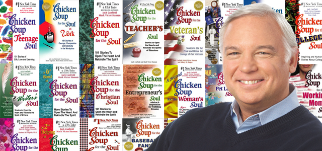

# 12.如何练就强大的执行力

## 12.如何练就强大的执行力

2014年，阿里巴巴公司上市。不过最受瞩目的并不是CEO马云，而是阿里巴巴最大的投资人孙正义。

从1999年起，孙正义向一共向阿里投资了8200万美元，到2014年IPO时其拥有的股值达到了780亿美元，回报率高达950倍。

更传奇的是，孙正义竟然只是和马云聊了6分钟之后就决定投资3000万美元了。

孙正义有句很著名的话：

> 三流的点子加一流的执行力永远比一流的点子加三流的执行力更好。

2006年的某一天，孙正义突然构想出了一款新设备，于是立刻激动地买了当日的飞机，飞向苹果总部库比蒂诺，打算像乔布斯推销自己的想法。

根据他的回忆：

> 我带着一张小图，草图上画着给iPod加上手机功能之后的效果。当我准备把草图给斯蒂夫看时，他说，“正义，别给我看你的画了，我自己有。”
>
> 我说，“好吧，我就不给你看我的草图了，但假如你做好了这款产品，能不能把日本的销售权给我呢?”
>
> 斯蒂夫说，“正义，你疯了。你现在连自己的移动运营商都没有，竟然就想要Iphone的销售权。”
>
> 我当时就决定，一定要买下一个移动运营商。

说干就干。几个月后，孙正义发起了人生第一场巨大的豪赌：斥巨资118亿美元收购日本第三大通信运营商——沃达丰日本。

沃达丰公司成立于1984年，是一家跨国性的移动电话运营商。在1987年成为世界最大的移动通信公司。后来进军日本，经营不善，在2006年，公司陷入巨额赤字。

资本市场很不看好孙正义的这次的收购计划，投资者们疯狂地卖出软银的股票，导致软银股价暴跌60%。

而孙正义还是如往常一样镇定。他之所以做出这种常人难以理解的疯狂举动，是因为他一直有自己的思考方式：减法思考。

他认为，一般人做事都是从现有的资源入手，这种方式风险低，强调的是滚动式发展。但是，这种思维的根基是物质决定思维，所以，很难有大的格局。他的方法是，先确定目标，然后逐个阶段的倒推。所有的阶段都是为最终的目标做准备。

孙正义的目标是拿下iPhone在日本的销售权，于是他就必须买下属于自己的移动运营商。

结果证明，孙正义的做法是对的。软银通过在日本销售iPhone，获得了巨大的市场份额。

### 什么是执行力

很多人都误以为，执行力就是快速行动。

不是这样的。

执行力正确定义应该是这样的：思考之后，快速行动，并且一直保持行动，直到完成它。

你发现了吗，执行力是由三个部分组成的：

1.快速投入行动 2.一直保持行动 3.完成任务

因此，在我们讨论如何练就强大的执行力时，我们得分别找出这三个部分的方法论。

### 怎样快速投入行动

你对这些场景还熟悉吗：

小时候，你想要一个玩具。你父亲告诉你，只要考到前十名，就买给你。于是，你立刻投入到学习中，你的学习热情空前高涨。因为，你很想要那个玩具。

长大后，你遇到一个女孩。你觉得她就是你的soulmate。你等不及自己十八岁的时候再追她。你会立刻制定计划，对她表白。因为，你真的很喜欢她。

你看到吗，当你喜欢上一件事儿的时候，你一定会行动的。

换言之，让行动快速上路的秘籍：

> 创造喜欢的感觉。

如果写作是你喜欢的事情，如果你有方法把写作变成你喜欢的事情——你一定会立刻行动。

我记得有次，一整天，我都写不出东西来。到了晚上，随便翻了翻一些作家的图片，顿时来了精神：

我根本就是想成为上图里聪明又漂亮的人，并且过着聪明又漂亮的生活啊。于是，就充满干劲地继续往下写喽。

你看，即便是一个小小的动作，就可以令我立刻投入到行动中去。所以，在写作的过程中，你一定要想办法，创造“喜欢”的感觉。

> 因为爱，所以做。

具体的技巧：

第一，有一个你超爱的写作设备。

因为要写这本书，我干脆换了一个Macbook pro. 当然，你喜欢用手机的话，也可以用手机啊。

第二，选择一个你超爱的写作软件。

我现在用的是Mweb，它支持全屏写作，这很爽。

第三，找一个让你沉浸于在写作中的地方。

如果在家里写不下去，就赶快换个地方。换到一个地方写不下去，就换另一个地方。我一开始在家里写，后来，发现效率低，又换到图书馆，再后来又换到咖啡馆。到最后，干脆，随身带着笔记本。

> There‘s a secret that real writers know that wannabe writers don't,and the secret is this: It's not the writing part that's hard.What's hard is sitting down to write. What keeps us from sitting down is Resistance.
>
> 真正的作家知道想成为作家的那些人不知道的一个秘密。这个秘密就是：写作，其实并不是最难的部分。最难得部分在于，你要坐下来，去写。 而阻挡我们坐下来去写的原因，叫做“不情愿”。

上面三个技巧的根本目的：不惜任何代价满足自己，让大脑再也不会产生“不情愿”的想法。

> Look in your own heart. Unless I’m crazy, right now a still, small voice is piping up, telling you as it has ten thousand times before, the calling that is yours and yours alone. You know it. No one has to tell you. And unless I’m crazy, you’re no closer to taking action on it than you were yesterday or will be tomorrow.
>
> You think Resistance isn’t real? Resistance will bury you.
>
> 你听听看内心的声音。除非是我疯了，那么现在有个小小的声音在呼唤，正如它曾千百次的呼唤过你。你一定知道的。除非是我疯了，否则，你是不会行动的，正如昨天没有行动或者明天也不会行动那样。
>
> 你觉得“不情愿”不是真实存在的？那我告诉你，它会将你吞没。

在写作开始之前，大脑时常出现这种想法：哎呀，我不喜欢这个环境，我真的写不下去。那么，为了避免大脑有这种想法出现，你必须将自己置身于让大脑觉得舒服的状态中。你要暗示它，哥们儿，你（大脑）想要的，我可是都满足你了，再也没有借口了对不对。于是，大脑只好乖乖听话，开始干活。

大脑之所以听命于你，是因为：

> 你的大脑并不是你，你的大脑是（属于）你的大脑。尽管你用它思考，好像它在指导你的行为，但是，你要明白你不应该隶属于你的大脑，而应该是你拥有你的大脑，并且应该是你可以控制你的大脑。

你完全可以运用心智去战胜那些“不情愿”的想法。你可不要以为普通人才有“不情愿”的想法，每个人都有。

这就是一个失败的典型案例：

希特勒最初的梦想是成为艺术家的。18岁的时候，他带着全身的家当，跑到维也纳学习。他可是申请了当地知名的艺术院系的。但你有见过他的作品吗？事实上，他还真的没什么艺术作品留下来。对他来说，发动二战，甚至都比要他坐下来，拿出一件像样的作品要容易呢。

对比之下，大文豪维克多雨果要聪明多了：

雨果在一年前就跟出版商签订了合约，但是这一年他一直忙于社交，迟迟未动笔（都是不情愿惹的祸）。眼看交稿的日子越来越近，他着急的一直挠头发挠衣服啊。挠着挠着，就想到一个好主意：自己不是都忙着社交嘛，那我干脆就把家里面能穿出去的正装全部丢掉，只留下睡衣睡裤，这下总不能跑出去见人了吧。由于家里一件漂亮衣服也没有，雨果也懒得出去了，就在家专心写作。然后，就写出了那部经典的《巴黎圣母院》。

### 怎样保持行动

你可能注意到了一件事：我在这本书里很少提到“坚持”这个词。哪怕在这篇文章中，题目似乎都理所应当是怎样坚持写作。

> 坚决不”坚持“。

我不要坚持去保持健康。我不要坚持去学习。我不要坚持去写作。原因很简单：如果有一件事儿，竟然需要坚持才去做的话，只能说明，你不爱它。还是拿恋爱来类比：如果需要坚持才能爱上一个人的话，这能是真爱吗？

是时候要把“坚持”这个概念从大脑中剔除了！

如果想要保持行动，你只需要思考一件事：

> 怎么样自然地长期做下去？

你看，这才是真正要解决的问题。对这个问题进一步拆解之后：

1.如何做到”自然“ 2.如何做到“长期”

#### 刚需

说到“自然”，我们可以先从两个角度来看。

从生物进化的角度，比如，长颈鹿。和其他动物相比，它跑又跑得不快，打又打的不凶，不会水也飞不起来，唯一的优点就是脖子长点儿。而为了生存，它就”自然地“去吃高处的树叶了。

从人类行为的角度，比如，你每天要做的事情。你要刷牙、洗脸、梳妆打扮。没人强迫你，但是你“自然”地就那么做了。因为，你要让自己看起开清爽、干净、体面，你不想给人邋里邋遢的感觉。

你发现了吗？”自然“发生的行为背后，是有两个字支撑的：

> 需求

当这件事儿变成切实的需求的时候，你自然会去做。甚至即便你有严重的拖延症都阻挡不了你的行动。需求的力量比拖延症强大多了。

需求是有程度之分的，越到深处，它的威力越强大。最深层的需求，是两个字：刚需。

当某件事成为你的刚需的时候，没有人没有任何事物能够阻挡你去做的雄心。

比如，很多人在英语学习上屡战屡败。最根本的原因是，他们只是学英语，根本就没有把它当成刚需在用啊（他们典型的借口是：国内没有合适的应用环境）。不过，你也会发现那些考雅思、托福的人，往往能很快学会英语。原因很简单，他们想要出国留学、出国工作，他们必须得过英语这一关。所以，成功地通过雅思、托福考试，就是他们的“刚需”。

回到写作这件事上来，你必须得思考：怎样让写作成为你的刚需。

讲一个鸡汤的故事：

有个叫杰克的中年教师，由于青年时代挥霍过度，以至于现在混得实在不咋地，身上背着14万美元的债务，每天只能吃点意大利通心粉。

在他45岁生日那天，没有人给他庆祝。于是，他画了一张一万美元的支票，当做生日礼物送给自己。

“紧盯目标”——对，那画出来的一万美元竟然成了他的目标。此后的许多天，他一直盯着那张支票思考，到底怎样才能赚到一万美元呢？突然有那么一刻，“感觉上帝伸出手来，拍了一下我的肩膀”。

他做了一个决定：写书。毕竟对哈佛毕业的他来说，写作并非难事。

为了快速赚到钱，他很快完成了第一本书。里面讲的是100个小故事，就是激发人们斗志，鼓励大家天天向上的那种。

写完书之后，杰克还面临一个问题：定书名。他知道，读者在书店里基本上是根据书名购买的，内容，拿回家还不一定看呢。那么，究竟用什么书名，才能够被读者喜欢呢，从而畅销呢？他想起来自己的奶奶，小时候总是熬鸡汤给他喝，总是念叨，“鸡汤能治百病”......书名有了，就叫《心灵鸡汤》（ Chicken Soup for the Soul）！

这本书出来之后，立刻狂销 800 万册！杰克终于实现了自己的梦想，赚到的又何止一万美元。

再后来，杰克根据“鸡汤”的类别，又写了祖父鸡汤，祖母鸡汤，男孩鸡汤，女孩鸡汤、教师鸡汤、创业者鸡汤......仅少女鸡汤就超过14种。从1993年到2008年，这个系列被翻译成50多种语言，累计发行量超过10亿。

而这颗成功的种子，竟然是杰克当初对那一万美元的渴望。

你可以为了赚钱去写作，这毕竟能带来硬邦邦的回馈。再换个角度，清晰的写作产生清晰的思考。为了做到“正确的思考”，你必须学会清晰的写作。

总之，快速行动的秘密是：把要做的事当成自己的刚需.

#### 复利的力量

解释”长期“之前呢，要先提一个重要的概念：复利。

爱因斯坦说复利是“世界第八大奇迹”，是“有史以来最伟大的科学发现”，甚至是“宇宙最强力量”。

先看一个表格：在本金一定（1万元）的情况下，利率和投资年限的变化，对新的本金的影响。

| 本金 | 收益率（复利） | 1年 | 5年 | 10年 | 20年 | 30年 |
| :--- | :--- | :--- | :--- | :--- | :--- | :--- |
| 1万元 | 1% | 1.01 | 1.05 | 1.1 | 1.2 | 1.3 |
|  | 5% | 1.05 | 1.28 | 1.63 | 2.65 | 4.32 |
|  | 10% | 1.1 | 1.61 | 2.69 | 6.73 | 17.45 |
|  | 20% | 1.2 | 2.49 | 6.19 | 38.34 | 237.38 |

钱能生钱。你看，在本金一定的情况下，懂得利用复利效应的人和完全不懂复利的人，在未来的财富上，竟然会产生这么大的差距。

复利效应不仅适用于理财活动中，它在诸多方面都适用。

你可以这么思考：复利是利息的利息。难道只有金钱才有利息吗？知识有没有利息呢？成长有没有利息呢？

成长当然是有利息的，甚至还有成长公式呢。

假设，一个人每天比别人多努力了0.01，那么，一年以后——

1\*（1+0.01）^365 =37.78

再假设这个人每天比别人少做了0.01，也就是每天退后了0.01，那么，一年以后——

1\*（1-0.01）^365 =0.0255

你看，仅仅是0.01的差距，只要时间足够长，这种对比是多么明显啊！

这个世界羡慕那些年少成名的天才。但事实上，他们的成功并非只是天分，而是积累的结果。

在 Mindset （Carol Dweck）里有这么一段话：

> Is this ability or mindset? Was it Mozart's musical ability or the fact he worked till his hands deformed? Was it Darwin's scientific ability or the fact he collected speciments nonstop from early childhood?
>
> 究竟是才能还是心智成就了天才？ 是莫扎特天生的音乐才华还是他不停练习直到手指被塑形？是达尔文天生的科学才华还是他从少年时代就不间断地收集样本？

说回天才球员科比。有次记者问他，你为什么能够取得成功。他这么说：

> Do you know what Los Angeles looks like at 4 o’clock in the morning? It is still in the dark at 4 o’clock, but I had already gotten up by then and was walking in the dark streets. The days passed and the darkness did not disappear. More than 10 years passed and the darkness in the streets of Los Angeles was still there at 4AM, but I had become a basketball player with strong muscles, excellent physical fitness, strength and a high field goal percentage.
>
> 你知道凌晨四点洛杉矶的样子吗？凌晨四点钟，我已经起床了，走在沉睡的黑暗的大街上。时光飞逝。连续十年，我就是这么做的。四点的洛杉矶还很黑，可是我是篮球运动员，我得保持强壮的身体和心智。

积累成就非凡。

回到“长期”的定义上，你觉得什么是长期呢？换句话说，难道你还没发现，像是理财、成长、写作，这些事情，时间越久得到的好处越巨大吗？

如果一件事情，时间越久得到的好处越是巨大，那么，就长期地做下去吧。（这还需要坚持吗？）

### 怎样确保自己完成任务

我们在【题纲】那篇文章里提到过，哪怕一开始的作品并不完美，也要拿出完整的作品来。

那么，如何保证自己能够拿出完整的作品呢？这里有三个策略：

#### 第一，关注进度表，而不是截止日期

拿写书这件事儿来说——

首先，我给自己设定了截止日期：在两个月内，完成这本书的初稿。

然后，根据截止日期，制定了每一天的进度表。一开始，进度表是根据题纲上的顺序来制定的。比如，周一应该完成哪个专题，周二应该写什么内容。

这么写了三天之后发现自己很难去根据题纲上的顺序完成写作。原因是有些专题，你需要深入的了解，你要给出方法论，比如习惯、执行力；而有些专题，只要讲清楚就可以，比如怎么设定字数。

所以我立刻调整了进度表，没有根据提纲上的顺序写作，而是要求自己完成当天的字数量。并且，在周末的时候，对这一周的“输出”，做一个复盘。

那么，为什么关注进度表比关注截止日期有效呢？有两个原因——

第一，每当你完成进度表上的一项任务时，你都会有一种成就感。但是，如果你只设定了一个截止日期，没有进度表的话，那么，极有可能出现的情况是，你心底的“魔鬼”，你的拖延症，你的不情愿（Resistance），你的懒惰，将阻止你行动——你永远都无法完成。

第二，设定进度表，能够给你一个直接的反馈。这篇文章完成度怎么样？我现在完成全书的1/3了，还是3/4了？

进度表，它能告诉你，现在处在什么位置；它能给你一个明确的方向。拿着它的时候，你知道我现在已经完成这么多了，只要再努力一点点，就能完成目标了。

**第二，公开写作计划。**

在【你就是作者】中，我提到，公开自己是个作家的身份。借助这个技巧，我转变了自己的身份，从真正“业余”到“专业”。

同样，公开自己的写作计划，也会令你发生变化。因为一旦你公开它，比如发朋友圈说，自己会在两个月内完成一本书，你就不得不产生一种动力（压力）去完成。

**第三，把重要的东西交给朋友保管。**

Project Life Mastery 的创始人 Stefen James 讲创业经历时，提到一个故事。他在写第一本书的时候花了两年的时间，结果还是失败了。而现在，他能够在24小时里写一本在Kindle上大卖的电子书。

他提过一个技巧，就是当你决定开始写书时，你要告诉你的朋友，并且把一件对你重要的东西交给他保管。同时，你告诉他，如果我不能在规定的时间里完成这本书，那这个东西就归你了。一旦你无法忍受失去的痛苦，你就要去完成任务。

