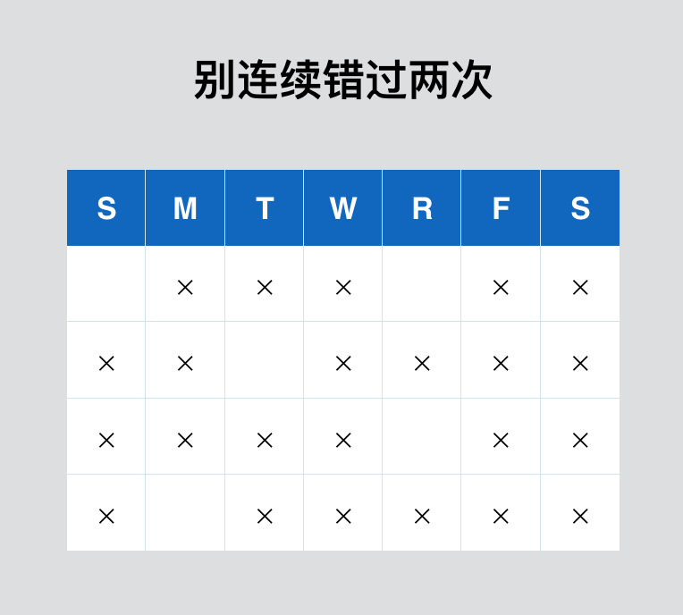

# 14.如何养成写作的习惯

## 14.如何养成写作的习惯

在正式养成写作的习惯之前，有必要了解一下“习惯”的作用原理。只有清楚地知道它的运作机制，才更有可能在没有写作习惯的时候，养成具体的习惯。

### 习惯的概念

这里要再次强调概念的重要性。一个人只有在脑袋里形成了正确、清晰、完整的概念，他才能正确地理解这个概念。

那么，习惯是什么？

简单来说：

习惯，是你每天不断重复的小的行为。

[杜克大学](https://web.archive.org/web/20110526144503/http://dornsife.usc.edu/wendywood/research/documents/Neal.Wood.Quinn.2006.pdf)的研究者表示，一个人每天的行为，有90%出自习惯。可以这么说：你如今的生活，其实就是习惯的累积结果。

> Experience sampling diary studies indicate that much of everyday action is characterized by habitual repetition.

你每天重复做的（比如，你每天花时间思考的事情，或者你正在做的事情）最终就塑造了现在的你、你的价值观，和你的个性。

当我们知道习惯是如此重要之后，我们又产生了一个新的问题：为什么坚持好的习惯这么难？为什么我们有变好的欲望，却没有看到任何进步呢？

你可以回想一下自己今年的新年愿望，你还记得多少？去年的呢？前年的呢？

有这么一个[数据](https://www.ncbi.nlm.nih.gov/pubmed/2980864)：大约81%-92%的新年决心都失败了。换言之，10次中至少8次，我们没有形成新的习惯，而是回到了原来的习惯模式中。

### 没有养成新习惯的五大原因

在Transform Your Habits一书中，James Clear说了没有形成新的习惯的五个原因：

> 1.trying to change everything at once 2.starting with a habit that is too big 3.seeking a result, not a ritual 4.not changing your environment 5.assuming small changes don't add up.

1.你想立刻改变一切。然而事实是，你是不可能一下子就改变自己的全部的。

2.你做出的那个改变太大了（或者说，你想要养成的那个新的习惯太大了）。以至于当你无法取得进步的时候，你难以承受这种失望。最终，只好放弃。

3.你在意的是习惯养成之后的那个好的结果，而不是想要去建立一个持续的“规矩”。

> A ritual is a highly precise behavior you do at a specific time so that it becomes automatic over time and no longer requires much conscious intention or energy.
>
> —— Tony Schwartz

4.你没有改变周围的环境。我们很少承认，或者注意到这件事，就是环境对我们的生活状态

5.你的潜意识认定小的改变没什么用。你认为只有大的改变才能够促就大的“成功”。你在意大的，忽视小的。你追逐大的，舍弃小的。而事实是，大的习惯是无法一下子就建立的。即便是小的习惯，也是需要时间去建立的。

### 要花多长时间建立一个新习惯呢？

在20世纪50年代，Maxwell Maltz观察到，一个做过整形手术的病人需要21天适应变化。Maltz的观察结果很快就被传来了，然后就有了很有名的21天改变习惯这种说法。

那么研究者对此是怎么认为的呢？他们发现在一个新的习惯变得自动化之前，至少需要2个月的时间。（66天最少，这个研究结果发布在欧洲社会心理日报上）多久建立一个新的习惯取决于具体的行为、人还有环境。换言之，一个人可能需要2-6个月，形成一个新的习惯，而不是21天。

除此之外，研究者还有一个有趣的发现：偶尔一两次没有行动，并不为影响习惯的形成。

> missing one opportunity to permorm the behaviour did not materially affect the habit formation process

换句话说，即使你偶尔搞砸了，也没事。因为形成一个好的习惯，并不是要么有要么无的过程。

所以，如果我们每天能够写上几百字，这很好。但如果，偶尔几天没有写作，也并不会影响我们形成写作的习惯。

尽管形成一个新的习惯不是那么容易的事情，但是你要放心，它对我们的要求，没那么苛刻。

### 怎样开始一个好的习惯

我之前在【你就是作家】中提到，一定要假装自己是个作家。从那时候开始，我真得把自己当成作家了，也真得无比认真地对待写作这件事情了。于是，我每天都有至少2个小时的时间坐下来写作。每天都做这件事情，就像每天都要刷两次牙一样。我不认为刷牙是习惯，也不认为刷牙是坚持。所以，对于我来说，写作，与”坚持“无关，甚至与”习惯“也无关。

然而，我知道大部分的人暂时没有像我一样，能够保持每天都写作。所以，我在这里提供五个方法论。

#### 第一，基于新的身份行动。

开始一个习惯并且一直保持的秘密：建立新的身份。因为你目前做出的大部分的行为、行动，基本上是对你当前身份的一种反映。

如果你是厨师，那么你就熟悉食材、熟悉营养搭配；如果你是销售员，那么你既要懂产品又要有销售技巧；如果你是设计师，那么你既要有专业知识，又要懂得与客户沟通......

通过上面的例子，我们倒推：我之所以养成了写作的习惯，其中一个原因是”我是一个作家。“

所以，这件事情就很简单了，因为我现在是个作家，所以，我不得不去每天（常常）写作，以至于我养成了作家本该有的写作习惯。

#### 第二，目标要小。

真正养成一个习惯并不容易。如果一上来就给自己设定一个大的目标，在一开始或许会完成得很好，但是随着难度逐渐升级，我们不会像最开始那样能够轻松地完成，我们会放弃。我们甚至早就习惯了放弃，不是吗？

所以，为了真正形成一个习惯，也就是说，为了在形成新的习惯的过程中不放弃，在最开始的时候，我们要把目标定的小一点儿。

> make it easy you can't say no —— Leo Babauta

如果我想形成跑步的习惯，那么，我的目标是，每天就跑1分钟。一周之后，每天跑2分钟。再过一周，每天跑3分钟。逐渐加量。

如果我想要健康的饮食，那么，我的目标是，每周一，拒绝油炸等垃圾食品，并且，这一天的食物里要有蔬菜。一个月之后，我要求自己每周两天的时间，拒绝垃圾食品，并且这两天中要吃蔬菜。逐渐加量。

回到养成写作的习惯这件事上。

我给出解决的方法是：不要管什么动力、意志力，你就给自己设定一个小的目标。比如，每天就写100个字。或者每天就写1分钟。而这100个字，或者1分钟，也无非就是三五句话而已。

你甚至都不用写出来这三五句话（这里的“写”，是打字的意思）。你完全可以打开锤子便签，用讯飞语音，把你想要表达的内容，说出来。讯飞语音会自动转化成文字。

写作是一个表达的过程，或者是一个表达的工具。所以，你未必真的要有写（打字）这个动作，你只要每天花出一个点点的时间，跟自己独处，去表达你想要表达的东西，这就够了。

说到表达，写作是纯文字的表达。除此之外，还有图像、声音、视频。尽管这是一本关于写作的书，但我想说的是，不管你用什么形式，请不要忘记表达自己。

在声音方面，我五音不全，同时也吐字不清。在图像和图形的识别方面，我大概只能记住单一的线条或者形状，比如圆、三角形，再复杂的图像，我是记不住的，比如人脸。我又有社交恐惧症，以至于，不怎么跟人交流。在这些方面，我是如此的“残缺”，以至于，没有其他选择余地，写作，竟成了我理所当然的表达方式——Writing is my therapy.

不要拒绝表达。

你可以从写开始，因为它是如此简单的一件事情。或许你会爱上写作，慢慢的成为作家；或许你会迷上声音，爱上影像，在探索过程中，找到了自己最舒服的表达方式。

与其一开始做得很好，不如一开始做得小，并且一直持续去做。这样，你的意志力和动力，会逐渐增加。从而，更容易长期去保持一个习惯。

#### 第三，把一个习惯，分成几个小的组块。

为了能保持一个习惯，在一开始就需要制定策略：将大的任务分解成一个个的小任务。

怎样完成20分钟的冥想？你可以把它分成两部分，每部分10分钟。

怎样每天做50个俯卧撑？把50个俯卧撑分成5组，每组10个。

怎么完成一本书呢？就是先完成一篇文章啊，再完成一篇文章，一直这么持续下去啊。

#### 第四，当你开始偏离时，要迅速回到轨道上

> The best way to improve your self-control is to see how and why you lose control. —— Kelly McGonigal

在习惯养成这件事情上，有两种想法，是错误的：第一种，追求完美；第二种，要么做到要么做不到。

每个人都会犯错，偏离轨道。不过，与大多数人不同，优秀的人懂得如何让自己尽快回到轨道上。

> When you screw up, skip a workout, eat bad foods, or sleep in, it doesn’t make you a bad person. It makes you human. Welcome to the club. —— Steve Kamb

虽然我们不应该期待失败，但是我们必须学会为失败做计划。我们得有一个对失败的“复盘”。花些时间想想，到底什么阻止你去行动？到底是什么阻碍你成功？日常中有哪些事令你偏离轨道？你应对这些问题的方案是什么？最后，你怎么重新回到轨道上来？

比如，我计划两个月之内完成这本书。所以，每天都会有一个任务量。但昨天一个字都没有写出来。那这个时候，就需要复盘了：昨天去外地了，在路上就花了3个小时的时间。我本以为，在车上的时候，可以有一个文字的输出，但由于路上发生的事情干扰了我，所以，无法进行文字输出。终于到了自己独处的时间，但是折腾了一整天，感觉很累，以至于，不想写。所以，没有完成当天的任务。

那么，如果下次遇到这种情况，该怎么避免呢？我会在当天提前2个小时起床。用早起的时间，补上当天的文字输出。在途中的时间，不写作，修改文章或者搜集下一篇的素材。

#### 第五，找到你的习惯基石

在《习惯的力量》，作者Charles Duhigg 提出了一个有趣的概念：习惯基石（keystone habits）。

我们可以从字面的意思来理解这个概念。它指，尽管我们在生活中有各种各样的习惯，但是总有一个最基础的习惯——习惯基石——在领导我们其他的行为习惯。

比如——

几个月前，我注意到一件有趣的事。每次工作结束，我都想好好吃一顿。即使我能吃奖励自己一些巧克力、冰激淋，我也想要吃更健康的食物。

如果我睡得很好，那么隔天醒来时，工作效率就更高。尤其是，工作开始的前两个小时，我的大脑思路更清晰，写作更容易。

然而，当我不运动时，我反而更想吃垃圾食品了。我会因为不重要的工作去熬夜。我觉得自己的身体最近变差了。我觉得我的状态在变得糟糕。

所以，你看到了吗，健康是我的习惯基石，它将我生活其他部分都连接起来。

斯坦福教授 BJ Fogg 说，你永远不可能只改变一个行为。我们的行为都是相互关联的，所以，当你改变一个行为时，其他的也就随之改变了。

因此，你要想一想你的习惯基石是什么。保持习惯基石，你会更容易养成一个习惯。

### 耐心比什么都重要

没有人一上来就能写得好。所以，能力的养成需要时间。

有了作品，可能不会立刻被关注。所以被关注需要时间。

能够忍受漫长时间的人，往往更有耐心。

> Patience and fortitude conquer all things.
>
> Ralph Waldo Emerson

耐心与坚韧将征服一切。

