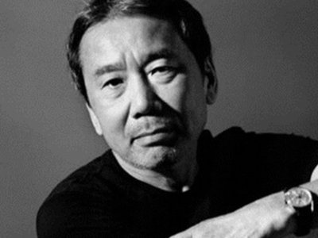
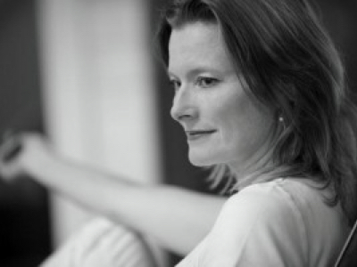
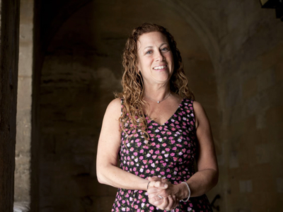
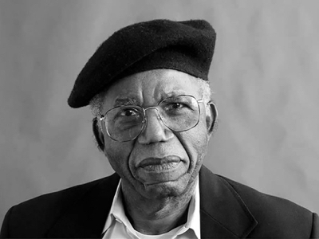
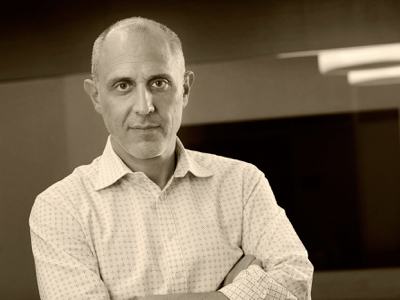
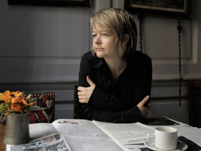
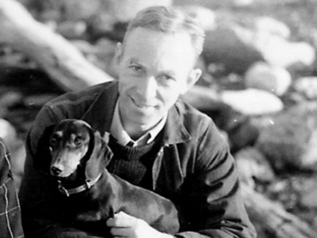
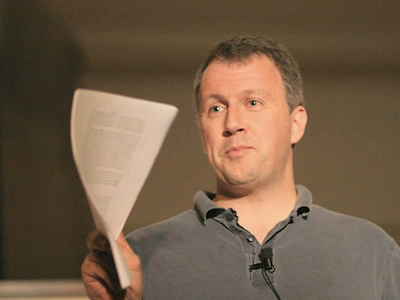
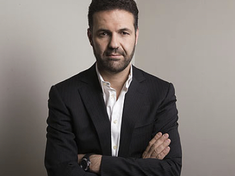

# 16.作家启示录（一）

## 16.作家启示录（一）

花心思写这一篇是为了与你分享成熟的作家们在写作过程中的经历，或者说他们的写作技巧（原则）。

你会发现由于他们的个性不同，所以采取的策略自然也不一样。比如，有人热衷于制定提纲，有人强烈反对它；有人想办法解决“作家障碍”这事儿，有人认为“作家障碍”是个幌子。

之所以把英文放在这儿，还是真诚地希望你能触摸最原汁原味的东西——喜欢哪个作家的观点，直接点开链接，去看就行了——而不会，因为我的“硬翻译”加“转述”，错过一种适合自己的语言风格。

### [Haruki Murakami](https://www.theparisreview.org/interviews/2/haruki-murakami-the-art-of-fiction-no-182-haruki-murakami): the repetition itself becomes the important thing

> When I’m in writing mode for a novel, I get up at four a.m. and work for five to six hours. In the afternoon, I run for ten kilometers or swim for fifteen hundred meters \(or do both\), then I read a bit and listen to some music. I go to bed at nine p.m.
>
> I keep to this routine every day without variation. The repetition itself becomes the important thing; it’s a form of mesmerism. I mesmerize myself to reach a deeper state of mind.
>
> But to hold to such repetition for so long — six months to a year — requires a good amount of mental and physical strength. In that sense, writing a long novel is like survival training. Physical strength is as necessary as artistic sensitivity.

简单的翻译一下：

写小说的时候，我每天4点就起了。然后，工作5到6小时。中午的时候，跑个十公里或者游上1500米（有时候两者都做）。接着阅读或者听些音乐。晚上9点就睡了。

我坚持每天都这么做，没什么变化可言。重复本身变得重要，这就像是一种催眠。我在催眠自己达到更深层的精神状态。

但是这么长期坚持——六个月到一年的时间——需要强壮的身体和心智的力量。也就是说，写小说，就像是做特训。身体力量与艺术敏感度同等重要。

### [Jennifer Egan](http://thedaysofyore.com/2011/jennifer-egan/)

> Be willing to write really badly. It won’t hurt you to do that. I think there is this fear of writing badly, something primal about it, like: “This bad stuff is coming out of me…” Forget it! Let it float away and the good stuff follows. For me, the bad beginning is just something to build on. It’s no big deal. You have to give yourself permission to do that because you can’t expect to write regularly and always write well. That’s when people get into the habit of waiting for the good moments, and that is where I think writer’s block comes from. When I was writing “The Keep,” my writing was so terrible. It was God-awful. My working title for that first draft was, A Short Bad Novel. I thought: “How can I disappoint?”

简单翻译一下：

乐于接受自己写得差的事情没那么糟糕。它也不会伤害到你。我认为很多作者对写得差这事儿有种原始的恐惧感：这个蠢东西竟然是我创造的......没事儿的，忘掉它吧！让糟糕随风而逝，好作品才会接踵而至。对我来说，坏的开始只是建立作品的基础。没啥大不了的。你必须容许自己接受不好、糟糕，因为你没法期待能一直写好。这也是绝大多数人的坏习惯：期望好事情一直发生。我认为作者障碍\(writer's block\)就是这么来的。初次写The Keep 这本书时，我的写作水平很糟糕，于是干脆把初稿命名为，一本糟糕的短篇小说（A short Bad Novel）。那时，我就在想，“都这样了，还想咋地？”

### [Jodi Picoult](http://www.thedailybeast.com/jodi-picoult-on-writing-publishing-and-what-shes-reading)

> I don’t believe in writer’s block. Think about it — when you were blocked in college and had to write a paper, didn’t it always manage to fix itself the night before the paper was due? Writer’s block is having too much time on your hands. If you have a limited amount of time to write, you just sit down and do it. You might not write well every day, but you can always edit a bad page. You can’t edit a blank page.

简单翻译一下：

我不太相信作者障碍（writer's block）这回事儿。想想看，你在大学准备毕业论文时也有卡住的时候。但是没办法，你得上交它，于是，就算熬夜也要把它完成。作者障碍，就是因为手边有太多的时间了。如果写作时间有限，那不管怎样，你都会坐下来去写的。可能不会每天都能写得很好，不过可以随时修改的嘛。反正，你不可能修改一张空白的纸，对吧。

### [Chinua Achebe](https://www.theparisreview.org/interviews/1720/chinua-achebe-the-art-of-fiction-no-139-chinua-achebe)

> I believe myself that a good writer doesn’t really need to be told anything except to keep at it. Just think of the work you’ve set yourself to do, and do it as well as you can. Once you have really done all you can, then you can show it to people. But I find this is increasingly not the case with the younger people. They do a first draft and want somebody to finish it off for them with good advice. So I just maneuver myself out of this. I say, Keep at it. I grew up recognizing that there was nobody to give me any advice and that you do your best and if it’s not good enough, someday you will come to terms with that.

简单翻译一下：

我相信一件事儿；好的作家除了坚持写作之外，不需要别人去告诉他应该怎么做。想想自己决心要做什么，然后投入其中，尽力做好。一旦你真正竭力去做了，接下来就是展示作品的时候。但是我发现，年轻人并不这么想。他们完成初稿之后，就迫不及待的各处询问意见。所以，我会告诉他们，继续做。在我的成长中，我发现还没有人给我什么建议，其实竭尽所能去做就可以了。如果暂时还不够好，那么总会越来越好的。

### [Joshua Shenk](http://blogs.plos.org/neurotribes/2011/06/02/practical-tips-on-writing-a-book-from-22-brilliant-authors/)

> Get through a draft as quickly as possible. Hard to know the shape of the thing until you have a draft. Literally, when I wrote the last page of my first draft of “Lincoln’s Melancholy” I thought, Oh, shit, now I get the shape of this. But I had wasted years, literally years, writing and re-writing the first third to first half. The old writer’s rule applies: Have the courage to write badly.

简单翻译一下：

要尽快地完成初稿，因为直到完成初稿，才能真正明确这本书的形状。我记得在完成 《林肯的忧郁》（Lincoln’s Melancholy ）初稿的最后一章时，我的想法是：靠，竟然直到现在，我才知道这本书究竟怎么回事。但是，我之前在不断地写然后重新修改前面的1/3，然后再变成1/2，这过程耗费了我几年的时间。唉，还是老话说得对：要有勇气面对自己糟糕的作品。

### [Sarah Waters](http://www.goodreads.com/quotes/341958-treat-writing-as-a-job-be-disciplined-lots-of-writers)

> Treat writing as a job. Be disciplined. Lots of writers get a bit OCD-ish about this. Graham Greene famously wrote 500 words a day. Jean Plaidy managed 5,000 before lunch, then spent the afternoon answering fan mail. My minimum is 1,000 words a day – which is sometimes easy to achieve, and is sometimes, frankly, like shitting a brick, but I will make myself stay at my desk until I’ve got there, because I know that by doing that I am inching the book forward. Those 1,000 words might well be rubbish – they often are. But then, it is always easier to return to rubbish words at a later date and make them better.

简单翻译一下：

把写作当成一种工作。要自律。很多作家都有一点强迫症。Graham Greene 每天写500字。 Jean Plaidy 必须在午饭前完成5000字，然后下午花时间回复邮件。我一天最少要写上1000字——有时候很容易，但坦白说，有时候，有点卡。不过，我会把自己按在桌子旁，直到完成它。因为只有这么做，才距离完成新书更进。那1000字可能很垃圾——通常都很垃圾，哈哈。但是，事情总是这样：那1000字会让之后的文章写起来更容易也更优质。

### [E.B.White](https://www.theparisreview.org/interviews/4155/e-b-white-the-art-of-the-essay-no-1-e-b-white)

> I never listen to music when I’m working. I haven’t that kind of attentiveness, and I wouldn’t like it at all. On the other hand, I’m able to work fairly well among ordinary distractions. My house has a living room that is at the core of everything that goes on: it is a passageway to the cellar, to the kitchen, to the closet where the phone lives. There’s a lot of traffic. But it’s a bright, cheerful room, and I often use it as a room to write in, despite the carnival that is going on all around me.
>
> In consequence, the members of my household never pay the slightest attention to my being a writing man — they make all the noise and fuss they want to. If I get sick of it, I have places I can go. A writer who waits for ideal conditions under which to work will die without putting a word on paper.

简单翻译一下：

我在工作的时候从来不听音乐。我没那种注意力，也不喜欢这样。不过呢，我可以在注意力分散的环境中工作。我的客厅四通八达，连接地下室、厨房、橱柜（有电话的地方）。在客厅里，人来人往。不过，它很明亮，我经常在那儿办公，尽管周围有各种可能令我分心的娱乐存在。

这么做的结果是，我的家人根本不会在意我正在写作——他们还是各忙各的。如果我讨厌噪音，我当然有地方离开。可是，一个作家如果只有在理想的环境中才能工作，那你就别指望他能写出什么了。

### [Paul Graham](http://www.paulgraham.com/writing44.html)

> Write a bad version 1 as fast as you can; rewrite it over and over; cut out everything unnecessary; write in a conversational tone; develop a nose for bad writing, so you can see and fix it in yours; imitate writers you like; if you can’t get started, tell someone what you plan to write about, then write down what you said; be confident enough to cut; have friends you trust read your stuff and tell you which bits are confusing or drag; don’t \(always\) make detailed outlines; mull ideas over for a few days before writing; carry a small notebook or scrap paper with you; start writing when you think of the first sentence; if a deadline forces you to start before that, just say the most important sentence first; write about stuff you like; try to tell the reader something new and useful; work in fairly big quanta of time; when you restart, begin by rereading what you have so far; when you finish, leave yourself something easy to start with; if you say anything mistaken, fix it immediately; learn to recognize the approach of an ending, and when one appears, grab it.

尽可能快速的把初稿写出来；然后一遍一遍地修正；删除任何不必要的部分；用交流的语调去写作；要有个“狗鼻子”，这样你能够判断自己哪里写得不够好；想象你的读者类型；如果你还没开始的话，就把你的写作计划告诉给某个人，然后把它们写到纸上；在修剪的时候要有信心；找到你信任的朋友，询问他们的意见；提纲不（总是）需要太详细；在写作之前的几天，酝酿想法；身边时刻带着纸笔；想到第一句就开始去写；如果截止日期需要提前，就写先你认为最重要的；写自己喜欢的话题；告诉读者新鲜有用的事情；每天写作前，先读一读之前写过的内容；每天要结束的时候，尽量留下第二天可以轻松开始的话题；如果你感觉哪里不对，要立刻改正；懂得何时结束。

### [A.J. Jacobs](http://www.thedailybeast.com/aj-jacobs-how-i-write)

> I am a big fan of outlining. I write an outline. Then a slightly more detailed outline. Then another with even more detail. Sentences form, punctuation is added, and eventually it all turns into a book.
>
> I write while walking on a treadmill. I started this practice when I was working on Drop Dead Healthy, and read all these studies about the dangers of the sedentary life. Sitting is alarmingly bad for you. One doctor told me that “sitting is the new smoking.” So I bought a treadmill and put my computer on top of it. It took me about 1,200 miles to write my book. I kind of love it — it keeps me awake, for one thing.

简单翻译一下：

我热衷于制定提纲。写一个提纲，然后再写一个详细的，接着再写一个更详细的。把句式、标点添进去，最终竟变成了一本书。

我一边写一边在跑步机上运动。开始这个练习是在写 Drop Dead Healthy 的时候。那段时间我看了很多研究报告，是关于久坐不动的危害性。有个医生告诉我，它和吸烟的危害一样大。于是，我就买了跑步机，然后把电脑放在上面工作。完成这本书时，我跑了1200英里。这让我清醒，我很喜欢。

### [Khaled Housseni](http://www.thedailybeast.com/khaled-hosseini-how-i-write)

> I don’t outline at all, I don’t find it useful, and I don’t like the way it boxes me in. I like the element of surprise and spontaneity, of letting the story find its own way. For this reason, I find that writing a first draft is very difficult and laborious. It is also often quite disappointing. It hardly ever turns out to be what I thought it was, and it usually falls quite short of the ideal I held in my mind when I began writing it. I love to rewrite, however. A first draft is really just a sketch on which I add layer and dimension and shade and nuance and color. Writing for me is largely about rewriting. It is during this process that I discover hidden meanings, connections, and possibilities that I missed the first time around. In rewriting, I hope to see the story getting closer to what my original hopes for it were.
>
> I have met so many people who say they've got a book in them, but they've never written a word. To be a writer — this may seem trite, I realize — you have to actually write. You have to write every day, and you have to write whether you feel like it or not. Perhaps most importantly, write for an audience of one — yourself. Write the story you need to tell and want to read. It’s impossible to know what others want so don’t waste time trying to guess. Just write about the things that get under your skin and keep you up at night.

简单翻译一下：

我不怎么写提纲，那对我没什么用。我不喜欢被限制在条条框框里，我喜欢意外和自发性，也就是让故事顺其自然的发生。不过也因此，第一稿特别难。它根本不是我想象中的样子，这让我失望。不过，好在我喜欢重新写。第一稿就像是素描画，画个大概的形象、尺寸、情感、颜色。对我来说，写作基本上意味着重写。在这个过程中，我会找到在初稿里错过的隐藏的含义、关系、可能性。在重写过程中，我总是希望它能够接近最初的那个想法。

我听很多人说起他们有好的想法，但他们从来没写一个字。想成为作家——在我看来，最基本的——你得真正去写。你得每天都写。不管喜不喜欢自己的东西，你都得写。或许，最重要的是，为一个观众写——你自己。写一个你想讲然后又想听到的故事。想知道其他人到底在想什么是不可能的事情，所以别白费力气了。还是写写自己内心深处的故事吧。

