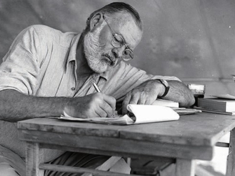
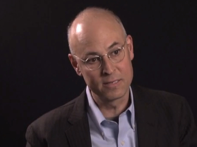
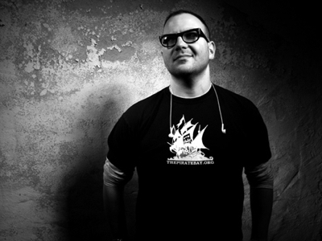
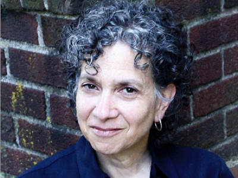
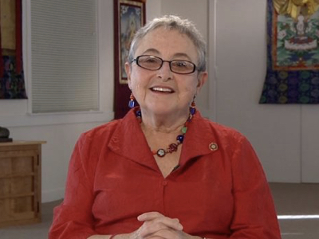

# 17.作家启示录（二）

## 17.作家启示录（二）

### [Ernest Hemingway](https://www.theparisreview.org/interviews/4825/ernest-hemingway-the-art-of-fiction-no-21-ernest-hemingway)

> When I am working on a book or a story I write every morning as soon after first light as possible. There is no one to disturb you and it is cool or cold and you come to your work and warm as you write. You read what you have written and, as you always stop when you know what is going to happen next, you go on from there.

当我要写书或者小说的时候，我都是尽早行动，尤其是在早晨第一缕阳光到来时。那时候没有人会打扰你，天气也比较凉爽，当然，越写就越感到温暖。读读自己写过的文字，直到你清楚接下来会发生，于是，就从那里开始。

> You write until you come to a place where you still have your juice and know what will happen next and you stop and try to live through until the next day when you hit it again. You have started at six in the morning, say, and may go on until noon or be through before that.

继续写，直到自己仍有余力。当你知道接下来要发生什么的时候，停下来。这样，第二天可以快速进入状态。同样，早晨六点钟开始，一直到下午，或者提前那么一点儿。

> When you stop you are as empty, and at the same time never empty but filling, as when you have made love to someone you love. Nothing can hurt you, nothing can happen, nothing means anything until the next day when you do it again. It is the wait until the next day that is hard to get through.

当你停下来的时候会感觉空虚，但和喜欢的人在一起却不会空虚甚至很满足。没什么能伤害 到你，没什么可能会发生。但第二天开始了，没什么就意味着一切的可能性。等待第二天的到来，是一种煎熬。

### [David Shenk](http://davidshenk.com/essays.html)

> Get feedback — oodles of it. Along the way, show pieces of your book to lots of people — different types of people. Ply them with wine and beg them for candor. Find out what’s missing, what’s being misinterpreted, what isn’t convincing, what’s falling flat. This doesn’t mean you take every suggestion. But this process will allow to marry your necessarily-precious vision with how people will actually react.

获取大量反馈。比如，把你的草稿给很多很看——不同类型的人。询问他们的意见。看看到底哪里缺失内容，哪里被误解，哪里没有说服力。我不是要你参考每条意见。而是这个过程会让你提前看到人们的真实反映。

> You’re obviously not writing a memoir here, but this book is still partly about you — the world you see, the way you think, the experiences you have with people. And trust me, readers are interested in who you are. So don’t be afraid to let bits and pieces of your personality and even life details seep into the text. It will breathe a lot of life into the book.

显然，你不是在写回忆录，但是这本书仍然与你有关——你看到的世界，你的思考方式，你经历的人。相信我，读者对于你是谁很感兴趣。因此，不要担心你将自己的个性，甚至生活中的只言片语写进书里。它们会让这本书更有生命力的。

### [Cory Doctorow](http://craphound.com/)

> Write every day. Anything you do every day gets easier. If you’re insanely busy, make the amount that you write every day small \(100 words? 250 words?\) but do it every day.

每天都要写。任何每天都做得事情都会让它变得更容易。如果你真的很忙，那就少写一点（100字？250字？）但无论如何，每天都要写。

> Write even when the mood isn’t right. You can’t tell if what you’re writing is good or bad while you’re writing it.

即便是情绪不对的时候也要写作。在写作的时候，你也无法知道能写得好还是坏。

> Write when the book sucks and it isn’t going anywhere. Just keep writing. It doesn’t suck. Your conscious is having a panic attack because it doesn’t believe your subconscious knows what it’s doing.

这本书很烂的时候，也要写下去。由于你的意识并不相信潜意识知道你在做什么，所以你感到痛苦。但其实没那么烂。

> Write even when the world is chaotic. You don’t need a cigarette, silence, music, a comfortable chair, or inner peace to write. You just need ten minutes and a writing implement.

即便外界混乱也要写。你不需要雪茄、安静、音乐、舒适的椅子，或者内心的宁静。你只需要十分钟以及一个写作设备。

### [Peter Conners](http://www.growingupdead.com/about-peter-conners.html)

> When I’m writing a book I only read other books that somehow inform my book. If it doesn’t serve my process — no matter how much I want to read it — I don’t. I suspect there are a lot of people who will give the opposite opinion \(take a break from reading about your subject matter, etc.\), but I’m not one of them. This is your time to be completely and justifiably obsessed. So go ahead — bask in the madness.

在写书的时候我只阅读对我的书有帮助的书籍。如果对写书的过程没有帮助——不管我多么想读它——我都不会去看的。我猜有很多人对我的看法不一（要从你的主题中出来，休息一下之类的），但我和他们不一样。写书是属于你完整地沉迷的时刻。全力以赴，疯狂去做吧。

> Non-fiction shouldn’t mean poorly written. Writing is writing and art always counts. Make your book beautiful to read and you’re more likely to communicate your messages to your reader.

非虚构性写作也不代表糟糕的写作。写作就是写作，艺术永远有价值。作品越是动人，就越能将讯息传递给读者。

### [Deborah Blum](http://deborahblum.com/)

> I let my first draft suck. kind of the Anne Lamott advice on “shitty first drafts.” to me my first draft is just an attempt to start unfolding the flow and logic of the story. if i get stuck, i just put xxx in the draft \(for figure this out later.\) with one of my books \(sex on the brain\) i did this so often that i had literal nightmares about it, that people were coming up to me and asking me if i had adopted an avant-garde writing style.

就像 Anne Lamott 建议的那样“糟糕的初稿”，于是干脆把它们丢到一旁。对我而言，初稿就是一个揭开故事的开始。如果我卡住了，那就把XXX放到草稿箱（过会儿再弄）。我在写 Sex on the Brain 的时候经常这么干，以至于我都做梦了：人们朝我冲过来，问我是不是正在使用一种超前卫的写作风格。

> I’m obsessive about the research. i organize and cross-list and file from the very beginning. i make notes of key points, issues, and themes. the amount of research one does for a proposal is very different from the amount of research one does for a whole book. so i keep track of all these key moments in a way that lets me recognize patterns that i didn’t see earlier. and also so that when i’m later actually writing, i know where to find everything. writers waste a lot of time looking for that study that they filed, well, somewhere.

我对调查研究超入迷的。在一开始我就会组织罗列需要的文件。我会在笔记上写些关键词、问题、主题。写一个话题需要的研究量和写书绝对不同。所以，我会在调研的时候持续地做笔记。这样，在之后的写作过程中，需要什么素材，我都知道它们在哪儿。很多作家都会花一大堆时间寻找他们已归档的素材，（可是我不会）。

> The best advice i got when writing an issue book was to write the first chapter LAST. this isn’t absolute, but it’s in the research and writing of later chapters that you often figure out what your primary points will be and how best to frame them.

我在写解决问题的这一类书时得到的最好的建议是最后写第一章。这当然不是绝对的，但是当你重新调研或者在写后面的章节时，回过头来，才会发现这本书的关键点，于是你就知道该如何制定它的框架了。

注： This is what publishers call an "issue" book: a book for a particular situation/problem in readers' lives-- one which does not affect all people.

### [Barry Boyce](https://www.amazon.com/Author-101-Insiders-Publishing-Bestseller/dp/1630473758)

> Planning. Planning. Planning. It’s a campaign. It requires more management to support the creativity. Cultivate a good relationship with your editor from the beginning. He/she is going to be your task master at some point. That’s going to go so much better if he/she is also your friend, colleague, supporter, and fan. The campaign of writing a book can get so lonely sometimes, you need a good attaboy just to remind yourself of why you’re doing it and that you’re not the crazy loser.

计划。计划。还是计划。这是一场战争。创造力需要管理的支持。要在一开始和你的编辑建立好的关系。如果他是你的朋友、同事、支持者、书迷，就更好了。写书是一场孤独的战斗。你需要一个好的伙伴时常提醒自己为什么要做这件事，提醒自己并不是失败者。

> As Trungpa Rinpoche said \(I paraphrase\): enjoy refreshing activities from time to time. If you’re planning and scheduling well, you can find opportunities regularly to breathe more fresh air into your life and replenish yourself, because “the work fills the available space” is nowhere more true than on a book project. Watch out for self-indulgent and cheap substitutes for actually taking an honest to god break, of whatever duration.

正如 Trungpa Rinpoche 所说：偶尔享受新鲜的活动。如果你的计划制定的很完善，那么你肯定有时间出来放松一下，给自己充电，因为，在写书的时候，闲暇空间被工作填满无疑是最真实的。小心自我放纵，但是要有真正的休息。

### [Paula Span](http://www.paulaspan.com/)

> The fact is, my 60,000-plus-word book was pretty much like writing 8 to 10 long-form pieces. I didn’t do it differently, in terms of research or writing or rewriting. My existing skills were perfectly adequate to the task; yours will be too. It took me 2.5 years but then, I was teaching and freelancing at the same time; had I focused solely on the book, it probably would’ve taken 18 months. So you will make your deadline, even if your book is longer and more complex.

事实上，我的6万字的书就是8到10个长篇文章构成的。除了调查收集素材、写、修改，也没做其他的。我现有的的写作技巧完全可以完成它，你也一样。那本书花了我两年半的时间，但那个时候我还在教学，同时是自由职业者。如果我全力以赴的话，可能18个月就完成了。所以，你一定要制定截止日期，即便它篇幅长又复杂。

### [Rudy Simone](https://www.amazon.com/Rudy-Simone/e/B0039XA9M4)

> I had the easiest time of my life writing my three Asperger books. I did learn that questionnaires make good research tools. I had three levels of questionnaires, each expanding on the one before it, so I didn’t have to individually interview each person. I did that by email or phone if and when it was warranted. By the time I wrote Aspergirls I had it streamlined: The questionnaires were posted on my site, the first one visible to the public so anyone could use it, then the 2nd and third were on hidden pages that I gave my participants the URL to. The data was compiled and I received email alerts whenever there was a new entry.

写 Asperge 系列三部曲是我人生中最惬意的时候。我学到一点，问卷调查对新书的调研工作很有帮助。我将所有的问题分成三张问卷，后一张问卷是对前一张的补充。我没有挨个采访别人，而是通过邮件或者电话的方式。后来在写 Aspergirl 时，我又转变了策略：将第一份问卷公开放在网站上，然后第二三份问卷的放到隐藏的页面，我会把链接发给那些参与者。这样，每次看邮件时就能得到新的数据。

### [Sylvia Boorstein](http://www.sylviaboorstein.com/)

> Do not open email until 5PM on any weekday or other day when i expect to be writing much of the day.

当我希望自己能写得多一点时，在下午5点之前就不会使用邮箱。 &gt; I take the due date for the first draft EXTREMEly seriously., like everything depends on that day.

我对初稿的截止日期要求很严苛，就好像一切都取决于那一天一样。

> When I do not like how what I’m writing is sounding, I quit. I leave the computer. I do something else, like cook soup. I “hear” what I am about to type before I type it and if it is not sounding like me naturally talking, I know i am not clear or balanced enough to go on.

如果写作的时候，我不喜欢那个声音，那时候，我就会停下来。离开电脑，做些其他的事儿，比如烧汤。在打下每个字之前，我会听到它的声音，如果那个声音不自然，不是真实的我，那我就知道自己还不够清晰，就不再继续了。

> I do not write from the beginning to the end. I write in the order that particular parts take form in my mind and I enjoy mulling them over… I mull and mull and imagine I am explaining them to someone and then I write them down.

我并不是从头写到尾。写作的顺序是，我头脑中会形成一些章节，我就很享受编排它们......想象自己正要将它们一点一点解释给别人听，然后再写出来。

