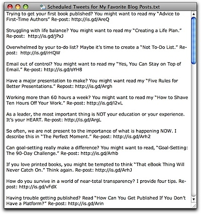
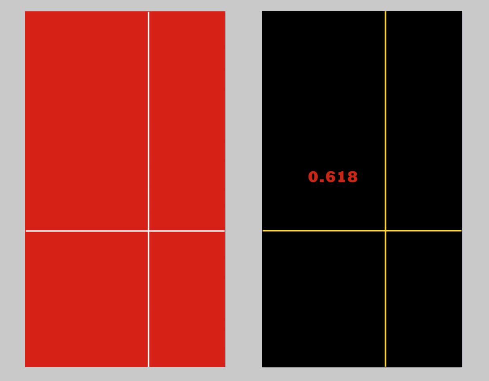
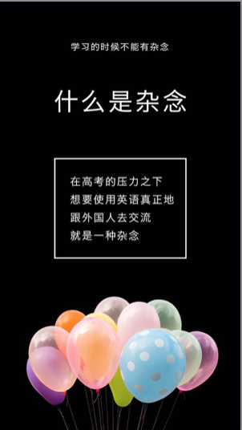

# 18.如何成为一个多产的作家？

## 18.如何成为一个多产的作家？

### 循环利用副产品

我们来讲一个超酷的概念，“recycle”，循环利用。

这个概念，我是从[ Michael Hyatt ](https://michaelhyatt.com/about)（畅销书作家、）那里看到的。他在 [How to recycle your blog content ](https://michaelhyatt.com/recycling-your-blog-content.html)写到：

> Over the years, I have written hundreds of blog posts. Some of them are no longer relevant, but, frankly, most of them are. The problem is that these inevitably scroll into my blog archives. As a result, they all but disappear.
>
> If you are a blogger, you know what I am talking about. You put a lot of work into those posts, and you hate to see them go to waste. The challenge is to make it more visible and more accessible.
>
> 这么多年吧，我也写了不少文章。有些文章之间没啥关联，但是，诚实地说，绝大多数，还是相关的。问题是，（每次发表之后）它们都不可避免的被放到‘归档’里。结果是，他们就那么消失啦。
>
> 如果你是写博客，你懂得我在说什么。你花了大量精力去写出来，并且发表。你不想眼生生看着它们被埋没。所以，挑战就在于，你要让它们再次被看到、被提及。

他分享了一些技巧，比如，在一篇新文章中，如果能够出现与旧文相关的关键词，就直接附上链接。甚至，他还特意编排 Twitter 的推送：

这么操作几个星期之后，他发现，网站的主要流量竟然来自推特呢。

2003年，刘未鹏开始写博客。最初的博客较短，后来渐渐写了自己的心得和看法，比如[《逃出你的肖申克》](https://web.archive.org/web/20120119213132/http://mindhacks.cn:80/2009/01/18/escape-from-your-shawshank-part1/)系列、[《一直以来伴随我的一些学习习惯》](https://web.archive.org/web/20120115080117/http://mindhacks.cn:80/2008/07/08/learning-habits-part1/)系列。《暗时间》这本书便是从他的博客文章中精选出来的。

你看，刘未鹏可能根本没想过写《暗时间》这本书。但，那些好的文章聚合在一起，就自然而然的成了一本书。

这些个文章，它完全就是“副产品”啊。

举个例子。“类比”那一篇，在我没打算写书之前就已经完成了。我完全没有“远见”，几个月后，它会被放到【你需要知道的思维工具】里面。

你看，这也是在利用写作的“副产品”，去完成一个“新作品”呢。

这么做的可不止我。

Jeff Goins 也说过，他完全利用自己和读者的两封来往信件，就完成了一篇高质量的文章。

> Don’t work harder; work smarter. Use what you’ve already written, polish it, and share it \(again\).

不要努力地工作，要学会聪明地工作。反复利用已经写过的文章，修改，并再次分享。

### 过度承诺

过度承诺，看起来似乎是个不太靠谱的事情。

我们通常的做法是，不要公开承诺，尤其是过度承诺。比如，大型的公司懂得一个策略，“under-promise and over-deliver”。举个例子，有些公司会公开说，某个产品将于10月份跟大家见面。结果，9月份就出来新品了。于是，用户会觉得，这完全超出心里预期，简直是个意外惊喜，所以会争相购买。

但是，我们在写第一本书的时候不能这么做。

Blaine Hogan （导演、演员、畅销书 Untitled: Thoughts on the Creative Process）的作者）[分享](https://goinswriter.com/blaine-hogan-interview/)了他在写第一本书时的方法：

> Under-promising and over-delivering is about fear, plain and simple. The way I attack the beast of resistance is by taking risks and standing in the face of fear. I do this by dreaming huge dreams and then doing the hard work to make them come to life.
>
> Do we run the risk of disappointing people or looking like flakes? Of course! But I would rather lay my head on the pillow every night knowing that I worked my butt off to try turning a vision into something beautiful rather than knowing that I under-promised something just to stay safe.
>
> Practically, this requires an emphasis on execution and a bias toward action versus mere ideas. Often, we put too much energy into our “ideas” and not enough time actually making them. In the end, this is all self-talk since I struggle daily to execute and act — and yet I know that when I cast big, scary visions, something amazing can happen.
>
> “低承诺高交付”，它与恐惧、朴素、和简洁相关。我与resistance（执行力那一章）作斗争的方法就是冒险面对这种恐惧。我的做法是，放大梦想，然后努力实现。
>
> 这样冒险是不是可能会让别人失望呢？当然。但是，我宁愿每晚在睡前清楚地知道，我有努力将远景变成现实，而不是为了保证自己的安全从而做出较低的承诺。
>
> 当然，这需要强大的执行力才行。通常情况下，我们花了太多时间放在“主意”上，而不是去实现它们。我每天都挣扎着去行动——好处是，我已经知道，当我有更大的愿景时，精彩的事情才会发生。

另外，“过度承诺”这个方法论之所以有效，其中一个原因是来自于“面子问题”。面子不仅存在于东方文化中，在全球都存在，它与我们的社交本能有关。

在《自私的基因》中有这样一个例子：在远古社会，男人在向女人求爱的时候会小心谨慎，因为一次洋相会很快被传递开来从而使得他们成为整个部落的笑柄。

> 由于人的大脑是经过漫长的进化年代“堆积”起来的，也就是说，从爬行动物到哺乳动物到高级灵长类这些进化阶段，我们的大脑从只有原始的反射模块，到拥有初步的情感区域，一直到神奇的具有6层结构的“新皮质”所支撑的高级认知能力，一步步走来。
>
> ——《Synaptic Self》

然而，我们的高级认知模块并没有与原始的反射模块完全融合。现象之一是：我们明明知道，在现代社会，人口流动剧烈，人际关系变动频繁，没有必要再像原始社会一样重视“面子”问题，但我们还是会在意它。

因此，当你公开对读者做出某种承诺时，潜在你身体内的“面子”因子一定会出现。它难以忍受失败或者失信，最终，只好“硬着头皮”去行动，直到完成承诺。

从这个角度讲，“过度承诺”，对于有效的写作，是有意义的。

### 学习多种技能

你会发现一件事情：会的技能越多，学习的速度反而越快。即便，这些技能，看起来貌似相互之间一点关系也没有。

举个例子。

最初开通公众号时，完全不懂页面排版。于是，各处收集资料去学。找来找去，李笑来老师的[Markdown Here 教程](https://mp.weixin.qq.com/s?__biz=MzAxNzI4MTMwMw==&mid=2651629983&idx=2&sn=749589cc7213c3e755fddeb210563815&scene=4#wechat_redirect)真实在：

> 关于中文排版，我在网上看了几篇教程，总结后来发现重点只有三个：
>
> * 字体大小
> * 行间距
> * 字间距

字体设计的比默认大一点；行间距比默认大一点；字间距比默认大一点——这就完啦。

不仅如此，它让我首次接触了Markdown 式的书写。之后，公众号文章、邮件、这本书的初稿，都在使用这种格式。

除此之外，这个教程里面又介绍了CSS，这是关于编程上的东西。于是，我又开始学习CSS。意外地，接触了使用Hexo为自己在Github上建一个静态Blog站点。然后，干脆，自己做了一个博客。

过了一阵子，又需要设计公众号的封面。于是开始学习制作幻灯片。意外地发现，苹果电脑自带的幻灯片制作软件 Keynote 真心是好东西。之后演讲视频的片尾，就是用它制作的。

从公众号排版到页面设计，到Markdown的使用，到制作博客，到制作幻灯片，到短片剪辑。你看，这么兜兜转转一阵子，那些看似毫无联系的技能，竟然在求知的过程中，密切地联系起来了。

**越学越多，越学越快。然后，实实在在的越学越好。**

你看：

> 设计的”最少必要知识“是什么呢？其实只需要记住两个词就可以了：
>
> -简洁 -留白
>
> 所谓”简洁“，有很简单的实施方案：在任何一个视觉框架之中，都要尽量减少各种元素数量、线条样式数量、颜色数量等等，控制在3个左右。比如，最多三种形状，最多三种线条，最多三种颜色，最多三种字体......所谓的”留白“，更简单，就是一定要留出61.8%（其实这是黄金分割数字）的空间（或者反过来，只占用最多61.8%的空间）......
>
> ——李笑来《我们重新认识了”速成“》

于是，我就这么去玩（刻意练习）了：

首先吧，脑袋里要有0.618的概念。但仅仅是脑袋里有也不行啊，还是得动手操作才可以，于是，干脆画着玩：

就这样刻意练习之后，还是要实践的。

比如，刻意找来许岑（或许是全世界幻灯片做得最好的人之一）在一块听听里面用到的幻灯片：

然后，用上0.618的理念，刻意地去修改，结果是这样的：

简单说，【刻意练习】就是重复地做你不不会做的事儿。

于是，有了第二张：

同样，把0.618的理念放进去，修改之后：

就这么不断地反复练习，从而:

> 神经元关联通过重复建成并固话了，进而甚至会产生大脑将我们所使用的工具”内化“的神奇效果。

所谓，熟能生巧，比如”盲打“，就是这么回事儿。

也许你会问，我上面讲到的这些和写作有什么关系呢？

哈，你忘记了——输入决定输出啊。

学习技能，这是一个输入的过程。学习的技能越多，即，输入就越多。

可是，如果想要学会学好、学以致用，就必须得有个输出的过程。而这个输出的方式之一，就是写作。

所以，你发现了吗，输入越多，输出就越多。输入的种类越多，输出就越广泛。

多产，几乎是注定的。

