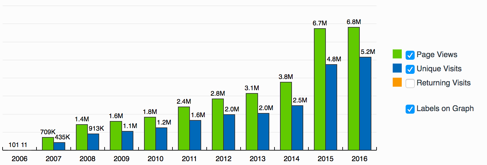
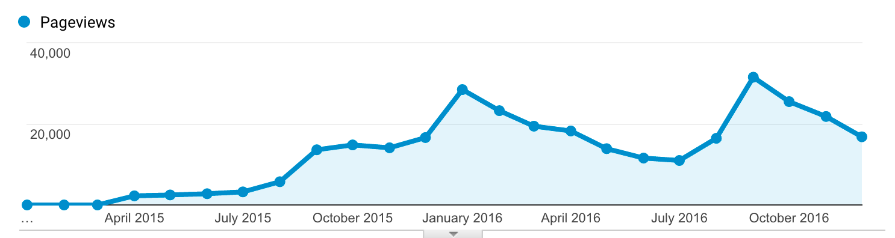
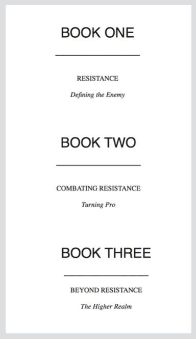

# 20.写什么（二）：长青内容

## 20.写什么（二）：长青内容

### 长销作者

李笑来多次强调说，他选择成为“长销书作者而不是畅销书作者”。思考过程是这样的：

> 为什么选择了长销书，而不是畅销书为目标呢？
>
> 虽然长远来看，我也知道其实无论哪个都不简单。可是，类比来看，生活就是更像长跑，而不是短跑啊。
>
> 许多年之后的今天，我有更深入的总结，在我看来，
>
> * 做“畅销书”，是做“注意力经济”；
> * 做“长销书”，是做“影响力经济”。
>
> “注意力经济”和“影响力经济”的差别很大，虽然都看似细微 —— 只说一点就够了，“注意力经济”的商业模式其实最终只有一个，也只能有一个：广告；“影响力经济”就不一样了，可以打造出很多个层次......

所以，选择成为长销书作者而不是畅销书作者，其实就是选择“影响力”经济之后的自然结果罢了。

### 睡后点击

在亚马逊的排行榜上，有三本关于数学的畅销书，作者是同一个年轻人：Kalid Azad。

2006年的时候，他开通了一个网站 betterexplained.com，用来分享课堂笔记。特别的是，他并不是单纯分享笔记而已，而是，将数学上的某个概念，用他自己的方式形象生动的解释，正如那个网站名称一样，“更好的解释”。

十年过去，他一共发表了168篇文章22万字。在最近一篇文章：Life Lesson After 10 Years of BetterExplained.com，里面他提到如何吸引流量——

> With evergreen content, you're building nets to throw into the ocean. More nets = more fish.
>
> With read-once content \(like a newspaper\), you're spear-fishing. More effort = more fish, but yesterday's effort doesn't help you today. It's exhausting.
>
> Just keep writing content you'd read yourself, and over time you'll see a buildup:
>
> 每一篇长青的文章，都像是一张网。你要做的就是把网撒进大海里。网越多，鱼就越多。
>
> 而一次性软文（比如，新闻），就像是鱼叉。努力越多，鱼当然就越多。但是，昨天的努力对今天，却几乎没什么复利效应。
>
> 当你持续地写长青内容，过段时间，你会发现累积的力量：

> Old posts are just as good as new ones for generating today's traffic. Let that back catalog work for you - 45% of my traffic comes from 2007-era posts. \(At that time, I had a lot of back content to import. I also had more time to spend after leaving my first job.\)
>
> 那些旧文章和新创造的文章一样，都能够吸引流量。我们再次回看一下目录吧——网站上45%的流量都来自我2007年写的文章（那时候，我有很多东西要输出。我也辞掉了第一份工作，所以有大量的时间。）

在这篇文章中，他提到了一个概念：睡后点击（Sleep Hits）。

所谓“睡后点击”的意思是：在发布了长青的文章之后，即便是过了很长一段时间，它们中的每一篇都还是有可能成为热点。

如图。

你看，在2015年10月份突然有篇文章成为了热点。然后这个热点带来的流量一直持续到2016年1月份，直到另一篇热点文章出现。当然之后，流量有所下滑，直到2016年19月份，又出现了热点文章。

### 长青内容

你发现了吗，这本书里的每篇文章，几乎都是以一个【概念】展开的，比如，执行力、设定目标、专注、刻意练习、习惯。

而，这些概念是不会“过时”的。甚至，每个概念，还能够继续生长。

举个例子。【执行力】那一篇，我用了很大的篇幅去明确执行力的定义，然后给出相应的方法论。

里面提到了一个概念 Resistance（我的翻译是“不情愿”）。你知道吗，Steven Pressfield 竟然紧靠这一个概念，就写了一本畅销又长销的书 The War of Art：Winning the Inner Creative Battle 出来。一本书总共分成三部分。每部分都和Resistance 相关。

除此之外，【执行力】那一篇里面还提到了延迟满足感、复利的力量、刚需。这里的每一个点，不夸张的说，都可以像Pressfield 那样，延伸成一本书。

因此，在我的定义里，“长青”，不是一个形容词，它是一个动词，意味着，生长能力。

一个有生长能力的概念，就像是一个有生命力的种子。既然它有生命力，所以，它总会发芽，于是慢慢变成一株小树苗，然后经过几百年，成为参天大树。

它成为参天大树就停止了吗？不是的。在树上，有鸟巢，有猴子、有虫、有啄木鸟；树下，有漂亮的彩色蘑菇；树底，还有各种微生物。

它，俨然是一个生态系统。

一个具有生长能力的概念，它可以长成一个段落，一篇文章，一本书。甚至，极大可能的，成为整个思考系统的一部分。

从写下的第一个字开始，到演化出一套思考系统结束。在没开始写作之前，根本无法想象，你的思考能力会进化的多么深刻。

