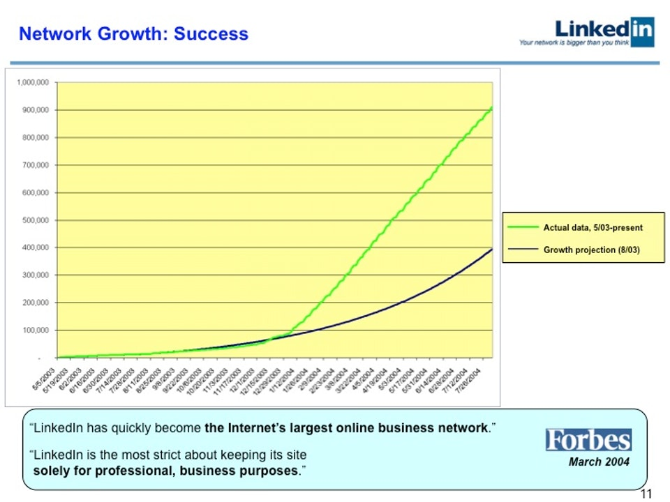
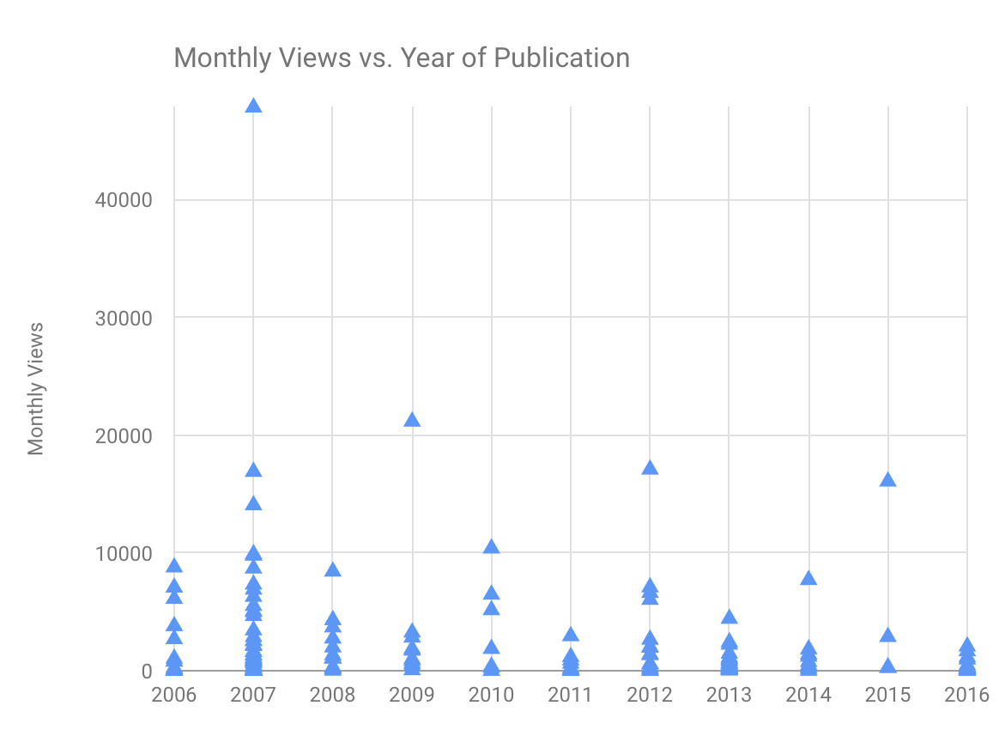
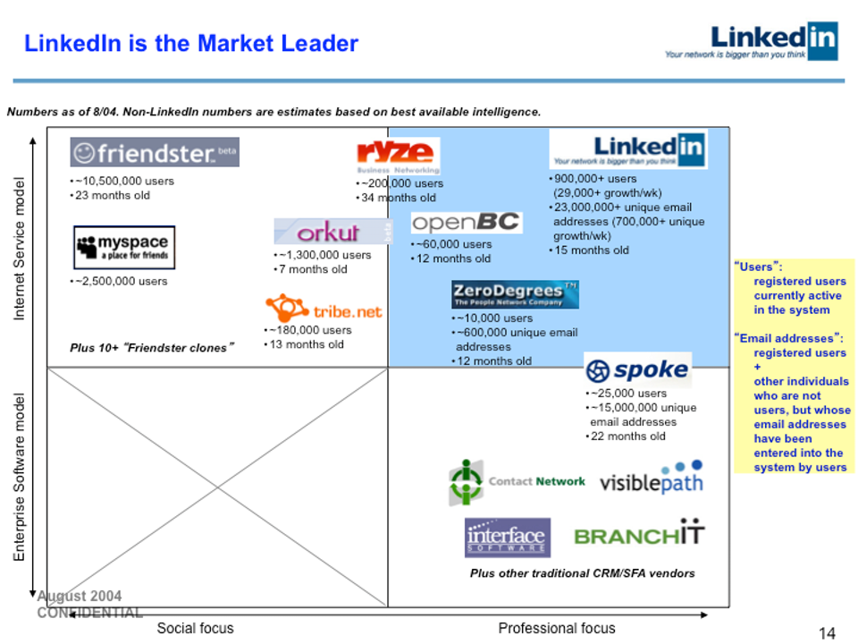
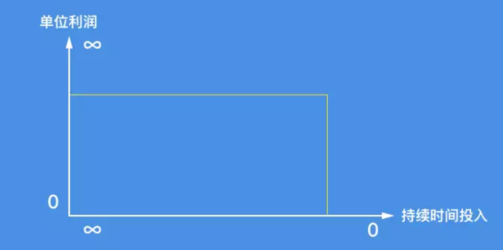

# 21.写什么（三）：长期被喜欢

## 21.写什么（三）：长期被喜欢

### 成功宝典

我有一个习惯：写硬思考日志。

20170702

> 人群中能够拿出真正作品的人永远是少数。而，一个作品想要被喜欢，更是难上加难。又，一个作品想要被长期的喜欢，简直难得没谱了？比如鲍勃迪伦的歌、许巍的《时光》...我努力做

20170703

> 我要有长期并且还得被喜欢的作品。比如，这第一本书。 但如果不能够被喜欢，又怎么长期地做下去呢？（即便能，也肯定是有少数人喜欢的） 反过来，如果不能够长期地去做，被喜欢的可能性是不是就小很多呢？换言之，长期去做，被喜欢的可能性更大。
>
> 那么，对于一个创业项目、一本书、一篇文章，做什么最有可能被喜欢？ 刚需！也就是说，做别人最最需要的事情，才最可能是被喜欢的！

事实上，当我将自己的思考写在纸上的时候，我完全被自己震惊了。因为，这简直是成功的宝典：

> 1.无论如何，你都要想尽办法拿出作品来。 2.在创造作品之前，你必须考虑这件事：如何让它被喜欢，并且还是被长期喜欢。 3.一件作品，越是能够被长期喜欢，创作者就会越幸福。 4.如果你的作品，不能够被人喜欢，那么，你继续创作的可能性会大幅降低。 5.换言之，越多人喜欢你的作品，你就会越想要创造作品。 6.对于任何作品，“刚需”（有用）可能是第一性原理。 7.无论是人、作品、还是创业项目，只要能做到给他人想要的，尤其是最想要的，才最有可能被人喜欢。 8.被喜欢的好处可太巨大了。

以下，我就举几个例子来证明上面的“成功宝典”。

#### 作品是你的社交名片

2013年，Linkedin 的创始人Reid Hoffman 公开了他在2004年向Greylock 基金寻求B轮融资时制作的幻灯片。Hoffman 的那次演讲成功的说服了Greylock ，获得了1000万美金的投资。

以下就是“字字千金”的[幻灯片](http://www.reidhoffman.org/article/2135)：

你没看错，全套幻灯片一共38张，每张都是这么“毫无美感”！

但问题是，投资人在乎的可真的不是这些哎。要知道，投资人面对的可是里德·霍夫曼（Reid Hoffman）。

2004年的时候，Reid Hoffman 已经37岁了。1990年，他毕业于斯坦福大学，获得符号系统与认识科学双学位。1993年，他获得牛津大学哲学硕士学位。1994年，他加入Apple Computer公司，参与eWorld的工作，对创建社交网络做最初的尝试。1997年，他与别人联合创立了自己的第一个公司SocialNet。在经营SocialNet的同时，霍夫曼还是Paypal创始董事会的一员。2000年，他离开SocialNet，在Paypal公司全职就任COO的职位。2002年，eBay公司以15亿美金收购PayPal，当时霍夫曼任职PayPal公司的执行副总裁。2002年12月，霍夫曼重新组建团队，联合创立了LinkedIn（这是第一个商业化社交平台），在2003年5月5日正式上线......另外，在PayPal被eBay公司收购之后，霍夫曼已经变成美国硅谷最多产和最成功的天使投资人。江湖人称“人脉王”。

所以，在那次演讲中，不是“幻灯片”的设计不重要，而是有更重要的东西等着投资人呢——里德·霍夫曼本人——他的作品（成就、经历、经验）可是远远比幻灯片重要多了。

你的作品就是你的社交名片。要想尽办法尽早地完成一部作品。

想来想去，写书，可能是成本最低成功率最高的项目了。

#### 思考：一个长期被喜欢的作品

亚马逊现在依然是互联网巨头，它也是地球上第一个真正成功的电商企业（Amazon 1995年成立，Ebay 1995年成立， Netflix 1997年成立，阿里巴巴 1999年成立， 京东 2004年成立......）。

你知道，亚马逊选择的第一个商品是什么吗？

书。

可你想过吗？全世界有那么多的商品可以卖，杰夫·贝索斯（Jeff Bezos）为什么首先选择卖书呢？在一次采访中，他分享了做出当时选择的原因：

* 市场一定要足够大
* 品类必须有长期成长性
* 消费者复购率要足够高
* 更重要的关键在于，我们要选择一个售后成本很低，甚至干脆没有售后服务的商品！

你发现了吗，当贝索斯完成了这个思考的时候，其实，亚马逊成功的结果就已经注定了。

同样，在决定写书之前，为了得到那个注定的结果，就必须要深入思考：我要写什么——不管是写“长青内容”，还是“长期被喜欢的内容”，这都是思考后的选择罢了。

#### 越长期被喜欢越幸福

> 在[《为什么你一定要学会写作》](https://mp.weixin.qq.com/s?__biz=MzAxNzI4MTMwMw==&mid=2651631176&idx=1&sn=627e06cd64c95bdcb3ce3423f6a9529b&chksm=801ff630b7687f261d551213adb97ddc8056ce38cc24fc3e65be6476900410d74c80860707c1&scene=27#wechat_redirect)中，有这么一段话：
>
> 写书，很可能是这世界上极少数极少数“普通人”真正可以做到“一劳永逸”的事情。如果有能力写好，有能力能出版，那么，这件事儿的收益模型就变成这样的了：
>
> 
>
> 这个“坐标”看起来有点别扭，因为横向的坐标，貌似反过来了，起点上是无穷大，终点上才是零。可事实偏偏就是如此的，在这件事儿上，长期来看，持续时间投入越趋近于零，收益（面积）就越大。我的两本畅销且长销的书都是这样的，《TOEFL 核心词汇 21 天突破》卖了两辈子（14 年），《把时间当作朋友》刚刚进入第二辈子（8 年）…… 而我在出版后持续投入的时间成本是多少呢？趋近于零。

上面的两段话指明了写作的好处。但除此之外，你发现了吗，作者在写下这段话时候的情绪：幸福。

越写就越会写。写就可能出书。出书可能获得财富自由。财富自由当然不是终点，但你会觉得幸福（快乐）。而这种幸福还不是一次性的哟，它是叠加的。因为，越写越想写。你看，几乎没有一个作者只写了第一本书之后，就不再继续写作的。

LinkedIn 是里德·霍夫曼的作品；Amazon 是杰夫·贝索斯的作品；《冰与火之歌》是乔治·马丁的作品（【专注】那一节）。

全世界很多人都喜欢这些作品，甚至是干脆离不开它们。

你知道，一个人活着的终极意义是什么吗？

> 被需要。

越是被他人需要，就会感到越幸福。

换言之，和这个世界产生强联系，是增强幸福感的最根本方式。

你发现了吗，貌似世界上少数人要比大多数人更幸福，而且幸福程度高出很多呢？

他们的共同特质，或者说，他们采取的方法论：

> 想方设法与世界产生强联系。

但，更为清楚深刻的解释是：

> 他们的世界真的很需要他们。

羡慕吧。

