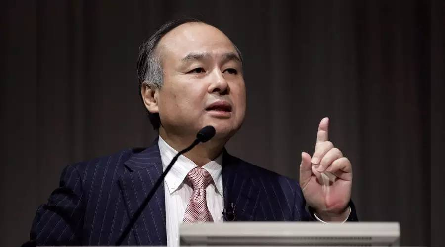

# 22.方法论的重要性（一）：实实在在的成功

## 22.方法论的重要性（一）：实实在在的成功

有个在伯克利大学读书的日本小伙，由于家庭经济出现了困难，他决定不再依靠父亲每月20万日元的生活补助，自己赚钱。

给别人打工的想法直接被他否决了。他知道自己现在的主要目标就是学习。可是，怎么才能利用空余时间赚钱呢？

他想了很久，忽然想到了一个人——被日本人尊称为“经营之神”的企业家松下幸之助。23 岁时，松下幸之助就建立了自己的电气器具工坊，在艰苦的条件下，他带领员工努力创新，成功推出了一个接一个的发明，如配线器、电池灯、电熨斗、电子管、真空管、二通插口以及自行车车灯等，最后把松下电器推向了世界，他也成了全日本最富有的人。

既然松下幸之助能依靠发明赚到钱，那么他也一定可以。他从小就表现出惊人的绘画天赋，但是在发明创造上简直一窍不通。不过，他知道一切事情都是有方法论的。

经过反复推敲，他发现了发明的三个诀窍。

第一，发明是为了解决某个问题。在生活中时时处处会遇到一些或大或小的问题。比如说，一般的圆柱状的铅笔，放到桌面上的时候它很可能滚动到地面上来，要是把铅笔做成棱状，是不是就能避免这种问题了？

另外，在上厕所的时候，人们都会有这样的苦恼：坐便器太凉了，而且也不卫生。他想，能不能用装汉堡包用的聚氯乙烯泡沫来做简易的马桶纸垫呢？于是，一项发明诞生了。

第二，逆向思维。

大多信号灯的形状都是一样的，只在颜色上有所区别，但有些类型的色盲者是分清颜色的，因此信号灯对他们来说没有任何作用。

那该怎么办呢？他干脆把信号灯通常用颜色传达信息的方法改为用图形来传达，于是后来世上就出现了以“○△□”等图形来传达信息的信号灯。

第三，随意组合。

他在英文单词卡片上写上各种各样东西的名称，比如橘子、钉子、记忆等等，写到300张时，就把它们想扑克牌一样，随手抽取3张，将它们组合起来，变成一种新产品。

他发现，这种方法是最简单的。后来，他直接通过计算机程序把一切可能的组合按照一定的逻辑要求排列出来。

经过了一年的反复操作，他得出了250多个创意。其中有一个引起了他的关注。这是“词典”“发音设备”和“液晶显示屏”的一个组合，也就是“可以发声的多国语言翻译机”，比如，你对着它说日语，它可以马上把这句话翻译成英语，这样一个不会英语的日本人马上就能和美国人对话了。

已经对发明研究十分敏锐的他立刻意识到，这个组合将会带来一种了不起的构想。他开始百般游说，最终赢得了“半导体声音合成芯片”的发明人和参与阿波罗登月计划的技术人员的青睐。依靠他们，这项发明得以一步步完善。

后来，这个发明被夏普公司以100万美金的价格买下来。

就这样，依靠他的“发明方法论”，他在19岁那年，赚到人生里第一个100万美金。他就是：

> 孙正义。

### 创业的方法论

1980年，23岁的孙正义回到日本，他并没有立刻创业，而是花了将近一年的时间来思考下一步：如何在已经想到的40种创业项目中选择最适合自己的模式。

> 对这40种项目，我全部都做了详细的市场调查，并根据调查结果，做出了10年的预想损益表、资金周转表和组织结构图。每一个项目的资料有三四十厘米厚，40个项目全部合起来，文件足有10多米高。

然后他列出了选择事业的标准，这些标准有25项之多，其中比较重要的有：

> 1．该工作是否能使自己持续不厌倦地全身心投入，50年不变； 2．是不是有很大发展前途的领域； 3．10年内是否至少能成为全日本第一； 4．是不是其他人没有想到的，独一无二的。

最终，他确立了奋斗目标：从事软件批发。

为什么最终确立了软件批发呢？他是这么考虑的：

> 第一，在所有的产业中，信息产业是最有前景的一项； 第二，根据行业数据显示，个人电脑市场将大幅增长； 第三，在个人电脑领域中，软件发展速度会大幅度地超过硬件。

这么考虑之后，他将工作的重点全部都放在了他新成立的公司软银上。

孙正义在日后的创业生涯中凭着自己独特的方法论，一度成为“世界首富”，被称为“日本的比尔盖茨”。

