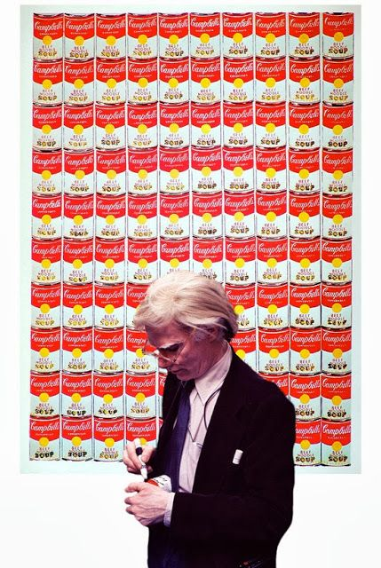

# 24.方法论的重要性（三）：学会写作

## 24.方法论的重要性（三）：学会写作

有这么一个人：

> 在他民风强悍的老家，他是他那群小伙伴里为数不多的几个没有陨落的人，最终活着步入中年；在新东方的岁月，他依然是孤注一掷的赌博，除了成为英文教师之外，大概人生也没有什么备选项；在比特币兴起的时代，他是最早的玩家，也经历过疯狂过山车一样的跌宕起伏，那时候没有人把比特币视为投资，因为它很快就变成了玩命。
>
> 但是他就这么一路走来，在众人的惊恐目光中，径直走到悬崖那头，宣称所有人都可以走过来。
>
> 他不认为自己有特别的地方，一切都可以用方法论解释。这也是他的承诺：方法论是可学习的、可重复的、可验证的。

他是李笑来，中国比特币首富，我的Mentor.

在他眼中，一切都是有方法论的。

比如，他分析《行尸走肉》其实就源自一个概念的设定：

> 突然有一天，病毒开始流行，所有人都被感染了......人们在死后会变成僵尸，被竟是要过之后也会变成僵尸，而僵尸只有被爆头才彻底死去......
>
> 在这个简单的设定基本之上，谁都可以开始创作了。
>
> > * 幸存者如何活下去，就拍了两季
> > * 讲如何成为一个团队的成员，如何才能保护家人，又拍了两季；
> > * 讲如何应对那些掠夺者，又拍了两季
> > * 接下来估计要讲的是，如何战胜奴役，估计至少两季……
>
> 这还没完，AMC 又出了另外一个衍生剧，叫 Fear of the Walking Dead，讲病毒刚开始流行的那段时间所发生的故事…… 理论上这是可以没完没了地拍下去的东西 —— 竟然都只不过来自于一个那么简单的设定。

根据他的分析，我刻意地分析了一下根据《南方吸血鬼》小说改编的《真爱如血》的设定：

> 吸血鬼不需要再吸食人和动物的血液为生，现在有一种人造血出现了。

在这个设定的基础上，每一季的剧情大概是这样的：

> * 第一季，吸血鬼惧怕人类，女主（精灵）遇到了男主（吸血鬼）
> * 第二季，女主和男主遇到了危险
> * 第三季，男主再次遇到危险，男二出来了；
> * 第四季，女主和男一男二都分手了；
> * 第五季，吸血鬼与人类的矛盾升级
> * 第六季，人类拯救吸血鬼
> * 第七季，人类、精灵、吸血鬼，他们各自过着属于各自应有的生活

就这么一路分析过来，我发现，原来写小说，即便是连载小说，并没有想象中那么难—— 一切都源于当初最简单的设定。甚至，我大胆地猜测，一部作品能够连载成功，最根本的原因就在于那个初始设定：它是否引人入胜。

这么算下来，无论是从《黑客帝国》到《权力的游戏》，还是从《青云志》到《盗墓笔记》，这一切都基于最初的设定而已。

当我再次深入研究这个方法论，并且把焦点汇聚在当代艺术家们的身上，竟然同样奏效。比如，超级网红安迪沃霍尔，他有一句很著名的话：

> In the future everyone will be world famous for 15 minutes.
>
> 未来每个人都可以在15分钟内成名。

而他的设定却异常简单：

> 重复重复再重复

每个作品可以有很多个分身。

每个作品可以有很多个颜色。

每个作品的风格可以重复用到其他作品上。

尽管他的作品风格是“重复的”，但这完全不影响他在波普艺术上的大佬地位。而且，竟然每份作品都很卖钱。

再次回到写作上。李笑来给出了最简单的一条建议：

> > “写对别人有用的东西”
>
> 这是写作的终极技巧，没有什么比这个更重要的了。仅仅这么一个问题，就会把这世间绝大多数文字过滤掉，你说它重要不重要？至于文笔什么的，不是不重要，但重要程度若是跟这个原则相比较的话，甚至可以直接忽略。
>
> 顺着这个思路走下去，对自己的提问就会逐步细化、深入：
>
> > 我写的这个东西对别人有没有用呢？ 我写的这个东西对别人有用的话，有多大的用处呢？如何做到最有用？ 我写的这个东西对别人有用的话，对多少人有用呢？如何做到对更多人有用？ 我写的这个东西对别人有用的话，在多长的时段里对别人有用呢？我如何做才能让那个时段更长一些呢？ 我写的这个东西对别人有用的话，如何才能优雅地让人们恰当地回馈我呢？ ……

“写对别人有用的东西”，这是写作者的终极宝典。

而再次深入思考，具体到底怎么写的时候，其实，那个答案已经显而易见了。

> 一篇篇文章，不需要有体系，不需要有规划，只需要每一篇写清楚一个概念或者一个方法论，持续地更新，持续地记录。

2017年1月31号，我写了一封信给Ray Dalio，里面提到了我看《原则》时的收获：制定写作原则。

> Here are my new writing principles:
>
> What is the principle \(concept\) ? Why is the principle \(concept\) important ? How to use the principle \(concept\) in right way ? What if I use the principle \(concept\) in a wrong way ? What does the principle\(concept\) connect with another important principle \(concept\) ?

如今，稍作修改之后：

1.每篇文章，只写一个概念（原则、方法论）。 2.它的清晰、正确、完整的定义是什么？ 3.它为什么重要？ 4.如何正确的使用它？ 5.它能够与什么相联系，并产生一个新的东西？

它们是我的写作基石。

我确信，人人都可以通过使用上面的原则，或者制定自己的写作方法论，完成第一本书。

道理很简单：

但凡最初的思考正确，好的结果是理所应当的。

