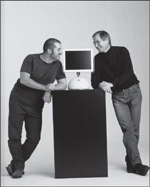

# 06.简洁的力量

## 06.简洁的力量

### 苹果成功的秘密

在《疯狂地简洁》（Insanely Simple）中，作者Ken Segall通过对苹果公司做了大量的调查之后，得到了一个结论——

> 简洁，是苹果获得成功的核心因素。虽然其他因素，比如领导力、远景、才能等等也很重要，但正是简洁才使得苹果创造出真正的东西。
>
> 简洁促使苹果革新，并且是持续地革新。

对苹果公司来说，简洁，到底意味着什么呢？在《史蒂夫·乔布斯传》中，乔布斯和设计师乔纳森·艾夫是这么看待简洁的：

 

Chapter Twelve The Design Real artists simplify

> 乔布斯和艾夫也在为如何能让每一个新设计变得简洁而绞尽脑汁。自从在第一本苹果手册里宣称“至繁归于至简”以来，乔布斯就以追求简洁为目标。追求简洁不是要忽视复杂性，而是要化繁为简。“要把一件东西变得简单，还要真正地认识到潜在的挑战，并找出漂亮的解决方案。”他说，“这需要付出很多努力。”
>
> 在艾夫这里，乔布斯终于找到了“灵魂伴侣”。他要的是真正意义上的简洁，而不是表面功夫。有一次，艾夫坐在他的设计工作室里，表达了他对简洁的看法：
>
> 为什么我们认为简单就是好？因为对于一个有形的产品来说，我们喜欢那种控制它们的感觉。如果在复杂中有规律可循，你也可以让产品听从于你。简洁并不仅仅是视觉上的，也不仅仅是把杂乱无章的东西变少或抹掉，而是要挖掘复杂性的深度。要想获得简洁，你就必须要挖得足够深。打个比方，如果你是为了在产品上不装螺丝钉，那你最后可能会造出一个极其烦琐复杂的东西。
>
> 更好的方式，是更深刻地理解“简洁”一词，理解它的每一个部分，以及它是如何制造的。你必须深刻地把握产品的精髓，从而判断出哪些不重要的部件是可以拿掉的。

### 一切都可以更简洁

简洁成就非凡，这是苹果公司给我们的启示。除此之外，很多聪明人都认为保持简洁无比重要。

比如，这几位：

> Occam’s Razor：A plurality is not to be posited without necessity

奥卡姆剃刀原则：若无必要，勿增实体

> Leonardo Da Vinci: Simplicity is the ultimate sophistication

莱昂纳多·达芬奇：简洁是终极的复杂。

> Ludwig Mies Van Der Rohe: Less is more

路德维希·密斯·凡德罗（德国建筑大师）：少即是多。

> Bjarne Stroustrup: Make Simple Tasks Simple.

比雅尼·斯特劳斯特鲁普（C++ 语言之父）：让简洁的任务再简洁。

简洁再简洁。

梭罗就是这么提醒我们的。翻开《瓦尔登湖》的任何一页，你都能发现他在用简明质朴、有条有理的方式讲述自己的感悟：

> I went to the woods because I wished to live deliberately, to front only the essential facts of life, and see if I could not learn what it had to teach, and not, when I came to die, discover that I had not lived
>
> 我走入林地，因为我希望能明明白白地活，只面对生活的基本需求。看看是否能学到生活的教诲，而不是要临死时才发现自己并没有活过。

### 简洁的语言

#### 语言的反向塑造

在《新生：七年就是一辈子》中，李笑来讲了一个故事——

一个从国内顶级大学外语专业毕业的有过几年兼职高考培训的年轻人，到他那里应聘STA阅读教学工作。结果，第一天讲课就出现了错误，然后被学生投诉了。后来，由于在讲课中多次出现错误被多次投诉，最后，只好把他辞退了。

这个底子非常好的年轻人，为什么会在短短几年里，专业能力下降那么多呢？

原来他之前一直在教那些连高考英语都不过关的高中生。于是，以他的学历和经验，根本就不需要备课。即便是，某个地方讲错了，由于那些高中生根本就听不懂，也就无法质疑他。于是，他就默默地被那些能力差的学生塑造了。

然而，当他来教STA阅读的时候，情况就完全不同了。教材的难度提高了不止一点；他面对的学生，年纪虽小，但是，参加STA培训的学生，可都是顶尖的高中生，他们和那些连高考英语都不过关的高中生，完全不在同一等级上。由于这个年轻人已经习惯了不备课，习惯了那帮高中生，所以，他怎么可能招架得住那些年龄比他小却比他更优秀的人呢？

最后，李笑来得出了一个结论——

> 人们普遍认为，在教育行业里，是老师在塑造学生。这好像很自然，但更多的时候，曾经长期从事教师职业的我，却更多的时候看到一个反过来的现象：很多的时候，其实是那些学生在塑造老师。

人，是很容易被“反向塑造”的。

人也是可以并且很容易被语言反向塑造的。心理学上有很多这样的例证，比如：

1.研究者在全世界（中国、希腊、印度、俄罗斯、澳大利亚......）收集到的[数据](https://www.edge.org/conversation/lera_boroditsky-how-does-our-language-shape-the-way-we-think)表明，说不同语言的人的思考方式不一样，甚至使用不同的语法的人看世界的方式都不一样。

2.最新[研究](http://www.slate.com/articles/news_and_politics/uc/2014/06/can_language_influence_our_perception_of_reality.html)表明，语言会架构我们解决问题的方法，甚至还会影响我们看待时空的概念。

3.[心理学家](https://www.scientificamerican.com/article/you-are-what-you-say/)认为，我们常常放在嘴边的常用词汇，都是一种自我暗示。

4.在[《语言的力量》](https://experiencelife.com/article/the-power-of-language/)这本书里，作者提到，语言能塑造我们的生活方式，所以在选择词汇时必须谨慎。越早能意识到语言的力量，越能够掌握自己的人生。

5.[《多语言事关重大》](https://books.google.co.jp/books?id=rtWCCwAAQBAJ&pg=PT109&lpg=PT109&dq=how+do+our+language+choices+reflect+who+we+are&source=bl&ots=l0N2jFo175&sig=HE72zbJujCRVbha62cwI5W0l524&hl=zh-CN&sa=X&redir_esc=y#v=onepage&q=how%20do%20our%20language%20choices%20reflect%20who%20we%20are&f=false)一书中提到，我们选择的语言不但反映价值观，还能够反映世界观。

......

由于语言本身会塑造我们，所以必须严肃对待（选择）自己使用的语言。在此基础上，越简洁越好。

#### 删除赘语

我们都知道自己被大量的垃圾信息充斥，被大量的错误价值观包裹。

大多数情况下，我们竟然对它们放任自如，不抵挡。

或早或晚，我们会由默默接收到默默接受错误的信息，并据此行动。或早或晚，我们也开始不知不觉地制造垃圾信息。或早或晚，我们被”反向塑造“成了那个年轻人。

我们该怎么做？

答案是：

> 将赘语从头脑中清除。

只有清晰的写作才能产生清晰的思考。

一个表达清晰的句子绝非偶然。很少有句子是第一次甚或第三次写出来就对路。为了保证你的作品是清晰的，你必须像同杂草做斗争一样同赘语作斗争。

不过，在学会和赘语做斗争之前，我们还得重新定义一下词素。

> 名词：是用来描述你能感知到的某个人或者事物的词汇，管它是抽象的还是具体的。
>
> 动词：是用来描述某个人或者某个事物行为和动作的，也是用来描述你能感知的那个名词性成分所发出的动作的。
>
> 形容词：是用来描述我们对某个人或事物的感知的。
>
> 副词：是用来描述我们对某个人或者事物的感知的感知的。

举个例子，“你的文章很简洁。” 在这句话中，“文章”是你感知到的事物，“简洁”是你对这个事物（文章）的感知，“很”是你对这个事物（文章）的感知的感知，也就是你对“简洁”的感知。

具体的训练方法是：

找一篇文章，用不同颜色的彩笔，将里面提到的形容词和副词圈出来。

就这么一篇文章又一篇文章的训练下去，你会发现一个不一样的世界：

> 仿佛进入了作者编织的神经网路，那些名词、动词、形容词、副词，再也不是生冷的文字，而是正在闪闪发光的感知。你看它，于是，就立刻能感受到作者的思想、情绪，就像正在拍电影似得。如梦如幻，色彩斑驳。

当我们对这些词素有了清晰、正确、完整的概念之后，就能判断出到底什么是赘语。

在《写作法宝：非虚构写作指南》（On Writing Well: The Classic Guide to Writing Nonfiction）中，威廉·津瑟（William Zinser）提供了识别赘语的技巧——

他会在一篇文章中用括号括上任何一个无用的成分。通常情况下只有一个词被括上：同动词意思一样的副词（高兴地笑），或者描述已经很清楚的事实的形容词（高高的摩天大楼）。他也会经常括上削弱句子力度的修饰语（有一点儿），或者”在某种意义上“之类的毫无意义的词组。有时候，他会括上整个句子——就是那种基本上重复前一句，或者读者无需知道，或者读者能自己明白的句子。他说，大多数初稿可以砍掉一半而不损失任何信息或作者的语气。

> 写作的改进同我们能去除的赘语数量成正比。

### 简洁的工作方式

Tim Ferriss 写了一本很疯狂的书《每周工作4小时：拜托朝九晚五的穷忙生活，晋身新贵族》（[The 4-Hour Workweek: Escape 9-5, Live Anywhere, and Join the New Rich](https://www.amazon.com/4-Hour-Workweek-Escape-Live-Anywhere/dp/0307465357)）。

他讲了句大实话：

> 早九晚五的工作，没有必要。

我们都有过这种经历：如果你的上班时间需要9小时，那你就会工作9小时。如果老板让你加班，每天要工作15小时，那你就会工作15小时。同样，如果有份工作要求你在两小时内完工，那么，两小时后，你一定能完成它。

因为有大把的时间，所以没那么在意效率，我们挥霍。而因为时间紧迫，于是得抓紧时间办事儿，并且得挑最重要的办。

这，就是我们绝对能够做到简洁的工作的根本原因。

在《每周工作四小时》里，Tim Ferriss 提到了一个对他的思考很重要的人，维弗雷多·帕累托（[Vilfredo Pareto](https://en.wikipedia.org/wiki/Vilfredo_Pareto)）。帕累托是意大利著名的经济学家、社会学家。1906年的某一天，通过调查研究，他发现了一个秘密：意大利20%的人口竟然掌握了80%的财产。这个秘密被称为帕累托法则，又叫做二八定律。

二八定律有什么用呢？

> 80%的结果是由20%的原因造成的； 80%成就来自于20%的付出和时间； 80%的利润来自于公司20%的客户......

再狠一点，在某些情况下，这个比例可能并不是 80/20，而是 90/10，甚至是99/1。

在意识到这件事之后，Tim Ferriss 很快将它应用到工作和生活中。由于工作时间减少，他有了更多的时间学习。比如，在[《全能星人》](https://v.qq.com/x/cover/36o4tonssrl62u6/d00151bkckj.html)的纪录片里，用一周的时间学会菲律宾语，然后直接跟当地记者做访谈；用一周时间学高尔夫，并打出标准杆，用三天时间学德国扑克，并连赢三场。

对于简洁的工作方式，他提到两个技巧（这两个技巧要一起用）：第一，列一张你需要做的事情的清单；第二，列一张不需要做的事情的清单。

具体地说，就是要问自己两个问题：

1.有哪20%的因素导致了我80%的不开心？ 2.有哪20%的因素让我获得了80%的成绩，于是感到幸福？

Tim Ferriss 是极聪明的人，他知道，就算他在书里把这两个问题写得这么明确了，很多读者还是不会行动。于是，他使出了狠招：

1.假如你有心脏病，每天工作两小时，你会做什么？

不是朝九晚五，不是五小时，也不是四小时，你只有两小时。倒不是说每天工作两小时是终点，这只是个开始而已。你可能觉得这种想法太疯狂了，但是，如果我告诉你，你绝对能够坚持数月，并且还能做好，而且是在每晚只有4小时的睡眠情况下，你信不信？事实上，每个新生儿的妈妈就是这么过来的。这个测试可不是选择题。别忘了，医生已经警告过你，你刚做完接三通管手术，如果不能把每天的工作缩短到2小时，你就会死。你会怎么做？又，难道你做不到吗？

2.如果你的心脏病又复发了，医生这次建议你每周只能工作两小时，你会怎么做？

3.如果这次，你头部中枪了，80%的活动都必须停止，你会将哪些活动移除？

简洁是无情地，需要对自己狠一点。如果你必须停止80%耗时的没有意义的活动——邮件、电话、对话、会议、见客户、排队等等——你该如何选择才能最小化这件事对收入的影响？（哪怕只使用这个策略一个月，你都会进入“疯狂地简洁”的轨道上）

4.你觉得对自己（工作和生活）最高效的三件事是什么？ 这三件事很可能让你感到不舒服。你要诚实一点，到底哪三件事，让你更高效？

5.学着问自己：“如果这是我今天唯一要做得事情，我对这一天满意吗？”

如果脑袋里没有清晰完整的待办事项，那你就不要坐在电脑桌前。不然，你只会漫无目的地浏览网页，于是就浪费了一上午的好时光。最好能在当天晚上就把第二天要做的事情列举下来。这样，打开电脑，就会立刻进入工作状态了。

另外每天要做的关键的事情，不要超过两件。当然，如果你的工作强度很高，这就没有必要了。但如果，你想着多任务并行，那你必须要“优先决策”，去做当天最重要的工作。这时候，你可以问问自己，“如果这是我今天唯一要做的事情，我对这一天满意吗？”

6.多任务处理是个坑。

不要相信多任务处理。这就像是你要一边刷牙一遍打电话同一时间还得回复邮件一样。 如果你能够恰当地“优先处理”，根本就不需要多任务。

有种症状叫做“task creep”，它指的是由于非关键任务与关键任务同时并行，以至于关键任务很难被完成。很多人奉行“多任务处理”，他们感觉自己工作够高效，同样的时间能做的更多，但实际上，他们反而容易忽视关键性任务。还记得吗，20%的任务产生80%的结果。而他们追求的恰恰是80%的任务，于是只能得到20%的结果。

### 最后

回到写作上，禅习惯（zenhabits）的创始人Leo Babauta 有这么一段话：

> Nearly everything can be shortened. Including this post, of course. I could probably cut 25% of this post and get away with it \(I’ve already cut 25%\). Go through your sentences and ask: is this necessary? What purpose does it serve? How would this read without it? And if you can, drop it. It makes your work more readable, clearer.
>
> 几乎所有的东西都可以被缩减。当然，也包括这篇文章。我可以把这篇文章再缩减个20%（事实上，我已经减掉25%了）。当你写出一个句子时，要问问自己：它是必要的吗？目的是什么呢？如果没有它会怎样？如果没有这句话也不会怎样，那么，就把它删掉吧。这将使你的文章更有可读性，也更清晰。

简洁，再简洁。引用安托万·德圣埃克絮佩里（法国飞行家、《小王子作者》）的一句话：

> Marie Jean-Baptiste Roger: It seems that perfection is not reached when there is nothing left to add but when there is nothing left to take away.

或许，完美的状态就是，删无可删的时候。

