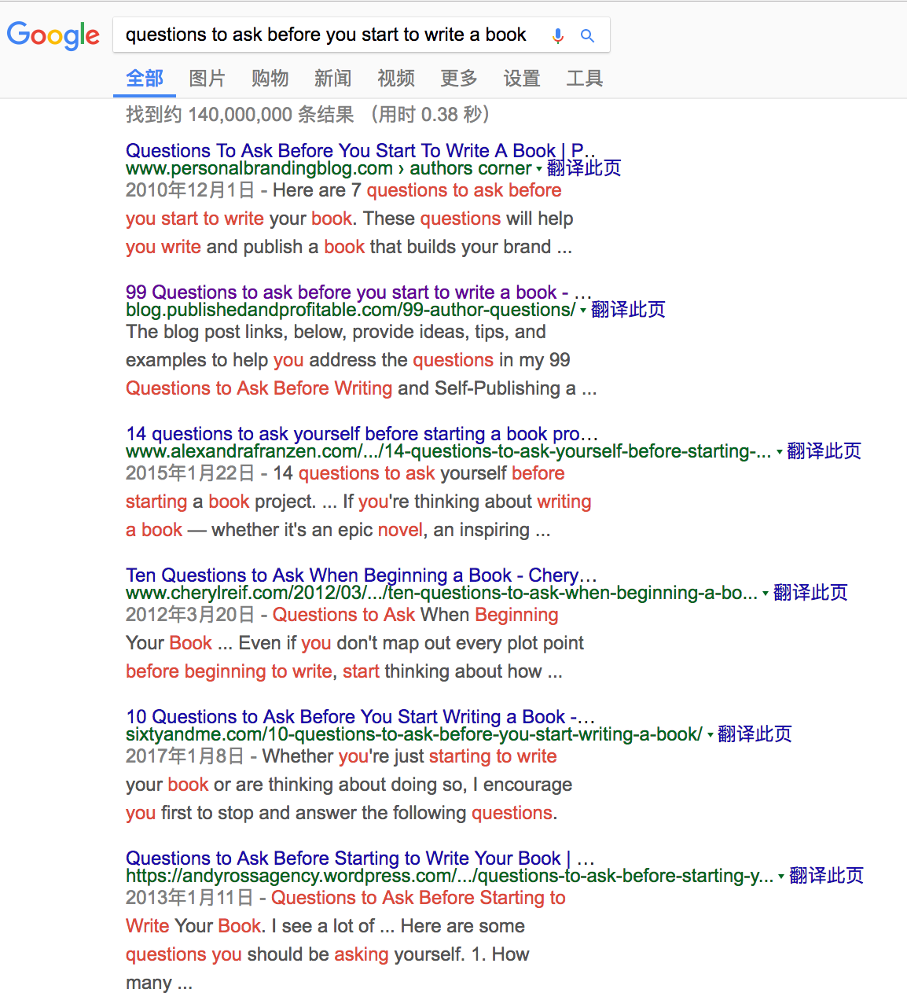
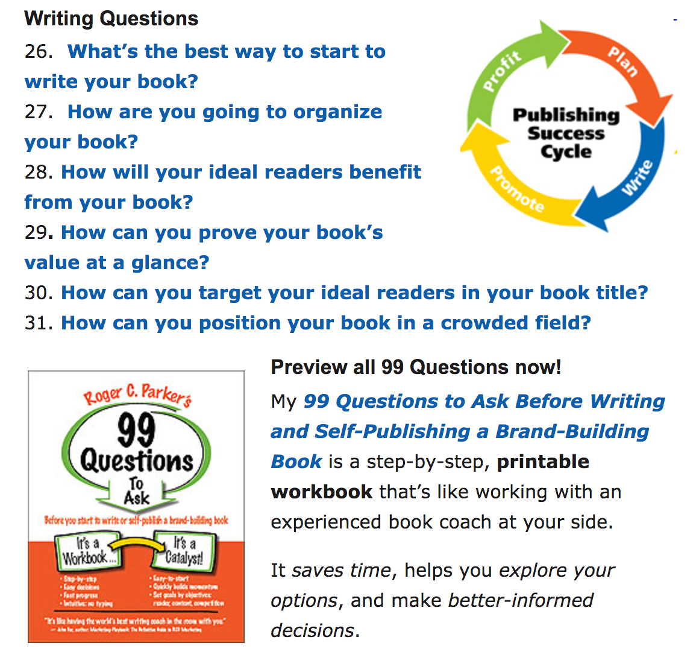

# 01.开始写作之前应该问自己N个问题

## 01.开始写作之前应该问自己N个问题

> While most others seem to believe that having questions is better than having questions, I believe that having questions is better than having answers because it leads to more learning.
>
> -Ray Dalio
>
> 大多数人认为有答案要比有问题要好，但我觉得有问题比有答案要好，因为，这让人更博观。

### 黄金圈法则

在《从为什么开始》（ Start with why : how great leaders inspire everyone to take action ）中，作者 Simon Sinek 揭露了一个秘密：

世界上所有成功的领导者或是品牌，都具备一项特质——他们思考、行动和传达的方式都遵循同一法则，即“黄金法则”。

这是一种思维模式，它把思考问题和认识问题分为三个层面：最外圈是what层，指的是事情的表象；中间一层是how，是实现目标的途径；最里面是why层，就是为什么做这件事。

Sinek 说大多数人总是从 what 层面思考，别人让他们做什么就去做什么。可是，聪明人不一样，他们遇到问题，总是先问自己为什么。

凡事，先从问为什么开始。

### 不懂就要问

我从来没有写过书，不知道怎样才能完成一本书。

不知道的事情，就去问喽。

在 Google 里输入“questions to ask before you start to write a book”（在写作之前，应该问哪些问题），于是得到N个答案。

为什么要花时间去浏览这些网页？

道理很简单：

只要耐心统计出网页里面出现频率最多的问题，就能直接倒推出第一本书应该怎么写和写什么了。

你想啊，大多数人都在问的问题，大多数人都重视以至于写在文章里面的问题，不就证明了他们想要解决这些问题吗？

发现了吗，这里面有一个巨大的潜在的：

> 需求。

所以，我决定，这第一本书，干脆就从这个点入手：如何完成第一本书。

### 问完就去做

在写之前，我问了自己N个问题：

我为什么要写作？ 我是为谁写的？ 我找到自己的声音了吗？ 个人写作风格 这本书应该保持的风格 如何调整个人写作风格与它应该有的风格之间的偏差

我想写本什么类型的书 我该如何组织架构它 如何得到准确的读者画像 他们对这本书的期待是什么 他们能够这本书里得到什么 我又如何确保他们能够得到他们想要的？

第一本书写多少字 我打算用多久的时间写这本书 如何确定是时候应该结束了这件事 阻止我写作的可能性的因素 我该如何解决这些因素 如何保持专注 如果没有灵感该怎么办 如果没有动力该怎么办 如果就是想要拖延该怎么办 有效写作VS无效写作

每一篇文章，需要多长时间？ 每一篇文章，只写一个概念 概念的重要性 怎么确保每一篇都是好文章 逻辑与文笔

写作计划 收集素材 调查研究 提纲 插图、封面的设计风格

我一定要引用英文 我决定自己制作插图 选书技巧 正确的读书方法 如何科学地做读书笔记 学习工具要不要写进去？ 常浏览的网站要不要写进去？ 对我影响最大的几本书，要不要写进去？ 对我写作影响最大的几本书，书籍、课程，要不要推荐？

......

当我把能想到的问题全都罗列下来，修剪之后，就基本确定到底要以哪种方式去呈现什么内容了。

另外，在浏览网页的时候，发现有个人竟然凭着《在你写书之前需要问的99个问题》（[99 questions to ask before you start to write a book](http://blog.publishedandprofitable.com/99-author-questions/)）写了一本书。

你看，这就是聪明人啊。

