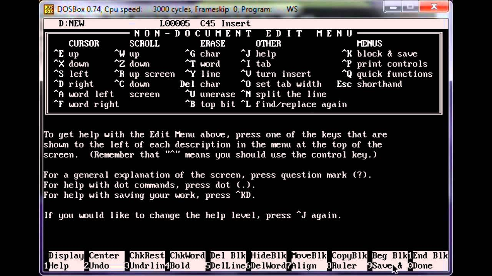

# Untitled

## 11.专注

### 乔治·马丁的电脑

1970年，有个美国年轻人以新闻系硕士学位从西北大学毕业了。随后的13年，他一直靠写作为生，虽然一直不温不火。这种状态，一直到他的第四部长篇小说《末日狂歌》（The Armageddon Rag）出版，他遇到了写作生涯的滑铁卢。用作者的原话说，“It essentially destroyed my career as a novelist at the time”。《末日狂歌》这本书摧毁了他作为小说家的写作生涯。

但是他太喜欢写作了，以至于根本停不下来。虽说不能写小说了吧，他还是接了写作的活。为CBS写电视脚本。不幸的是，那个电视剧后来就被叫停了。他又跑到了ABC公司，但同样，那电视剧又被叫停了。

倒霉就像龙卷风，说来就来。可是，没有人知道它什么时候离开。这种状态，一直持续了将近10年。好在他心智坚韧，他决定重新写小说。

写了两百万字之后，他，家喻户晓。对，他就是有史以来，奇幻小说系列《冰与火之歌》的作者，乔治·马丁。这个系列的第一册，被HBO拍下来之后，就获得了13项艾美奖提名。至于，其他的成就，就不必多说了。

不过，令我好奇的并不是马丁老爷子获得的成就，而是，他究竟是怎么完成这些书的——

第一部，《权力的游戏》--298，000字 第二部，《列王的纷争》--326，000字 第三部，《冰雪的风暴》--424，000字 第四部，《群鸦的盛宴》--300，000字 第五部，《魔龙的狂舞》--422，000字

数据来源：[The Cesspit.](http://cesspit.net/drupal/node/1869/)

这些加起来一共是1，770，000字。

你知道他怎么做到的吗？

原来老爷子在写小说时，用的是绝大多数人没听过的一个程序：WordStar 4.0。看一下这屏幕，你就知道它有多古老了——

马丁说，“我在写作的时候还是在自己的老机器 DOS上运行WordStar4.0，它很老了，但超级棒。我不用脸书，也不用推特，我不追热点。因为，总有一天，脸书和推特也会成为过去。我没时间、精力或者乐趣去使用这些社交软件。”

乔治·马丁先生卖出的书籍可能比世界上任何人都要多，但是他的电脑甚至不能够发送一封邮件。

我们想要获得成功。我们会寻找一些有效率的软件或者工具，比如番茄计时法，GDT工作法。

可是，或许，这些都不重要。重要的是，我们要少一些被打扰的可能，我们只需要变得更加关注。

### 最重要的问题

Daniel Goleman（心理学家、畅销书作者，主要作品有《情商》、《专注：杰出背后的驱动力》）说：

> It may surprise you to know that attention is like a muscle. Like a muscle in the gym, and that there are exercises, mental exercises that can improve attention that strengthen the brain circuitry for attention just like you'd go to gym and you'd do some reps on a CYBEX machine and get a stranger tricep.

你可能会很惊讶，因为注意力竟然和肌肉有异曲同工之处。就像你在健身房时，使用健身器材训练肌肉一样，注意力也是有训练方法的。脑力训练会提高注意力，增强大脑回路。

我们当然有科学的方法保持专注。但是，你想过这个问题吗：

> 为什么要保持专注？

答案其实很简单：在专注的状态下，你做事情更有效率。

你想想看，不管是GTD管理还是番茄工作法，它们的目的都是，想法设法让你把事儿完成，并且是越早越好。

越早越好的潜台词就是：提高效率。

因此，关于“注意力”，最本质的问题应该是：

> 如何在保持专注的情况下，提升效率？

反过来思考：

> 我做的什么事儿，可能导致自己效率不高？

第一，浪费时间（注意力）。

我们总说，“时间就是金钱”，但是，我们真的像精打细算每100块钱那样在乎过每一小时（别说是每一分钟了）了吗？

在Barking Up the Wrong Tree: The Surprising Science Behind Why Everything You Know About Success Is \(Mostly\) Wrong 一书中，有这么一段话：

> They say time equals money, but they’re wrong. When researchers Gal Zauberman and John Lynch asked people to think about how much time and how much money they’d have in the future, the results didn’t add up. We’re consistently conservative about predicting how much extra cash we’ll have in our wallets, but when it comes to time, we always think there will be more tomorrow.
>
> 他们总说时间等同于金钱，其实，他们不是那么想的。当研究者要求人们思考自己在某一刻会有多少时间和多少钱的时候，结果说不通了。人们对自己口袋里会有多少钱的预测很保守；却觉得自己会有更多的时间。

第二，关注不可控制的部分

在这个世界上，有很多事情我们是无法控制的，该发生的还是会发生，它们也一定会影响最终结果。但是，与其把注意力放到那些未知的不可控的因素上，不如将注意力放在能够把握的地方。

畅销书作者 Ryan Holiday 说：

> If I’m doing something tomorrow and I’m worried about it raining and ruining it, no amount of me stressing about it is going to change whether it rains or not. The Stoics are saying, “Not only are you going to be happier if you can make the distinction between what you can change and can’t change but if you focus your energy exclusively on what you can change, you’re going to be a lot more productive and effective as well.”
>
> 如果我明天有事情要做，然后我很担心明天可能会下雨影响那件事，那么无论我感到多大的压力，我都无法改变明天到底下不下雨的事实。斯多葛派哲学有句老话：如果你能够区分你能改变的和你不能改变的，并且将自己的注意力放在你能够改变的部分，那么，你不但会更快乐，还会更多产跟高效。

除了斯多葛派哲学。。。。。，在19世纪30年代，美国基督教神学家尼布尔写过一段《宁静祷文》[（The Serenity Prayer）](https://en.wikipedia.org/wiki/Serenity_Prayer)：

> God, grant me the serenity to accept the things I cannot change, Courage to change the things I can, And wisdom to know the difference. 上帝啊 请赐予我平静，让我接受我不能改变的 请赐予我勇气，让我改变我能改变的 请赐予我智慧，让我能区分两者

这是一个硬邦邦的道理：将注意力放到你能够改变的事物上。

注意力是有限的，没有人可以一直保持专注。想要提升效率，你就要很聪明地把它放在自己能够改变的部分。

#### 保持专注的技巧

1.冥想（在【成功密码：早晨仪式】那一节）

2.创造能够保持专注的环境

克里斯·萨卡，是硅谷著名的投资人，他在福布斯第十四届全球最佳创投人排行榜中名列第三，他的投资案例包括Twitter、Instagram、Uber等等。

不过，另类的是，他并不住在硅谷。他住在加州的一个山区里。他说，一个人在生活里会有两种挑战。一个是防守，一个是进攻。比如，邮箱就是一个防守的工具，你总是要完成别人交给你的任务。而他不想再没完没了的防守下去，他想要进攻。于是，他就远离了硅谷的中心，来到山区里。

在这里，他可以集中地做一些事情。

比如，他住的地方是滑雪胜地。他会邀请很多硅谷人到他这里来做客。久而久之，他与这些人建立了深厚的关系。这也是他为什么能够在Twitter、Instagram等项目的早期投资人的原因。

我讲萨卡这个故事，并不是鼓励你搬到山区住。而是，告诉你一件事，面对生活的挑战，比起被动接受，我们最好是主动出击。换句话说，你要给自己创造，不被打扰的条件。

3.在早晨，做创造性的工作

这可能需要你：

上午的时间，尽量不使用微信、微博等聊天工具；拒绝手机里的信息推送；手机静音。

在 Manage Your Day-to-Day一书中，作者Jocelyn.K.Glei 提到，“一日之计始于晨”，所以，在早晨的时候应该选择做创造性工作（creative work），而不是应接性工作（reactive work）。

所谓“创造性工作”，是指你可以主动去做的事情，比如，写作、设计页面、写代码。而“应接性工作”，多指你听了别人的意见和要求，对其修改，或者说，与创造性工作无关，但是，也不得不去做的事情。比如，你写完一篇文章之后，还需要编辑、发布，这个工作，就和创造性无关。你就不要在上午做了。

4.营造仪式感。

这个策略是从许岑那学到的。

许岑说，他当初为了学好吉他，花了四万七。直到现在，他仍坚定地认为，那把价值4万七的吉他，是他能学成指弹吉他的关键因素之一。

他认为，买任何东西都不要图便宜。因为便宜东西本来就不是靠专注力制造出来的，而是胡弄出来的。

奢侈品就不一样。它是专注力的结晶。奢侈品的制造，就算材料本身不值钱，制造者也要付出比制造廉价品的人多得多的时间与专注。

追求奢侈品并不是我们的目标。然而图便宜绝对会分散我们的注意力。要训练专注力，仪式感的营造是很重要的。

### 专注模式 VS 分散模式

很多人在研究专注这个主题的时候，都会把重点放到“怎么样保持专注”上面。然而，需要提醒的一点是，没有任何训练方法可以让一个人一直保持专注。

农民伯伯很清楚，一片土地在收割完庄稼（或者水果蔬菜）之后，一定要休整一段时间。没有任何农民会拔出成熟的萝卜之后，立刻再种上土豆的。因为，他们知道，土地需要休息，如果，种完萝卜紧接着种土豆，长出来的土豆一定是又小又涩的。

同样地，大脑也需要休息，需要恢复。所以，当我们在充分调用注意力一段时间后，我们得让大脑“停机”一段时间。

从这个角度看，“休息”也是保持专注的一种方法。

番茄工作法是一种时间管理方法。它将完整的工作分成若干个25分钟，并且每隔25分钟会有5分钟的休息时间。而它之所以高效，其中一个原因是它给了你休息的时间。

《学习之道》的作者芭芭拉奥克利说，人的大脑有两种思考模式，专注模式和发散模式，它们对学习都很重要。

专注模式，和大脑的前额叶皮层，也就是集中注意力有关。而且，专注模式基本上是将注意力放在你已经熟悉的事物上。比如，在学西班牙语时，你想更加熟练的掌握它的动词变位，你就可以调用你的专注模式。或者，在游泳时，你想游得更快，你也可以用上专注模式调整手臂和腿部的动作。

而分散模式不像专注模式那样，需要大脑集中注意力，它看起来和任何一个特定脑区的关系都不太紧密。有时候，你一走神，发散模式就出现了。比如，你在一个问题上苦苦思索都没有答案，你可以试着让大脑休息一下，进入发散模式。因为松弛的状态下，大脑的各个区域更加容易连接起来，从而为解题思路提供新的灵感。

那么，大脑为什么会有这两种思考模式呢？

这或许可以从生物演化中找到答案。用一只鸟举个例子。一只鸟它想要生存下去。它需要做两件事：一方面，它要调用自己的注意力去啄地面上的谷粒；另一方面，它需要时刻提防周围可能出现的天敌。那么这只鸟是怎么做的呢？如果我们经常观察鸟类，就会发现：它们会先啄一下地面上的食物，然后抬头看看四周的情况，如此往复。其实，鸟类这种工作机理就很像人类大脑的工作方式，也就是在专注和分散这两种模式中频繁地进行切换。

在专注模式下，大脑前额叶皮层自动沿着特定的神经通路传递信号，这些信号就会将之前的思考连接起来，从而创造出记忆痕迹。很多时候，我们说自己记东西记得不牢固，主要原因就是我们没有创造记忆痕迹。书中介绍了两个创造记忆痕迹的方法，它们分别是重复和练习。奥克利说，自己在国防语言学院学的俄语课程，应该是世界上最好的语言项目之一了。那里的教学方式，其实就是让学习者通过不断的练习，重复，从而创造记忆痕迹的过程。这种记忆能深深的印在脑子里，以至于她二十年没有说过俄语，可是有次出差俄国，还是能立刻想起来俄语怎么说。

不过，我们不可能长时间处于专注模式下学习，这不仅仅消耗大量的注意力，而且容易形成惯性思维。所以，我们需要切换到分散模式，让大脑休息放松。而且分散模式还有一个好处就是，它往往能为我们百思不得其解的难题，提供新的灵感和更加宏观的视角。

书里还提到了很多发散模式的方法，睡觉就是最重要的一种。事实上，睡眠对于我们的学习有很多好处。比如，它可以加深我们的记忆力，还能够提供新的解决方案。这是因为大脑在沉睡状态下的前额叶皮层关机了，从而，大脑内的很多区域就可以自由的“交流”。很多有经验的学习者都表示，他们习惯在睡前思考问题，并且在梦中多次梦到这些内容。这样的梦境能帮助学习者增进理解能力，巩固记忆，形成知识组块。

当然，召唤发散模式的方法可不只睡觉这一种。像散步、游泳、听纯音乐，泡澡，都是不错的选择。不过，对于和朋友聊天、看电影、打游戏，或者是听流行音乐等活动，就很容易把你拖进专注状态里了。

那么，怎么区别这两种模式呢？我们只需要记住，专注模式下，需要消耗注意力，而发散模式却让大脑更加的放松，我们甚至可以把发散模式当成是专注模式后的奖励。举个例子来说，假如我们手里有个手电筒，那么专注模式下的光束密集集中，穿透力强，并且是打在一块特定区域上;而发散模式下，光束会散开，强度会降低，照射范围却更广了。

不过，你不要以为这两种模式是对立的，事实上，这两种模式只有配合默契，才能真正掌握学习之道。

