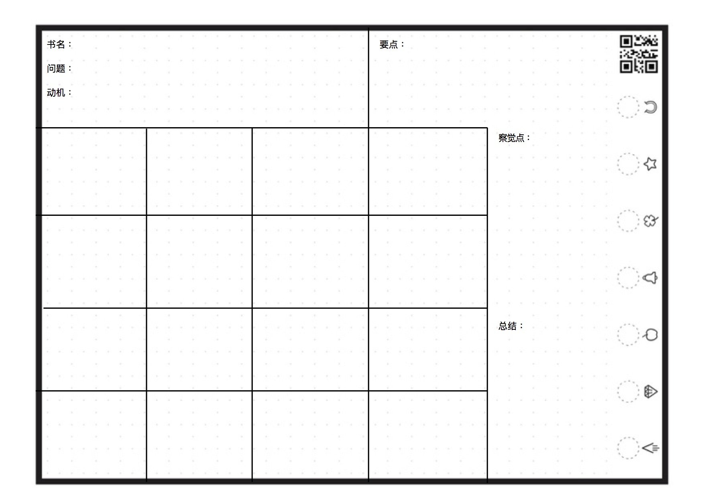
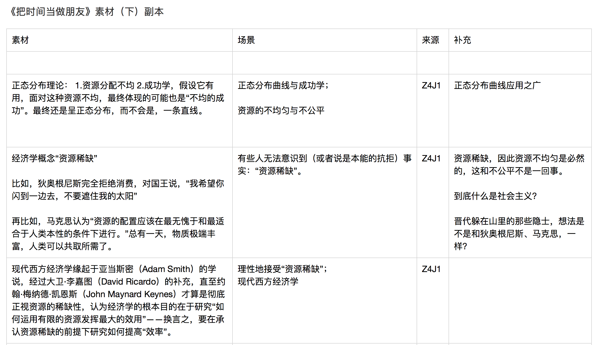

# 05.阅读

## 05.阅读

> In my whole life, I have known no wise people \(over a broad subject matter area\) who didn’t read all the time – none, zero. You’d be amazed at how much Warren reads – at how much I read. My children laugh at me. They think I’m a book with a couple of legs sticking out.
>
> 我这辈子遇到的聪明人（来自各行业的聪明人）没有不每天阅读的——没有，一个也没有。沃伦读书之多，我读书之多，可能会让你吃惊。我的孩子都经常笑我，他们说我是一本长了两条腿的书。
>
> Warren and I do more reading and thinking and less doing than most people in business. We do that because we like that kind of a life. But we’ve turned that quirk into a positive outcome for ourselves. We both insist on a lot of time being available almost every day to just sit and think. That is very uncommon in American business. We read and think.
>
> 沃伦和我花更多的时间去阅读和思考，而不是像这个行业中大多数人那样。我们这么做是因为我们喜欢这种生活。当然，我们的这种怪癖能产生积极的结果。我们坚持花大量的时间坐下来好好阅读。这在美国商业中不同寻常。阅读又思考。

读书，需要认真对待。我们读到什么样的书籍，就会得到什么样的内容。书的质量影响思考的质量。于是，选书，就像选择吃健康的食物还是油炸食品一样，决定了大脑健康。

### （一）选书

#### 不要问别人要书单

寻找到一本书，并且鉴别出一本书是否是好书，本身就是一种能力的训练。这是需要动手行动和动脑思考，才能练就的强大本领。不要把练习的机会，轻易地给了别人。

#### 作者

在决定读一本书之前，有必要好好了解一下书的作者。我的做法基本上是这样的——

国外的作者：我会在YouTube上找他的相关视频看，或者翻翻他的Twitter或者脸书，有些作者还有个人网页。

国内的作者：我会去翻翻他的微信公众号或者微博等社交账号。

这样做的好处有三点——

1.论点提前看。

一个作者的社交账号里通常会出现书里的论点。直接了解这个作者的观点，几乎等于提前把书里的观点过滤了一遍。

如果我觉得他的观点有意思，或者对我有用，那会开始去看他的书籍，并且是带着一定的基础去看他的书籍。从而，可以做到快速阅读和快速理解这本书。

如果对他的观点没兴趣，那就没必要继续浪费时间。事实上，这是绝大多数人买了书之后，将它束之高阁的原因。买的时候期待一本好书，翻了两页，就看不下去了。谁让你之前没好好研究作者呢？要是早知道这个作者喜欢用艰涩的长句，而你一点都看不进去，那一早就不要买这本书嘛。

2.其他读者的反馈。

当你去了解这个作者时，你会发现他的社交账号下面有各种各样的留言。这个评价几乎都是他的读者留下来的。要知道，读者在作者个人社交账号上的留言，比亚马逊或者京东上留下的评价更客观、更准确。

想一想，你看完书之后，更愿意给作者留言还是给京东留言呢。

3.多链接。

在YouTube上打开一个关于某个作者的视频，往往能得到其他相关视频。

#### 参考文献（链接）

我固执地认为，近百年的非虚构书籍中，那些没有参考文献（链接）的书籍，就不要读了吧。因为任何知识都不可能是独立的，它们本是相互关联的。

参考文献本应是一本书应有的组成部分（链接，也本应是一篇文章的组成部分）。同时，利用参考文献可以反向了解一本书的质量。

#### 网站上的书籍测评

你可以翻翻看亚马逊、豆瓣上的书评。同时，还有专题排行榜。

#### 浓缩书

Blinkist、GetAbstract，这两家是专门提供浓缩书服务的。所谓“浓缩书”，就是把一本书里面的精华提取出来。

这两家是需要服务费的。当然，如果不想用这种服务，你还可以在从网页里看看这两家都有什么书。一般情况下，质量不高的书，他们也不好意思拿来做“浓缩书”。

#### 跟聪明人学习

1.想看哪个领域的书籍，就去搜索该领域的牛人都看了哪些书籍。

2.查理芒格推荐的书单

3.比尔盖茨每年都推荐的书单

4.罗辑思维推荐的书单

不要向别人要书单，是独立思考的一种态度。这与向聪明人学习，即看看聪明人都读了哪些书，不矛盾。

#### 补充几条

靠着上面几条原则，我选到的书都还不错。

当然，下面还有几条原则也需要注意一下——

> 出版社
>
> 每个出版社的出版能力各不相同，也各有所长。尽量选择在锁定的领域里知名的出版社。反正你不能买电影出版社出版的《精通 Python》——这当然是玩笑，电影出版社没出过这么一本书。
>
> 版次
>
> 第一版的书，慎买慎读。再版次数越多，说明此书的内容越经典。优先选择那些“第 n 版”（n 越大越好）的书。
>
> 印次
>
> 有时，要学习的领域太新，乃至于只有第一版的书。那就要看，有没有那种印次已经很多的书：比如，第一版第 n 次印刷（n 越大越好）。
>
> 印数
>
> 即便最终你不得不买第一版第一次印刷的书，那也最好先看看印数。首印数量太少，可能说明出版社对其销量没有信心……
>
> “编”与“著”
>
> 编著这两个字经常放在一起，但实际上有天壤之别。“著”的意思是原创成分更多，“编”的意思是"拿来放在一起"……有的书缺德，把两个字放在一起用“编著”糊弄读者。当然要优选“著作”。
>
> 李笑来 [《选书的基本原则》](http://zhibimo.com/read/xiaolai/reborn-every-7-years/C03.html)

### （二）读书

#### 指读法

我们先来做一个实验：

1.将你的左手放到视野的正前方，放到你觉得舒服的距离就可以。

2.眼睛盯住你的左手10秒钟。你一定要专心，专注。脑袋里不要想其他的，眼睛也不要乱看其他的。

3.这时，将你的右手伸出来，伸到视野内任何一处，并且轻度摇晃。此刻，你还是要专注地盯住你的左手。

4.将你的右手换一个位置。此刻，你还是要盯住你的左手。

请问，你在专注地盯住左手的时候，有没有注意到右手的存在？

你看得到的。即便，我已经告诉你，要你专心地盯住你的左手，但是你的余光还是可以看到右手的（不信的话，你再做几次试验。或者，你可以和朋友一起做这个实验）。为什么，你已经告诉自己的大脑要专心，可是你还是可以看的到你的右手呢?这是因为你的眼睛“分神”了。

所以，我们会得到一个结论：在看书的时候，眼睛一定会“分神”的。而，眼睛分神，一定会浪费时间。

换言之，如果眼睛不分神，是可以节省时间的。在一定阅读量的情况下，阅读时间变少了，相对而言，阅读速度就提高了。而只要学会控制自己的眼睛，就能自然而然地提高阅读速度。

你注意到了吗？阅读速度，与我们身体的本能——眼睛——有关。

怎样让眼睛不“分神”呢？

指读法。

很多人对指读法有误解，觉得它只会让阅读速度变慢。事实上，指读法的好处是巨大的，而且不止一个好处。

前期，你只需要用一个手指，匀速地在书上划过。它不止训练眼睛的专注度，还有阅读理解能力。

后期，你渐渐习惯使用指读法时，你可以用三只手指，在书上划过。这时候，你的阅读速度将是原来的三倍。

#### 三分法

Tim Ferriss（畅销书作者、创业者、投资人）为了将读书的速度提高两倍，他是这么做的——

将一行字分为三部分，左、中、右。在阅读的时候，眼睛故意不去看每一行两边的字。

一开始，每行先分别遮住左右两边各一个字，也就是，每行遮住两个字。

训练一段时间之后，每行遮住左右两边各两个字，即，相当于每一行少看了4个字。

然后，再遮住三个字，这时候相当于每一行少看了6个字。

这么做并不会影响内容的吸收，并且能够提升速度。

#### 表格阅读法

这个方法，我是从 Xdite（全球知名开发者）看到的：

在开始读书之前，先画一个这样的模板： 

模板的使用方法——

> Step 1 ：找出你最想问这本书的一个问题 请你下载这个 A4 模版，每次读书的时候，就写上： 书名 你最想要在书中得到的一个解答 你提出这个问题的动机
>
> Step 2 ：限时 30 分钟快速摘出 16 个关键字 然后开始「快速读书」 我指的「快速读书」是指开始快速翻阅这本书，看到你认为「最相关的关键字、段落」就记进去 总共有 16 格，填下你观察到的关键字 记得读书时，旁边放一个计时器，严格限制最多只能读 30 分钟
>
> Step 3 ：针对这 16 个关键字，整理出 3-5 个重点 看着这 16 个关键字，整理出你认为的 3-5 个重点 这 16 个关键字，你会发现其实都在讲同样的几件事，而且他们可以浓缩成 3-5 个重点或一系列的动作
>
> Step 4 ：复述心得 拿着这张 A4 笔记，马上复述给朋友听，你在这本书得到的心得。 你会震惊于：自己竟然可以复述整本书所有的要点以及来龙去脉。

这个方法背后的机理是——

> 1. 人类的工作记忆区只有五格
>
> 许多人看书时是抱着一个开放的心态，希望在一本书当中 GET 到许多精髓。但是，人的「工作记忆」（不知道这是什么的读者，请百度一下认知心理学）只有5格。也就是读这本书，读一次的时间内，你不可能记得超过5件事，这是铁铮铮的人体限制。
>
> 所以在书中，依照顺序看到很多不同面向的重点时，就会变成捡了西瓜、掉了苹果，捡了橘子、掉了西瓜，捡了柠檬、掉了橘子。到最后什么都掉了。 。 。 。 。 。 。 。
>
> 这就是看完一本书后，几乎绝大多数人，什么重点都会忘掉，只会记得这是一本「好书」的原因 ＸＤＤＤ
>
> 只有读者抱着「我要苹果、我要苹果、我要苹果、我要苹果、我要苹果」的心态，最后怀里才可能真的剩下5个苹果。而且当眼中只有苹果时，其他在路上出现的水果都会被扔掉，所以读书效率就会变得无比的高。用 30 分钟读完一本书的速度找出书中所有的苹果，完全是可能的。
>
> 1. 限制才能带来效率
>
> 为什么又要设计 16 格笔记（还很小格），而且还得在 30 分钟内完成。几个原因：
>
> 你得用笔写，写在纸上。纸就是你的篮子，人的暂存格只有 五 格。如果不用笔记，最后看完一本书里面只有 五 个苹果而已。
>
> 再来，书里面可能有 50 个苹果，有些苹果其实不好吃，只有 16 个格子，可以逼读者记下重点的重点。 而格子为什么很小，是因为有些段落很好。格子这么小，就是要逼读者能够用 1-2 话讲清楚这个重点。 如果不限制时间，就不会加快效率。
>
> 当你摘了 16 颗苹果之后，自然而然你就能看到哪 5 类的苹果是好吃的。而且你还记得一路上摘苹果的过程，学到怎么样挑出苹果的秘诀，总结出摘苹果的套路。
>
> 用这个方法，轻轻松松就能在 30 分钟内，就做出一本读书的笔记摘要，而且还不用搞爆自己的工作记忆区。
>
> 1. 其他注意事项
>
> 如果觉得路上看到很多橘子却不能摘很可惜，请你再印一张表格，重新「我要橘子、我要橘子、我要橘子、我要橘子、我要橘子」的这个过程。这其实就是「每次读书都有不同滋味」的概念，不用担心你真的落下什么哈。
>
> 「不能只字不差的阅读书」感觉很有罪恶感。但，想想当你在用搜索引擎时，不也是针对茫茫大海只取你要的一部分资讯吗？那时候你怎么没有罪恶感了？你没发现，对一本书「搜索」其实超有效率。
>
> 还有，这个方法就是一直记关键字、一直记关键字不要停。不要在找写关键字时还在回想总结你以前的经验，「把格子当作心得栏写」，这样完全是错的！错的！错的！这个方法的重点就是快进快出工作记忆区，头脑零酸爽负担感。

注：

心理认知学家对“[工作记忆](https://en.wikipedia.org/wiki/Working_memory)”（working memory）的存储能力的看法并不一致。

[Miller \(1956\)](https://www.ncbi.nlm.nih.gov/pmc/articles/PMC2864034/#R12) 认为它的存储最多7格，最少2格；其他[调查报告](https://www.ncbi.nlm.nih.gov/pmc/articles/PMC2864034/#R12)显示，人的工作记忆有3-4格；还有的研究表明，工作记忆的储存能力因人而异。

但无论如何，它都是有局限性的。

#### 精读

快速阅读与眼睛的移动有关。在阅读的过程中，人眼并不是持续移动，而是短暂的、快速的运动（也就是”扫视“）和短暂的暂停（也就是”固定点“）。

普通阅读者平均一分钟能够读200-300字；有经验的阅读者能做到平均一分钟读400-500字。

> It is conducted at a higher rate \(700 words per minute and above\) than normal reading for comprehension \(around 200–230 wpm\), and results in lower comprehension rates, especially with information-rich reading material.

[研究表明](https://works.bepress.com/marcel_just_cmu/84/)，在此基础上，如果再提高阅读速度，就会降低对文章的认知理解。

李笑来有两句经常挂在嘴边的话：

> 阅读的方式只有一种，就是“精读” 必须学会“只字不差”地阅读

为什么很多人都希望提高阅读速度？

我想，他们大概清楚，在相同的时间里，读五本书的一定比读一本书的收获多。

可是，他们忽略了一件事，如果在相同时间里，读了五本书却并不理解里面到底讲了什么。那么，这似乎没有读明白一本书的收获大吧？

因此，所谓的“阅读速度”，一定是在“理解”的基础上建立起来的。

> 想要提升阅读理解能力，就必须精读。

**精读是模仿的基础，模仿是“成精”的基础**

> Most of us find our own voices only after we’ve sounded like a lot of other people.
>
> —Neil Gaiman

在找到自己的声音之前，你必须学会倾听别人的声音。就像每一个音乐家、舞者、运动员、诗人必经之路一样：模仿造就伟大。

从学习写作的角度来说，模仿大师的作品，比其他技巧更加重要。而模仿的基础就在于，精读。要慢到“只字不差”的阅读；要慢到遇到难以一时理解的句子就倒回去多看几遍。

李笑来的文章，简洁、朴素，我都是“只字不差”看完的。不仅如此，还用自己的声音录制了他的得到专栏《通向财富自由之路》。在录制的时候，自然需要“只字不差”地朗读。长时间地被简洁、朴素的语言浸泡着，自然也形成了简洁、朴素的风格。

模仿的技巧在于，像作者一样阅读。

海明威说，如果一个作家对他想写的东西心里有数，那么他可能会省略他所知道的东西。只要作家写得真实，读者，也会强烈的感觉到他所省略的地方，就好像是作者已经写出来了一样。而如果一个作家省略的是他所不了解的东西，那只会给他的作品留下空白。

换个角度思考，如果读者能够像作者一样思考（阅读），他就更能准确、完整地理解作者的真实意图。

一个硬邦邦的方法论：

> 第一，圈出文中事实的部分。 第二，圈出文中属于作者看法的部分。 第三，圈出看法对事实的支持（案例、数据等）

#### 四、我的读书方法

在写这篇文章之前，我做了一些调查，各个领域人物的读书方式都不太一样。在运用他们的读书方式，也就是真正实践的过程中，我发现有些读书方法让我读得更快记得更多，有些方法对我就没那么奏效。而尽管有些方法有效，我却不太喜欢。

于是，我得到一条结论：

> 好的方法，不仅有效还会令你上瘾。

如果一个方法单纯有效，却不能令你上瘾，那么它只是刚刚及格而已。这和产品一样，如果只是性价比高，但售后服务没跟上，那它可能只是及格而已。

选书，是一种能力；找到适合自己的读书方法论，也是一种能力。我的读书方法特别“随大流”：

> 具体情况具体分析。

举个例子。

准备写这本书时，我需要查找大量的资料。就拿这篇来说，我得去寻找怎样读书方面的书籍（比如，《怎样读一本书》、《高效的学习方法》），名人的读书方法（比如，查理芒格、比尔·盖茨），等等。所以，面临的阅读量是巨大的。因此，选择只字不差的精读，是低效的。在这时候应该怎么阅读呢？

我把这种读书方式称之为”关键词“阅读法——

找到一篇文章，或者找到一本书之后，立刻从目录开始寻找相应的关键词。然后将其中的5个关键点，写在纸上。在纸张背面写上书名、作者和类别。

将这些素材按一定顺序贴到桌子上，然后，根据已有素材，确定这篇文章的内容、顺序。换句话说，当这些素材有序的排列在桌子上，并且，在划分重点，排列顺序之后，这篇文章，基本完成了。

### （三）读书笔记

选书很重要。输入的质量决定输出的质量。

读书方法很重要。你能从一本书里学到多少取决于你怎么处理读书的过程。

读书笔记很重要。读书笔记，在当下未必有用，但以后一定会用到。

有多少次，你写文章的时候，想引用某个相关的知识点。可是，你只能模糊地记得你曾看到过它，但就是记不起来它具体的样子，你记不起来它源自哪里。

这时候，有个笔记可以查，该多好啊。

#### 向漫画家学习做笔记

你知道对漫画家而言最重要的技巧是什么吗？绘画能力？幽默？还是素材？

都不是。

对漫画家而言，最重要的是简化的能力。换言之，漫画家必须捕捉最重要的要素，并且将其简化。

比如，我们可能认识艾德·奥尼尔（美国情景喜剧《摩登家庭》杰伊的扮演者）：

一个缺乏想象力的画家可能会画成这样：

而，一个漫画家可能会画成这样：

这个漫画家意识到两件事：

1.脑袋特殊的形状。虽然他的脑袋和我们长得差不多，但是仔细看，你会发现，他的下颚会比脑袋其他部分都要宽。

2.眼神中的困惑、卷曲的眉毛、紧闭的嘴唇——通过这三个特点，漫画家将艾德的情绪全都表现出来了。

所以，你发现了吗？与漫画家相比，那个画家最重视竟然是具体的形象而非关键信息。

但是，我们在记录笔记的时，正确的做法应该是什么呢？

我们得学习漫画家，用最少且必要的文字表达关键信息。换言之，笔记，不需要具体，只需要最少且必要。

#### 表格法

这是我看《把时间当做朋友》时做的笔记。

上面的表格的形式，并不是我在没看这本书之前就固定下来的。看完第一遍之后，发现这本书里有大量的案例值得挖掘深究为我所用，所以，我愿意花时间，去整理它涉及到的素材。

之所以分成四部分，这完全是，我遵守自己的笔记原则，“最少且必要”。素材、场景、来源、补充，这四列完全满足收集素材的需求。

某程度上，与其说这是读书笔记，不如说，这是素材收集。

事实上，所谓的“读书笔记”，的确不应该只具有思考+心得的功能，它还应该是你素材宝库的来源。

#### 便利贴记录

不管是看书（文章）还是看视频，我的习惯是在便利贴正面写上标题+作者+来源，反面会写上3-5个喜欢的点。

我在录制读书视频的时候，用的就是这种方法。它的好处在于，你能直接找到需要的主题，并且快速提取关键信息。

不管使用什么方式去做笔记，关键在于，要做笔记。并且，是做有用有效的笔记，而不是漂亮的笔记。

在做到了有用有效之后，需要挑战的是，想方设法，把做笔记的时间压缩到最短，换言之，提高你的效率。

所谓的优秀的人，无非是，做同一件事情，他们花费的时间更少。所以，如果你们的时间量是一样的话，他们能做更多的事情而已。

